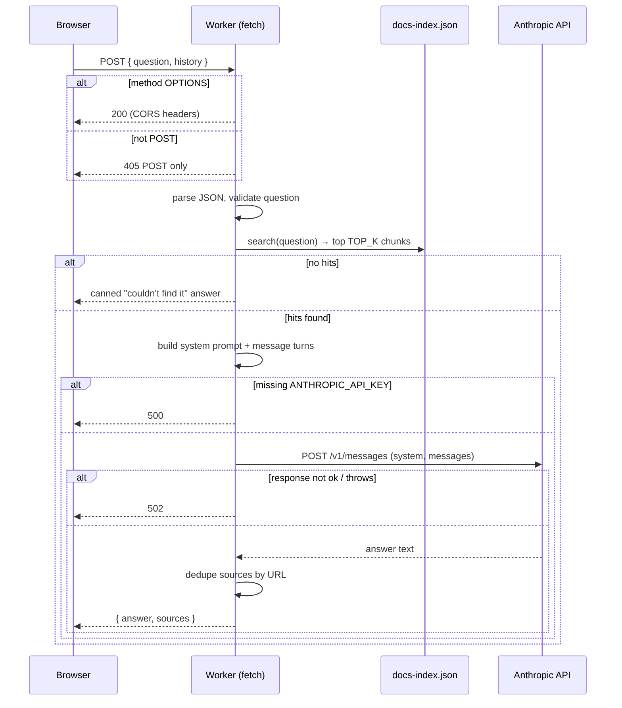

**File:** `chat-worker/src/index.js` · **Lines:** 157

> Cloudflare Worker — the chatbot backend for the Snabbit docs site.
> Stateless: it receives a question (plus recent chat history for context),
> keyword-searches the bundled docs index, asks the Anthropic API (Claude
> Haiku 4.5) to answer using only the matched docs, and returns the answer +
> source links.
> The conversation is NOT stored here — the browser keeps it (session memory)
> and sends recent turns with each request. The Anthropic API key lives only
> as a Wrangler secret on the Worker; it never reaches the browser.

## Imports

This file pulls in the following modules. Relative imports point to other documented files; external imports are libraries from `node_modules`.

| Module | Imports | Kind |
| --- | --- | --- |
| `../docs-index.json` | `default as INDEX` | internal |

:::note
No exported symbols detected by the AST. This file is a side-effect entrypoint, a re-export barrel, or a runtime bootstrap — open `chat-worker/src/index.js` directly to read the source.
:::

## Diagrams

<!-- fill:file:diagrams -->
The `fetch` handler's request lifecycle, from inbound POST to grounded answer:

<!-- /fill:file:diagrams -->

:::caution
The bundled source (`chat-worker/src/index.js`) calls the **Anthropic Messages API (Claude Haiku 4.5)**, which requires an `ANTHROPIC_API_KEY` Wrangler secret. Note that a later revert commit describes switching the chatbot to free Cloudflare Workers AI; if that change lands, this page should be regenerated to match.
:::
