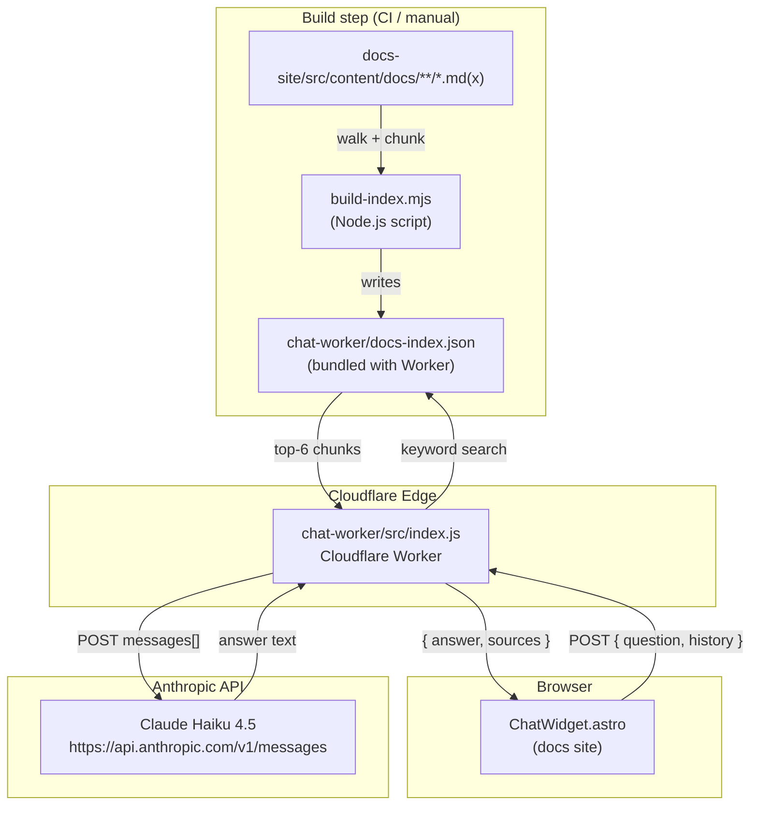

The `chat-worker/` directory contains a stateless **Cloudflare Worker** that
powers the "Ask the docs" AI chatbot embedded on every page of this
documentation site. It also contains the build script that produces the search
index the Worker bundles at deploy time.

## What it is and why it exists

The chatbot lets readers ask natural-language questions about the Snabbit Agent
Console without leaving the docs. Instead of a full-text search box, users get a
conversational answer grounded exclusively in the documentation content, with
links to the source pages.

The Worker is **stateless**: it holds no session data. Every request is
self-contained — the browser sends the question plus a short window of prior
conversation turns, the Worker keyword-searches the bundled index, forwards the
relevant excerpts to the Anthropic Claude Haiku model, and returns the answer.
No database, no server-side session, no persistent storage of any kind.

## Architecture



## How it works

### 1 — Build time

`build-index.mjs` is run once before each deployment (or whenever the docs
change). It:

1. Recursively walks `docs-site/src/content/docs/`, skipping directories whose
   names start with a digit (frozen version archives).
2. For each Markdown or MDX file, strips frontmatter, splits the body on `##`
   heading boundaries, and cleans the text (removes Mermaid blocks, normalises
   whitespace).
3. Splits any section longer than 1 500 characters into consecutive chunks.
4. Writes the resulting flat array of `{ title, heading, url, text }` objects
   to `chat-worker/docs-index.json`.

The JSON file is committed alongside the Worker source and bundled into the
deployed Worker by Wrangler, so no network call is needed at request time to
fetch the index.

### 2 — Request time

The browser's `ChatWidget.astro` component sends a `POST` request to the
deployed Worker URL with the body:

```json
{
  "question": "How do I filter agents by status?",
  "history": [
    { "role": "user",      "content": "What is the agent console?" },
    { "role": "assistant", "content": "The agent console is …" }
  ]
}
```

The Worker:

1. Validates the request method (POST only) and body (JSON with a non-empty
   `question` field).
2. Slices `history` to the last 6 turns (3 user + 3 assistant) to bound prompt
   length.
3. Tokenizes the question (lowercase, alphanumeric, stop-words removed) and
   scores every chunk in the bundled index. Title/heading matches count 4× more
   than body matches. Returns the top-`TOP_K` (6) chunks.
4. If no chunks score above zero, returns a canned "not found" message without
   calling the Anthropic API.
5. Formats the top chunks as numbered `[Doc N]` blocks and appends them to the
   system prompt.
6. Calls `https://api.anthropic.com/v1/messages` with the `claude-haiku-4-5-20251001`
   model, a 600-token limit, and the assembled messages array.
7. Deduplicates the hit list by URL and returns `{ answer, sources }`.

### 3 — Session memory

Conversation history is stored exclusively in the browser (session storage
inside `ChatWidget.astro`). The Worker never writes to any store. Each new
question arrives with the most recent turns embedded in the request body.

## Key design decisions

### Stateless Cloudflare Worker

Workers have no file system and no built-in database. Keeping session state in
the browser avoids the need for KV or Durable Objects, reduces cost to zero
(the free tier covers normal doc-site traffic), and means there is nothing to
expire or clean up.

### Anthropic Claude Haiku via direct HTTP

The Worker calls the Anthropic Messages REST API directly using `fetch()`. There
is no SDK dependency — the Worker bundle stays small and the `ANTHROPIC_API_KEY`
is stored as a Wrangler secret, never embedded in source.

Model: `claude-haiku-4-5-20251001` — the fastest and cheapest Claude model,
suitable for short grounded-answer tasks.

### Keyword search, not vector embeddings

The Worker uses a TF-style substring counter rather than embedding vectors.
Reasons:

- The documentation corpus is small (tens of pages); keyword matching gives
  acceptable relevance without a vector store.
- No external embedding API call is needed at request time.
- Title and heading matches are weighted 4× to prefer topically relevant pages.

### ANTHROPIC_API_KEY as a Wrangler secret

The API key is never in source code or `wrangler.toml`. It is injected at
deploy time via `wrangler secret put ANTHROPIC_API_KEY` and exposed to the
Worker through the `env` object.

### History capped at 6 turns

`payload.history.slice(-6)` keeps only the last 6 array elements (which
correspond to at most 3 user turns and 3 assistant turns). This prevents the
prompt from growing unboundedly over a long session.

### TOP_K = 6 chunks

Six chunks at up to 1 500 characters each add at most ~9 000 characters of
context to the system prompt — well within Haiku's context window and the
600-token answer budget.

## Configuration reference

| Constant / setting | Location | Value | Notes |
|--------------------|----------|-------|-------|
| `MODEL` | `src/index.js` | `claude-haiku-4-5-20251001` | Anthropic model used for answers |
| `ANTHROPIC_URL` | `src/index.js` | `https://api.anthropic.com/v1/messages` | Anthropic Messages API endpoint |
| `ANTHROPIC_VERSION` | `src/index.js` | `2023-06-01` | Required `anthropic-version` header |
| `TOP_K` | `src/index.js` | `6` | Max chunks fed to the model |
| `MAX_CHUNK` | `build-index.mjs` | `1500` | Max characters per index chunk |
| `SITE_BASE` | `build-index.mjs` | `/sdlc-sample-worflow` | Must match `base` in `astro.config.mjs` |
| `ANTHROPIC_API_KEY` | Wrangler secret | _(set via CLI)_ | Never in source; exposed via `env` |
| `max_tokens` | `src/index.js` | `600` | Max tokens in Anthropic response |

## Deployment workflow

:::caution
Run `node build-index.mjs` **before** every deploy. The index is bundled into
the Worker at deploy time. If the docs have changed but the index has not been
rebuilt, the chatbot will give answers based on stale content.
:::

```bash
cd chat-worker

# 1. Install Wrangler (first time only)
npm install

# 2. Rebuild the search index from the current docs
node build-index.mjs       # or: npm run index

# 3. Deploy to Cloudflare
npm run deploy             # runs: wrangler deploy

# 4. Set the API key secret (first time, or when rotating)
npx wrangler secret put ANTHROPIC_API_KEY
```

After deploying, note the Worker URL printed by Wrangler and configure the docs
site's `WORKER_URL` environment variable so `ChatWidget.astro` knows where to
send requests.

:::tip
`npm run dev` starts a local Wrangler dev server so you can test the Worker
against a real Anthropic API key without deploying. Secrets set with
`wrangler secret put` are available in the local dev environment too.
:::

## Source files

| File | Purpose |
|------|---------|
| `chat-worker/src/index.js` | Cloudflare Worker — chatbot request handler |
| `chat-worker/build-index.mjs` | Node.js build script — produces `docs-index.json` |
| `chat-worker/docs-index.json` | Generated search index (committed; bundled at deploy) |
| `chat-worker/wrangler.toml` | Wrangler deploy configuration |
| `chat-worker/package.json` | npm scripts and Wrangler dev-dependency |

## Per-file reference

- [Worker — src/index.js](/sdlc-sample-worflow/chat-worker/worker/) — request handler, keyword search, Anthropic call
- [Index builder — build-index.mjs](/sdlc-sample-worflow/chat-worker/build-index/) — docs walker, chunker, index writer
