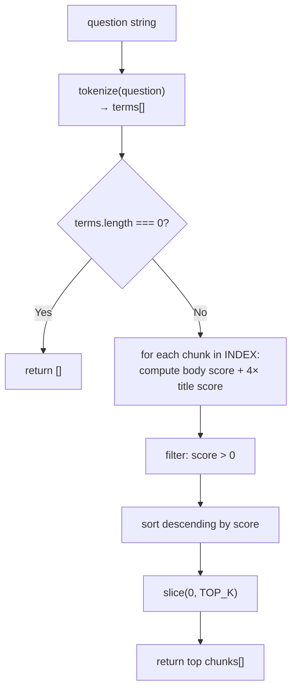
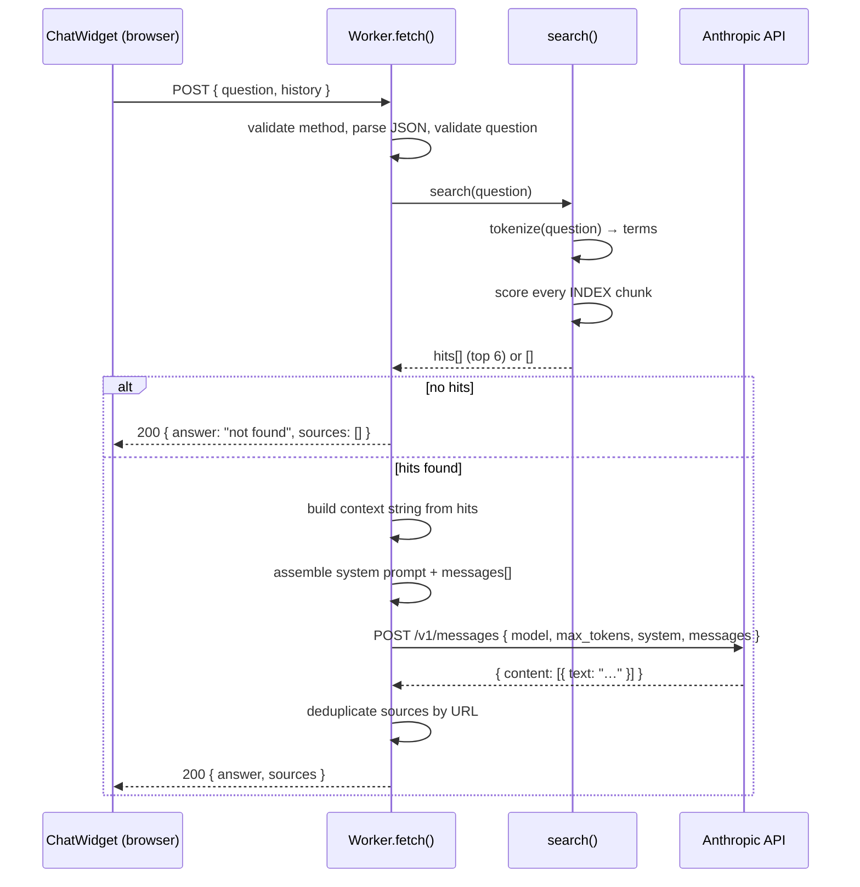

**File:** `chat-worker/src/index.js`

The Cloudflare Worker that handles every chatbot request from the docs site.
It receives a user question and optional conversation history, keyword-searches
the bundled `docs-index.json`, calls the Anthropic Claude Haiku API with the
most relevant documentation chunks as grounding context, and returns the answer
with deduplicated source links.

## Module-level constants

### `MODEL`

```js
const MODEL = 'claude-haiku-4-5-20251001';
```

The Anthropic model identifier used for all answer generation. Claude Haiku is
the fastest and most cost-efficient Claude model, well-suited for short grounded
Q&A tasks. Changing this value to a different Anthropic model identifier
(e.g. `claude-sonnet-4-5-20251001`) requires no other code changes.

### `ANTHROPIC_URL`

```js
const ANTHROPIC_URL = 'https://api.anthropic.com/v1/messages';
```

The Anthropic Messages API endpoint. The Worker calls this URL directly via
`fetch()` — there is no Anthropic SDK dependency in the bundle.

### `ANTHROPIC_VERSION`

```js
const ANTHROPIC_VERSION = '2023-06-01';
```

The value sent in the required `anthropic-version` HTTP header on every request
to the Anthropic API. Anthropic uses this header for API versioning; it must
match a value that Anthropic supports.

### `TOP_K`

```js
const TOP_K = 6;
```

The maximum number of documentation chunks fed to the model as grounding
context. After keyword scoring, only the top `TOP_K` chunks (by score,
descending) are included. Six chunks at up to 1 500 characters each add roughly
9 000 characters of context — comfortably within Haiku's context window while
keeping latency low.

### `SYSTEM_PROMPT`

```js
const SYSTEM_PROMPT = `You are the documentation assistant for the Snabbit Agent Console.
Answer the user's question using ONLY the documentation excerpts provided below.
If the answer is not in the excerpts, say you could not find it in the docs and
suggest rephrasing. Be concise and accurate. Never invent APIs or behaviour.`;
```

The static part of the system message sent to the Anthropic API on every
request. It instructs the model to:

1. Identify itself as the Snabbit Agent Console documentation assistant.
2. Answer **only** from the provided documentation excerpts (grounded
   generation — no hallucination).
3. Admit when the answer is absent from the docs and suggest the user rephrase
   rather than inventing content.
4. Be concise and accurate.

At request time, the Worker appends a `DOCUMENTATION EXCERPTS:` section
containing the top-`TOP_K` chunks to this prompt before sending it to the API.

### `STOP_WORDS`

```js
const STOP_WORDS = new Set(
  'a an the of to in is are and or for on at it this that with as be by from how what when which do does'.split(' '),
);
```

A `Set` of 20 common English function words that are excluded from keyword
tokenization. Without this filter, tokens like `the`, `is`, and `how` would
appear in almost every document chunk and produce meaningless scores. The set
is checked in O(1) time via `Set.has()`.

### `CORS`

```js
const CORS = {
  'Access-Control-Allow-Origin': '*',
  'Access-Control-Allow-Methods': 'POST, OPTIONS',
  'Access-Control-Allow-Headers': 'Content-Type',
};
```

A plain object containing the three CORS headers included on every response.
`Access-Control-Allow-Origin: *` permits the docs site — which may be served
from a GitHub Pages domain different from the Worker's `workers.dev` domain —
to call the Worker from browser JavaScript without a same-origin restriction.

## Functions

### `tokenize(s)`

```js
function tokenize(s) {
  return (s.toLowerCase().match(/[a-z0-9]+/g) || []).filter(
    (w) => w.length > 1 && !STOP_WORDS.has(w),
  );
}
```

**Parameters**

| Name | Type | Description |
|------|------|-------------|
| `s` | `string` | The string to tokenize — the user's question or a chunk's combined text field. |

**Returns:** `string[]` — lowercase alphanumeric tokens with single-character
tokens and stop words removed.

**Algorithm**

1. `s.toLowerCase()` — case-folds the input so matching is case-insensitive.
2. `.match(/[a-z0-9]+/g)` — extracts runs of letters and digits. Punctuation,
   spaces, and special characters are treated as delimiters and discarded.
   Returns `null` on an empty or all-punctuation string; `|| []` coerces the
   result to an empty array.
3. `.filter(w => w.length > 1 && !STOP_WORDS.has(w))` — drops single-character
   tokens (e.g. `s` from a possessive) and any token that appears in
   `STOP_WORDS`.

**Examples**

| Input | Output |
|-------|--------|
| `"How does useFetch work?"` | `['usefetch', 'work']` |
| `"filterAgents"` | `['filteragents']` |
| `"the a an"` | `[]` (all stop words) |
| `""` | `[]` |

### `search(question)`

```js
function search(question) {
  const terms = tokenize(question);
  if (!terms.length) return [];
  const scored = INDEX.map((chunk) => {
    const text = (chunk.title + ' ' + chunk.heading + ' ' + chunk.text).toLowerCase();
    const titleText = (chunk.title + ' ' + chunk.heading).toLowerCase();
    let score = 0;
    for (const t of terms) {
      score += text.split(t).length - 1;
      score += (titleText.split(t).length - 1) * 4;
    }
    return { chunk, score };
  });
  return scored
    .filter((s) => s.score > 0)
    .sort((a, b) => b.score - a.score)
    .slice(0, TOP_K)
    .map((s) => s.chunk);
}
```

**Parameters**

| Name | Type | Description |
|------|------|-------------|
| `question` | `string` | The user's raw question string. |

**Returns:** An array of up to `TOP_K` (6) chunk objects from the bundled
`INDEX`, sorted by relevance score descending. Returns `[]` if the question
contains no indexable terms.

**Early return**

If `tokenize(question)` yields an empty array (empty question, all stop words,
or all single characters), `search` returns `[]` immediately without iterating
the index.

**Scoring formula**

For each chunk in `INDEX`:

```
score = Σ body_occurrences(term)  +  Σ title_occurrences(term) × 4
```

- `body_occurrences` counts non-overlapping occurrences of a term in the full
  concatenation `chunk.title + ' ' + chunk.heading + ' ' + chunk.text`
  (case-folded).
- `title_occurrences` counts occurrences in `chunk.title + ' ' + chunk.heading`
  only, and multiplies by 4.

The 4× title weight means a chunk whose heading is `filterAgents` will rank
above a chunk that merely mentions filtering once in its body text, even if the
body chunk has more total occurrences.

Occurrence counting uses `str.split(term).length - 1`, which counts
non-overlapping, non-regex substring matches in O(n) time.

After scoring, chunks with `score === 0` are discarded, the remainder is sorted
descending, and the list is truncated to `TOP_K`.



### `json(body, status)`

```js
function json(body, status = 200) {
  return new Response(JSON.stringify(body), {
    status,
    headers: { 'Content-Type': 'application/json', ...CORS },
  });
}
```

**Parameters**

| Name | Type | Default | Description |
|------|------|---------|-------------|
| `body` | `any` | — | Value to serialize with `JSON.stringify`. |
| `status` | `number` | `200` | HTTP status code for the response. |

**Returns:** A `Response` object with `Content-Type: application/json` and all
three `CORS` headers. Every code path in the Worker that returns a response uses
this helper, ensuring consistent headers regardless of whether the response is
a success or an error.

### Default export — `fetch(request, env)`

```js
export default {
  async fetch(request, env) { ... }
};
```

The Cloudflare Worker entry point. Cloudflare calls this function for every
HTTP request routed to the Worker. `env` exposes secrets and bindings configured
in `wrangler.toml` — in particular, `env.ANTHROPIC_API_KEY`.

#### CORS preflight (OPTIONS)

```js
if (request.method === 'OPTIONS') return new Response(null, { headers: CORS });
```

Browsers send an `OPTIONS` preflight before cross-origin `POST` requests. The
Worker responds immediately with `200 null` plus the CORS headers without
running any other logic.

#### Method guard

```js
if (request.method !== 'POST') return json({ error: 'POST only' }, 405);
```

Any method other than `OPTIONS` or `POST` receives a 405 response.

#### Request body parsing

```js
let payload;
try {
  payload = await request.json();
} catch {
  return json({ error: 'Invalid JSON body' }, 400);
}
```

Parses the request body as JSON. If the body is not valid JSON (or the
`Content-Type` is wrong), `request.json()` throws and the Worker returns 400.

#### Input extraction and validation

```js
const question = (payload.question || '').toString().trim();
if (!question) return json({ error: 'Missing "question"' }, 400);

const history = Array.isArray(payload.history) ? payload.history.slice(-6) : [];
```

| Field | Type | Validation | Behaviour |
|-------|------|-----------|-----------|
| `question` | `string` | Non-empty after trim | Returns 400 `{ error: 'Missing "question"' }` if absent or blank |
| `history` | `array` | Optional | Defaults to `[]`; sliced to last 6 elements to cap prompt length |

`payload.history.slice(-6)` retains only the last 6 array elements. Because
the browser alternates user/assistant turns, 6 elements corresponds to at most
3 complete exchange pairs.

#### Keyword search

```js
const hits = search(question);
if (!hits.length) {
  return json({
    answer: "I couldn't find anything about that in the documentation. Try rephrasing your question.",
    sources: [],
  });
}
```

If `search()` returns an empty array (no chunks matched any term), the Worker
returns a canned "not found" answer immediately **without calling the Anthropic
API**. This avoids an unnecessary paid API call and is guaranteed to be fast.

#### Context string construction

```js
const context = hits
  .map((c, i) => `[Doc ${i + 1}] ${c.title} — ${c.heading}\n${c.text}\n(URL: ${c.url})`)
  .join('\n\n');
```

Each of the `TOP_K` hits is formatted as a numbered block:

```
[Doc 1] Page Title — Section Heading
...chunk text...
(URL: /sdlc-sample-worflow/some/page/)

[Doc 2] ...
```

The numbered format lets the model reference specific excerpts in its answer if
needed. The URL is included so the source deduplication step later can link
back to the correct page.

#### System prompt assembly

```js
const system = `${SYSTEM_PROMPT}\n\nDOCUMENTATION EXCERPTS:\n${context}`;
```

The static `SYSTEM_PROMPT` and the dynamically built `context` string are
concatenated into a single system message string passed to the Anthropic API.

#### Messages array construction

```js
const messages = [
  ...history
    .filter((m) => m && (m.role === 'user' || m.role === 'assistant') && m.content)
    .map((m) => ({ role: m.role, content: String(m.content).slice(0, 2000) })),
  { role: 'user', content: question },
];
while (messages.length && messages[0].role === 'assistant') messages.shift();
```

The Anthropic Messages API requires the `messages` array to begin with a `user`
turn. The construction process:

1. Filters `history` to only entries that have a valid `role` (`'user'` or
   `'assistant'`) and a truthy `content` value. This guards against malformed
   history entries sent by the browser.
2. Truncates each history entry's content to 2 000 characters to prevent very
   long prior answers from bloating the prompt.
3. Appends the current `question` as the final `user` turn.
4. Strips any leading `assistant` turns with the `while` loop — this can occur
   if the browser sends history that starts mid-conversation.

The `system` string is passed as a separate top-level field to the API (not as
a message in the array), which is the correct Anthropic API format.

#### Anthropic API call

```js
const resp = await fetch(ANTHROPIC_URL, {
  method: 'POST',
  headers: {
    'x-api-key': env.ANTHROPIC_API_KEY,
    'anthropic-version': ANTHROPIC_VERSION,
    'content-type': 'application/json',
  },
  body: JSON.stringify({ model: MODEL, max_tokens: 600, system, messages }),
});
if (!resp.ok) {
  const detail = await resp.text();
  return json({ error: 'AI request failed', detail }, 502);
}
const result = await resp.json();
answer =
  (result.content?.[0]?.text || '').trim() ||
  "I couldn't generate an answer just now.";
```

The Worker calls the Anthropic Messages API directly using the runtime `fetch`.
Required headers:

| Header | Value | Purpose |
|--------|-------|---------|
| `x-api-key` | `env.ANTHROPIC_API_KEY` | Authentication — Wrangler secret |
| `anthropic-version` | `'2023-06-01'` | API version selector |
| `content-type` | `'application/json'` | Required for POST JSON body |

Request body fields:

| Field | Value | Purpose |
|-------|-------|---------|
| `model` | `MODEL` | Model identifier |
| `max_tokens` | `600` | Upper bound on answer length |
| `system` | assembled system string | Grounds model behaviour |
| `messages` | assembled messages array | Conversation context + question |

The answer is extracted from `result.content[0].text` using optional chaining.
If the value is empty or absent, a fallback string is used instead.

:::note
`env.ANTHROPIC_API_KEY` is a Wrangler secret set with
`npx wrangler secret put ANTHROPIC_API_KEY`. If it is absent, the API call
returns a 401 from Anthropic, but the Worker also checks for the missing secret
explicitly and returns a 500 before making the call.
:::

#### ANTHROPIC_API_KEY guard

```js
if (!env.ANTHROPIC_API_KEY) {
  return json({ error: 'Server is missing its ANTHROPIC_API_KEY secret' }, 500);
}
```

Checked before the `fetch` call. Returns a 500 with a descriptive message
rather than letting the Anthropic API return an opaque 401.

#### Source deduplication

```js
const seen = new Set();
const sources = [];
for (const c of hits) {
  if (seen.has(c.url)) continue;
  seen.add(c.url);
  sources.push({ title: c.title, url: c.url });
}
```

Multiple chunks from the same page share the same `url`. The deduplication pass
iterates the ranked `hits` in order, so the first (highest-scoring) chunk for
each page wins, preserving relevance ordering in the sources list.

#### Response shape

```json
{
  "answer": "The filterAgents function accepts a status string and returns …",
  "sources": [
    {
      "title": "filterAgents",
      "url": "/sdlc-sample-worflow/frontend/lib/filteragents/"
    },
    {
      "title": "Agent Console — Getting started",
      "url": "/sdlc-sample-worflow/getting-started/"
    }
  ]
}
```

`answer` is the model's text response. `sources` is an ordered array of
deduplicated pages cited as context, each with a display title and an absolute
site-relative URL that the `ChatWidget.astro` component renders as links.

## Error reference

| Condition | HTTP status | Response body |
|-----------|-------------|---------------|
| `OPTIONS` (preflight) | `200` | _(empty, CORS headers only)_ |
| Non-POST method | `405` | `{ "error": "POST only" }` |
| Malformed JSON body | `400` | `{ "error": "Invalid JSON body" }` |
| Missing or blank `question` | `400` | `{ "error": "Missing \"question\"" }` |
| No search hits | `200` | `{ "answer": "I couldn't find …", "sources": [] }` |
| `ANTHROPIC_API_KEY` not set | `500` | `{ "error": "Server is missing its ANTHROPIC_API_KEY secret" }` |
| Anthropic API returns non-2xx | `502` | `{ "error": "AI request failed", "detail": "<response text>" }` |
| `fetch()` to Anthropic throws | `502` | `{ "error": "AI request failed", "detail": "<error string>" }` |

:::caution
The `502` responses propagate a `detail` field containing the raw Anthropic
error body or JavaScript error string. Do not surface this field verbatim to
end users in production — it may contain quota information or internal API
details.
:::

## Complete request sequence



## Used by

`ChatWidget.astro` (`docs-site/src/components/`) sends `POST` requests to the
Worker URL. The Worker URL is configured in the docs site's build environment
(typically as `PUBLIC_WORKER_URL` or `WORKER_URL`). The widget stores
conversation history in browser session storage and sends the last 6 turns with
each new question.

## See also

- [Chat worker overview](/sdlc-sample-worflow/chat-worker/) — architecture, deployment workflow, configuration table
- [Index builder — build-index.mjs](/sdlc-sample-worflow/chat-worker/build-index/) — how `docs-index.json` is produced
