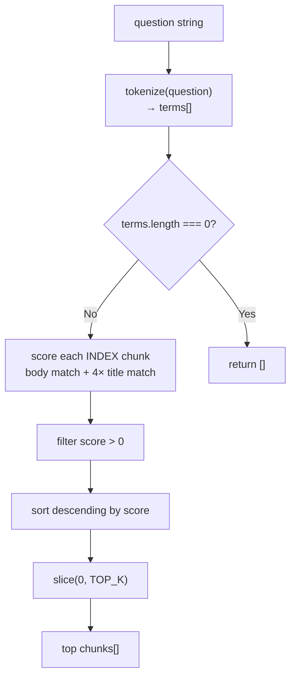
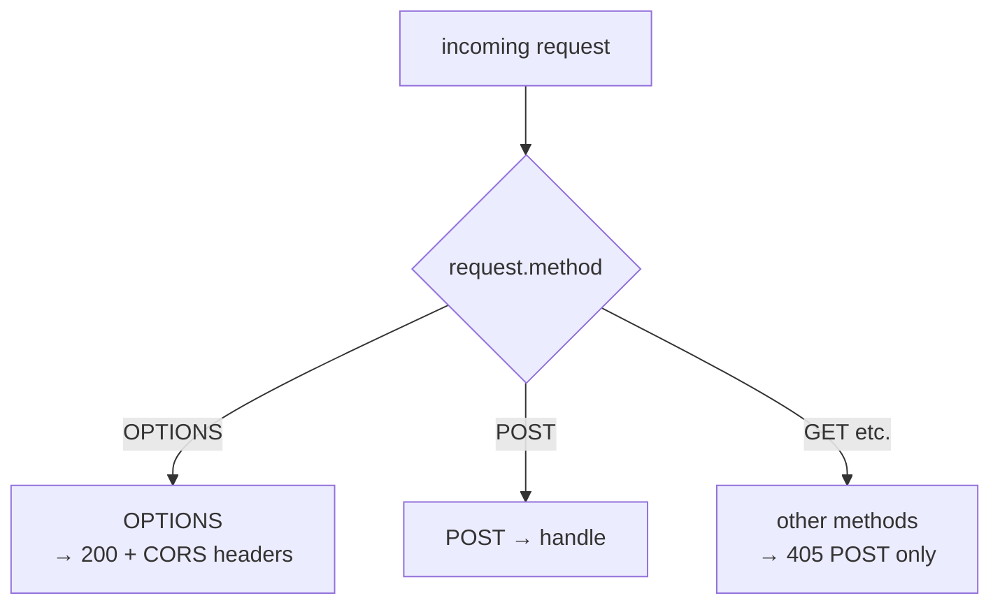
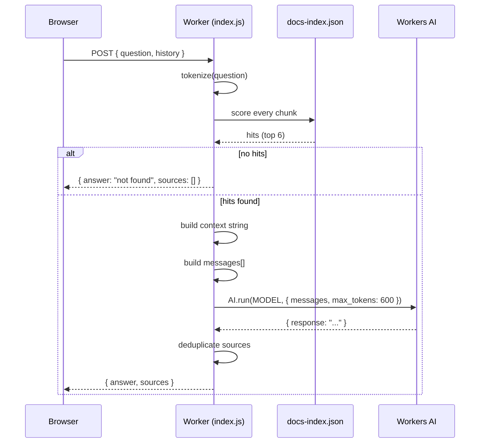

**File:** `chat-worker/src/index.js`

The Cloudflare Worker that handles chatbot requests from the docs site. Receives
a user question and optional conversation history, finds the most relevant
documentation chunks via keyword search, asks a Cloudflare Workers AI model to
answer using only those chunks, and returns the answer with source links.

## Constants

```js
const MODEL = '@cf/meta/llama-3.1-8b-instruct';
const TOP_K = 6;
```

| Constant | Value | Purpose |
|----------|-------|---------|
| `MODEL` | `'@cf/meta/llama-3.1-8b-instruct'` | The Workers AI model used to generate answers. Available on the free tier within the daily Neuron allowance. |
| `TOP_K` | `6` | How many document chunks to inject as grounding context. Higher values give the model more context but increase prompt length and latency. |

## `SYSTEM_PROMPT`

```js
const SYSTEM_PROMPT = `You are the documentation assistant for the Snabbit Agent Console.
Answer the user's question using ONLY the documentation excerpts provided below.
If the answer is not in the excerpts, say you could not find it in the docs and
suggest rephrasing. Be concise and accurate. Never invent APIs or behaviour.`;
```

Instructs the model to:
1. Answer **only** from the provided excerpts (grounded generation, not hallucination).
2. Admit when the answer is not in the docs, rather than inventing content.
3. Be concise.

## `STOP_WORDS`

```js
const STOP_WORDS = new Set(
  'a an the of to in is are and or for on at it this that with as be by from how what when which do does'.split(' '),
);
```

A fixed set of 30 common English words excluded from keyword matching. Without
filtering these, every question would match nearly every document chunk.

## `tokenize(s)`

```js
function tokenize(s) {
  return (s.toLowerCase().match(/[a-z0-9]+/g) || []).filter(
    (w) => w.length > 1 && !STOP_WORDS.has(w),
  );
}
```

**Parameters:** `s` — any string (the question, or a chunk's text).

**Returns:** An array of lowercase alphanumeric tokens, with stop words and
single-character tokens removed.

**Steps:**
1. `s.toLowerCase()` — case-fold.
2. `.match(/[a-z0-9]+/g)` — extract runs of letters and digits (no punctuation). Returns `null` on empty input; `|| []` coerces to an array.
3. `.filter(w => w.length > 1 && !STOP_WORDS.has(w))` — drop single-character tokens and stop words.

**Example:** `tokenize("How does useFetch work?")` → `['how', 'does', 'usefetch', 'work']` before stop-word removal → `['usefetch', 'work']`.

## `search(question)`

```js
function search(question) {
  const terms = tokenize(question);
  if (!terms.length) return [];
  const scored = INDEX.map((chunk) => {
    const text = (chunk.title + ' ' + chunk.heading + ' ' + chunk.text).toLowerCase();
    const titleText = (chunk.title + ' ' + chunk.heading).toLowerCase();
    let score = 0;
    for (const t of terms) {
      score += text.split(t).length - 1;       // body matches
      score += (titleText.split(t).length - 1) * 4;  // title matches (4×)
    }
    return { chunk, score };
  });
  return scored
    .filter((s) => s.score > 0)
    .sort((a, b) => b.score - a.score)
    .slice(0, TOP_K)
    .map((s) => s.chunk);
}
```

**Parameters:** `question` — the user's raw question string.

**Returns:** An array of up to `TOP_K` (6) chunk objects from `INDEX`, sorted
by relevance score descending.

**Early return:** If `tokenize(question)` produces no terms (empty question or
all stop words), `search` returns `[]` immediately.

**Scoring logic:**

For each chunk in `INDEX`, a score is computed as:

```
score = Σ(body_occurrences(term)) + Σ(title_occurrences(term) × 4)
```

`text.split(t).length - 1` counts non-overlapping occurrences of term `t` in
the full chunk text (title + heading + body). The title and heading are counted
a second time with a 4× weight so that a question about "filterAgents" ranks
the `filterAgents` page above pages that merely mention filtering.

Chunks with `score === 0` are excluded before sorting. The final list is
truncated to `TOP_K`.



## CORS headers

```js
const CORS = {
  'Access-Control-Allow-Origin': '*',
  'Access-Control-Allow-Methods': 'POST, OPTIONS',
  'Access-Control-Allow-Headers': 'Content-Type',
};
```

Allows requests from any origin — the docs site may be served from a different
domain (e.g. GitHub Pages) than the Worker (Cloudflare's `workers.dev` domain).

## `json(body, status)`

```js
function json(body, status = 200) {
  return new Response(JSON.stringify(body), {
    status,
    headers: { 'Content-Type': 'application/json', ...CORS },
  });
}
```

**Parameters:**

| Param | Type | Default | Purpose |
|-------|------|---------|---------|
| `body` | `any` | — | Value to serialize to JSON |
| `status` | `number` | `200` | HTTP status code |

**Returns:** A `Response` with `Content-Type: application/json` and all CORS
headers. Used by every code path that returns a response.

## Default export — `fetch(request, env)` handler

```js
export default {
  async fetch(request, env) { ... }
};
```

The Cloudflare Worker entry point. Receives every HTTP request.

### Request routing



**OPTIONS:** Returns an empty 200 with CORS headers (CORS preflight).

**Non-POST:** Returns `{ error: 'POST only' }` with HTTP 405.

### Request parsing

```js
let payload;
try {
  payload = await request.json();
} catch {
  return json({ error: 'Invalid JSON body' }, 400);
}
```

Parses the request body as JSON. Returns 400 on malformed JSON.

### Input extraction

```js
const question = (payload.question || '').toString().trim();
if (!question) return json({ error: 'Missing "question"' }, 400);

const history = Array.isArray(payload.history) ? payload.history.slice(-6) : [];
```

| Field | Validation | Purpose |
|-------|-----------|---------|
| `question` | Non-empty string | The user's question |
| `history` | Array (optional), truncated to last 6 elements | Recent conversation turns for context |

`payload.history.slice(-6)` keeps the last 6 turns to bound prompt length.
If `history` is absent or not an array, it defaults to `[]`.

### Search and context building

```js
const hits = search(question);
if (!hits.length) {
  return json({
    answer: "I couldn't find anything about that in the documentation...",
    sources: [],
  });
}

const context = hits
  .map((c, i) => `[Doc ${i + 1}] ${c.title} — ${c.heading}\n${c.text}\n(URL: ${c.url})`)
  .join('\n\n');
```

If `search()` returns no hits (question terms match nothing in the index),
the worker returns a canned "not found" message without calling the AI.

Each hit is formatted as a numbered block `[Doc N]` with title, heading, body
text, and URL. These blocks are concatenated and injected into the system
prompt.

### Message array construction

```js
const messages = [
  { role: 'system', content: `${SYSTEM_PROMPT}\n\nDOCUMENTATION EXCERPTS:\n${context}` },
  ...history
    .filter((m) => m && (m.role === 'user' || m.role === 'assistant') && m.content)
    .map((m) => ({ role: m.role, content: String(m.content).slice(0, 2000) })),
  { role: 'user', content: question },
];
```

The messages array follows the standard chat format:

| Position | Role | Content |
|----------|------|---------|
| 0 | `system` | `SYSTEM_PROMPT` + documentation excerpts |
| 1…N | `user` / `assistant` | Sanitized history turns (max 2000 chars each) |
| Last | `user` | The current question |

History entries are filtered to only include turns with a valid role and
non-empty content. Each is truncated to 2000 characters to avoid excessive
prompt length from long prior answers.

### AI call

```js
const result = await env.AI.run(MODEL, { messages, max_tokens: 600 });
answer = (result.response || '').trim() || "I couldn't generate an answer just now.";
```

`env.AI` is the Cloudflare Workers AI binding (configured in `wrangler.toml`).
`max_tokens: 600` limits response length — enough for a thorough but concise
answer. The `.trim()` cleans trailing whitespace from the model output.

**Error handling:** If `env.AI.run` throws, the worker returns HTTP 502:

```js
return json({ error: 'AI request failed', detail: String(err) }, 502);
```

### Source deduplication

```js
const seen = new Set();
const sources = [];
for (const c of hits) {
  if (seen.has(c.url)) continue;
  seen.add(c.url);
  sources.push({ title: c.title, url: c.url });
}
```

Multiple chunks from the same page produce the same URL. Deduplication using
a `Set` preserves the relevance order (first occurrence wins) while ensuring
each page appears at most once in the sources list.

### Response shape

```json
{
  "answer": "...",
  "sources": [
    { "title": "filterAgents", "url": "/sdlc-sample-worflow/frontend/lib/filteragents/" }
  ]
}
```

## Complete request flow



## Used by

The `ChatWidget.astro` component (in `docs-site/src/components/`) sends POST
requests to the Worker URL (configured via `WORKER_URL` in the docs site
environment). The widget stores chat history in browser session memory and
sends the last 6 turns with each request.
