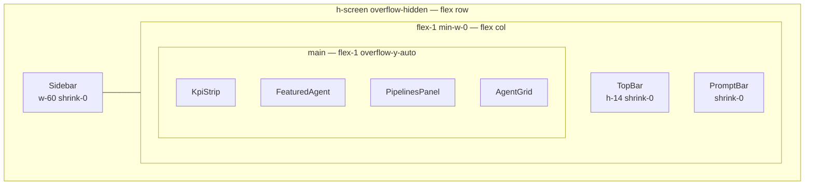

**File:** `src/App.tsx`

The root React component. Splits the agent catalogue into the featured agent
and the remainder, then assembles the full dashboard layout from seven child
components.

## Imports

```ts
import { AGENTS, FEATURED_AGENT_ID } from './data/agents'
import Sidebar from './components/Sidebar'
import TopBar from './components/TopBar'
import KpiStrip from './components/KpiStrip'
import FeaturedAgent from './components/FeaturedAgent'
import PipelinesPanel from './components/PipelinesPanel'
import AgentGrid from './components/AgentGrid'
import PromptBar from './components/PromptBar'
```

All agent data is imported from the static local catalogue. No props are
accepted — `App` is the composition root and owns the top-level data split.

## Design


Figma section **"Pre-Approval Updated Flows"** (Snabbit 2.0, node `28445-27446`).
The design shows the multi-step pre-approval gate flow that surfaces inside the
dashboard — a bottom-sheet pattern where a user image, a "Pre-approve" action
chip, and an approval confirmation screen are presented in sequence before an
agent pipeline is authorised to proceed.

## Component

```ts
export default function App()
```

**Parameters:** None.

**Returns:** A `<div>` forming the full viewport layout.

**Side effects:** None at render time. `PipelinesPanel` (a child) makes a
network call to `GET /api/pipelines` on its own mount.

## Implementation walkthrough

```tsx
export default function App() {
  const featured = AGENTS.find((a) => a.id === FEATURED_AGENT_ID) ?? AGENTS[0]
  const rest = AGENTS.filter((a) => a.id !== featured.id)

  return (
    <div className="flex h-screen overflow-hidden">
      <Sidebar />
      <div className="flex min-w-0 flex-1 flex-col">
        <TopBar />
        <main className="flex-1 overflow-y-auto">
          <div className="mx-auto flex max-w-6xl flex-col gap-5 px-5 py-5">
            <KpiStrip />
            <FeaturedAgent agent={featured} />
            <PipelinesPanel />
            <AgentGrid agents={rest} />
          </div>
        </main>
        <PromptBar />
      </div>
    </div>
  )
}
```

### Featured agent split

```ts
const featured = AGENTS.find((a) => a.id === FEATURED_AGENT_ID) ?? AGENTS[0]
const rest = AGENTS.filter((a) => a.id !== featured.id)
```

`FEATURED_AGENT_ID` is currently `'pr-reviewer'`. `AGENTS.find` returns
`undefined` if the constant is ever changed to a non-existent ID; the
nullish-coalescing fallback `?? AGENTS[0]` ensures `featured` is always
a valid `Agent`, preventing a crash.

`rest` is every agent whose `id` differs from `featured.id`. Since both
`FEATURED_AGENT_ID` and `featured.id` come from the same lookup, the
featured agent never appears in the grid.

### Outer flex row

```tsx
<div className="flex h-screen overflow-hidden">
```

`h-screen` makes the outer container exactly the viewport height. `overflow-hidden`
prevents the body from scrolling — all scrolling is confined to the inner
`<main>` region, keeping `Sidebar`, `TopBar`, and `PromptBar` fixed in place.

### Main column

```tsx
<div className="flex min-w-0 flex-1 flex-col">
```

`flex-1` causes this column to fill the remaining width after the
240px `Sidebar`. `min-w-0` overrides the default flex minimum-content
sizing so the column can shrink below its content width (important for
the `truncate` utility on agent names inside the column).

### Scrollable content area

```tsx
<main className="flex-1 overflow-y-auto">
  <div className="mx-auto flex max-w-6xl flex-col gap-5 px-5 py-5">
```

`flex-1 overflow-y-auto` makes `<main>` fill the space between `TopBar`
and `PromptBar`, with vertical scroll when content overflows.

The inner `<div>` centers content at `max-w-6xl` (72rem / 1152px) with
`px-5 py-5` (20px) padding and `gap-5` (20px) between the four panels.

### Panel order

| Order | Component | Data source |
|-------|-----------|-------------|
| 1 | `KpiStrip` | Static (`KPIS` from `kpis.ts`) |
| 2 | `FeaturedAgent` | `featured` (from `AGENTS`) |
| 3 | `PipelinesPanel` | Live (`GET /api/pipelines`) |
| 4 | `AgentGrid` | `rest` (from `AGENTS`, minus featured) |

## Layout diagram



## Tests

`src/App.test.tsx` — 4 tests. `global.fetch` is stubbed to an empty pipelines
response so `PipelinesPanel` never makes a real network call:

| Test | Asserts |
|------|---------|
| renders the featured agent | "Featured agent" eyebrow + "PR Reviewer" name in the document |
| renders the KPI strip | `region` with accessible name `/key metrics/i` present |
| renders agents in the grid | "Deploy Bot" and "Alert Triage" visible |
| renders the prompt input | Element with `aria-label="Prompt input"` |

## Used by

`src/main.tsx` — the only consumer:

```tsx
createRoot(document.getElementById('root')!).render(
  <StrictMode>
    <App />
  </StrictMode>,
)
```
