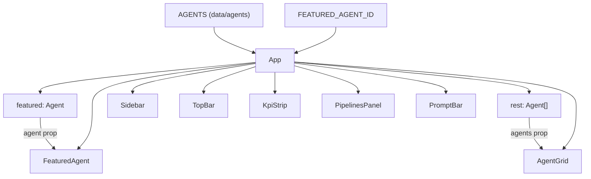

<!-- structure:5ef7b27a64d1 -->

**File:** `src/App.tsx` · **Lines:** 40

<!-- fill:file:summary -->
`App.tsx` is the root component of the dashboard: it lays out the full-screen Agent Console shell and wires together every top-level piece. It pulls `AGENTS` and `FEATURED_AGENT_ID` from `./data/agents`, picks out the featured agent, and renders `Sidebar`, `TopBar`, `KpiStrip`, `FeaturedAgent`, `PipelinesPanel`, `AgentGrid`, and `PromptBar` in a flex layout. It is mounted by `main.tsx` (inside `StrictMode`) and exercised by `App.test.tsx`.
<!-- /fill:file:summary -->

## Imports

This file pulls in the following modules. Relative imports point to other documented files; external imports are libraries from `node_modules`.

| Module | Imports | Kind |
| --- | --- | --- |
| `./data/agents` | `AGENTS`, `FEATURED_AGENT_ID` | internal |
| `./components/Sidebar` | `default as Sidebar` | internal |
| `./components/TopBar` | `default as TopBar` | internal |
| `./components/KpiStrip` | `default as KpiStrip` | internal |
| `./components/FeaturedAgent` | `default as FeaturedAgent` | internal |
| `./components/PipelinesPanel` | `default as PipelinesPanel` | internal |
| `./components/AgentGrid` | `default as AgentGrid` | internal |
| `./components/PromptBar` | `default as PromptBar` | internal |


## Symbols

This file exports 1 symbol. Every export is documented below, in declaration order.

| Name | Kind | Default |
| --- | --- | --- |
| App | component | yes |

## App (default export)

**Kind:** `component`

```ts
export default function App() { ... }
```

<!-- fill:sym:App:summary -->
`App` is the default-exported root component that composes the entire dashboard. It derives two values from the static catalogue — the featured agent and the remaining agents — then returns the page layout: a `Sidebar` beside a vertical column holding the `TopBar`, a scrollable `main` region with the `KpiStrip`, `FeaturedAgent`, `PipelinesPanel`, and `AgentGrid`, and a `PromptBar` pinned below. It holds no state of its own; its only logic is splitting `AGENTS` into the featured agent and the rest before delegating to child components.
<!-- /fill:sym:App:summary -->

### Line-by-line walkthrough

Each top-level statement of `App`, in execution order. The line numbers reference the source file as it appears today.

**Line 11 — `FirstStatement`**

```ts
const featured = AGENTS.find((a) => a.id === FEATURED_AGENT_ID) ?? AGENTS[0]
```

<!-- fill:sym:App:walk:0 -->
Looks up the featured agent by scanning `AGENTS` for the one whose `id` matches `FEATURED_AGENT_ID`. The `?? AGENTS[0]` fallback guarantees `featured` is always a defined `Agent` even if that id is ever removed from the catalogue, so the rest of the component never has to guard against `undefined`.
<!-- /fill:sym:App:walk:0 -->

**Line 12 — `FirstStatement`**

```ts
const rest = AGENTS.filter((a) => a.id !== featured.id)
```

<!-- fill:sym:App:walk:1 -->
Builds the `rest` array by filtering out the featured agent, comparing on `a.id !== featured.id`. This avoids showing the featured agent twice — once in the `FeaturedAgent` slot and again in the `AgentGrid` — and the result is what gets passed as the `agents` prop to the grid.
<!-- /fill:sym:App:walk:1 -->

**Line 14 — `ReturnStatement`**

```ts
return (
    <div className="flex h-screen overflow-hidden">
      <Sidebar />
      <div className="flex min-w-0 flex-1 flex-col">
        <TopBar />
        <main className="flex-1 overflow-y-auto">
          <div className="mx-auto flex max-w-6xl flex-col gap-5 px-5 py-5">
            <KpiStrip />
            <FeaturedAgent agent={featured} />
            <PipelinesPanel />
            <AgentGrid agents={rest} />
          </div>
        </main>
        <PromptBar />
      </div>
    </div>
  )
```

<!-- fill:sym:App:walk:2 -->
Returns the dashboard layout. The outer `div` is a full-height (`h-screen`), clipped flex row containing the `Sidebar` and a `min-w-0 flex-1` column. That column stacks the `TopBar`, a scrollable `main` region (`flex-1 overflow-y-auto`) whose centered, max-width inner `div` renders `KpiStrip`, `FeaturedAgent` (receiving the `featured` agent), `PipelinesPanel`, and `AgentGrid` (receiving `rest`), and finally a `PromptBar` fixed at the bottom of the column. Only `main` scrolls, keeping the sidebar, top bar, and prompt bar in view at all times.
<!-- /fill:sym:App:walk:2 -->

### Behavior

<!-- fill:sym:App:behavior -->
- **Shell layout.** The root `<div className="flex h-screen overflow-hidden">` makes a full-viewport, non-scrolling row; `overflow-hidden` confines scrolling to the inner `main`.
- **Two columns.** `<Sidebar />` is the fixed left rail; the sibling `<div className="flex min-w-0 flex-1 flex-col">` is the content column. `min-w-0` lets it shrink so child truncation/`line-clamp` works inside flex.
- **Column stack.** Top to bottom the column holds `<TopBar />`, a scrollable `<main className="flex-1 overflow-y-auto">`, and `<PromptBar />` pinned at the bottom — so only `main` scrolls while the chrome stays put.
- **Content width.** Inside `main`, `<div className="mx-auto ... max-w-6xl ... gap-5 ...">` centers and caps the content width and spaces the sections.
- **Data flow.** `<FeaturedAgent agent={featured} />` receives the looked-up featured agent and `<AgentGrid agents={rest} />` receives the filtered remainder; `KpiStrip` and `PipelinesPanel` take no props and fetch/read their own data.
- **No state or handlers.** `App` holds no state and wires no events — its only logic is the `featured`/`rest` split before composition.
<!-- /fill:sym:App:behavior -->

### Examples

<!-- fill:sym:App:example -->
`App` takes no props and is rendered once at the application root. `main.tsx` mounts it like so:

```tsx
import { StrictMode } from 'react'
import { createRoot } from 'react-dom/client'
import App from './App.tsx'

createRoot(document.getElementById('root')!).render(
  <StrictMode>
    <App />
  </StrictMode>,
)
```

With the current catalogue, `featured` resolves to the `'pr-reviewer'` agent and the remaining eleven agents flow into `AgentGrid`, so the rendered page shows the PR Reviewer in the featured slot and the other agents in the grid below.
<!-- /fill:sym:App:example -->

### Used by

- `src/App.test.tsx`
- `src/main.tsx`

## Tests

| Suite | Test | Asserts |
| --- | --- | --- |
| <App /> | renders the featured agent | Asserts the `Featured agent` heading and the `PR Reviewer` name (the `FEATURED_AGENT_ID` agent) are both in the document. |
| <App /> | renders the KPI strip | Asserts a region with the accessible name matching `/key metrics/i` is present. |
| <App /> | renders agents in the grid | Asserts non-featured agents `Deploy Bot` and `Alert Triage` appear, confirming `AgentGrid` received `rest`. |
| <App /> | renders the prompt input | Asserts the element labelled `Prompt input` (from `PromptBar`) is present. |

## Diagrams

<!-- fill:file:diagrams -->
The diagram below shows how `App` derives `featured`/`rest` from `AGENTS` and composes its child components, including which data each child receives.



:::caution
The Figma designs referenced in PRs #1–#4 for `App.tsx` could not be embedded because the Figma export token has expired (HTTP 403). Re-run the docs agent with a valid Figma token to attach them.
:::
<!-- /fill:file:diagrams -->
