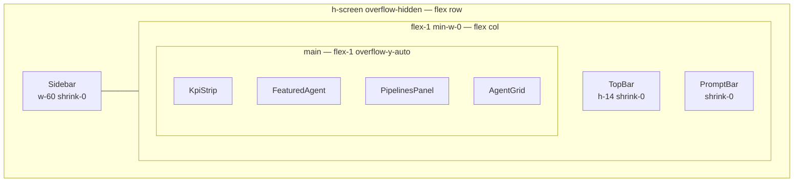
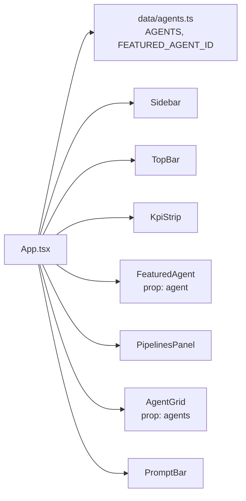

**File:** `src/App.tsx`

The root React component. Splits the agent catalogue into the featured agent and the remainder, then assembles the full dashboard layout from seven child components.

:::caution
Figma designs from PRs #1–#4 (which changed App.tsx) could not be exported — the Figma API token has expired. Update this page after refreshing the token.
:::

## Imports

```tsx
import { AGENTS, FEATURED_AGENT_ID } from './data/agents'
import Sidebar from './components/Sidebar'
import TopBar from './components/TopBar'
import KpiStrip from './components/KpiStrip'
import FeaturedAgent from './components/FeaturedAgent'
import PipelinesPanel from './components/PipelinesPanel'
import AgentGrid from './components/AgentGrid'
import PromptBar from './components/PromptBar'
```

All agent data comes from the static local catalogue in `src/data/agents.ts`. `App` accepts no props — it is the composition root and owns the top-level featured/rest split.

## The `App` function

```ts
export default function App()
```

**Parameters:** None.

**Returns:** A `<div>` forming the full viewport layout shell.

**Side effects at render time:** None. `PipelinesPanel` (a child) issues a `GET /api/pipelines` request on its own mount, not inside `App` itself.

## Featured / rest split

```ts
const featured = AGENTS.find((a) => a.id === FEATURED_AGENT_ID) ?? AGENTS[0]
const rest = AGENTS.filter((a) => a.id !== featured.id)
```

`FEATURED_AGENT_ID` is currently `'pr-reviewer'`. Two things happen here:

1. `AGENTS.find` locates the featured agent by its stable `id`. If `FEATURED_AGENT_ID` is ever changed to an ID that does not exist in `AGENTS`, `find` returns `undefined`; the `?? AGENTS[0]` fallback ensures `featured` is always a valid `Agent` and prevents a render crash.
2. `rest` is every agent whose `id` is not `featured.id`. Because both values come from the same lookup, the featured agent never appears in the agent grid beneath it.

## Layout structure

### Outer flex row

```tsx
<div className="flex h-screen overflow-hidden">
```

- `h-screen` — the outer container is exactly viewport height.
- `overflow-hidden` — prevents the `<body>` from scrolling. All scrolling is confined to the inner `<main>` region, keeping `Sidebar`, `TopBar`, and `PromptBar` pinned at all times.

### Sidebar

```tsx
<Sidebar />
```

Rendered first in source order (leftmost in the flex row). The sidebar is a fixed-width (`w-60`, 240 px) column containing the workspace logo, nav items, recent agent sessions, and a user footer. It does not shrink.

### Main column

```tsx
<div className="flex min-w-0 flex-1 flex-col">
```

- `flex-1` — fills all remaining horizontal space after the 240 px sidebar.
- `min-w-0` — overrides the default flexbox minimum-content sizing (`auto`), which would otherwise prevent this column from shrinking below its content width. Without `min-w-0`, long agent names inside the column could push the layout past the viewport edge.
- `flex-col` — stacks `TopBar`, `<main>`, and `PromptBar` vertically.

### TopBar

```tsx
<TopBar />
```

A fixed-height header (`h-14`, 56 px) that does not grow or shrink. Contains the breadcrumb, global search input, and environment switcher.

### Scrollable content area

```tsx
<main className="flex-1 overflow-y-auto">
  <div className="mx-auto flex max-w-6xl flex-col gap-5 px-5 py-5">
```

- `flex-1 overflow-y-auto` on `<main>` — fills the vertical space between `TopBar` and `PromptBar`; scrolls vertically when the content overflows.
- `mx-auto max-w-6xl` on the inner `<div>` — centers content horizontally, capped at 72 rem (1152 px). On very wide screens the content column does not stretch further.
- `flex flex-col gap-5` — stacks the four panels with 20 px (`gap-5`) gaps between them.
- `px-5 py-5` — 20 px padding on all four sides of the content column.

### Panel order

| Order | Component | Data source | Rationale |
|---|---|---|---|
| 1 | `KpiStrip` | Static (`KPIS`) | High-level metrics; first thing users scan |
| 2 | `FeaturedAgent` | `featured` (from `AGENTS`) | Hero spotlight for the most important agent |
| 3 | `PipelinesPanel` | Live (`GET /api/pipelines`) | Real-time CI/CD health follows the featured agent |
| 4 | `AgentGrid` | `rest` (remaining `AGENTS`) | Filterable catalogue is the most detailed, placed last |

### PromptBar

```tsx
<PromptBar />
```

Pinned to the bottom of the main column. Contains the model picker, the multi-line prompt textarea, and the send button. It does not grow.

## Layout diagram



## Dependency diagram



## The `max-w-6xl` content container

The `max-w-6xl` constraint (72 rem / 1152 px) keeps the four panels at a comfortable reading width on large monitors. Without it, `KpiStrip` cards would stretch to an impractical width on ultrawide displays. The `mx-auto` centers the column when the viewport exceeds 1152 px.

## Used by

`src/main.tsx` is the only consumer:

```tsx
createRoot(document.getElementById('root')!).render(
  <StrictMode>
    <App />
  </StrictMode>,
)
```

## Tests

`src/App.test.tsx` — 4 tests. `global.fetch` is stubbed to an empty pipelines response so `PipelinesPanel` does not make a real network call:

| Test | Asserts |
|---|---|
| renders the featured agent | "Featured agent" eyebrow + "PR Reviewer" name in the document |
| renders the KPI strip | `region` with accessible name `/key metrics/i` present |
| renders agents in the grid | "Deploy Bot" and "Alert Triage" visible in the document |
| renders the prompt input | Element with `aria-label="Prompt input"` |
