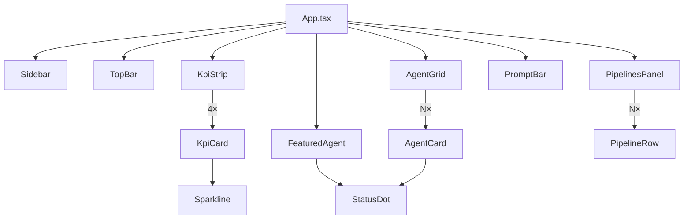

All UI components live in `src/components/`. They are presentational React function components; shared non-visual logic is delegated to `src/lib/`. `PipelinesPanel` is the sole exception — it is the only component that makes a network call directly.

## Component table

| Component | File | Purpose | Key props |
|---|---|---|---|
| `Sidebar` | `Sidebar.tsx` | Fixed 240 px left navigation column. Shows workspace logo, nav item list, recent agent sessions, and user footer. | None (self-contained) |
| `TopBar` | `TopBar.tsx` | 56 px header bar. Contains breadcrumb path, global search input, and environment switcher. | None (self-contained) |
| `KpiStrip` | `KpiStrip.tsx` | Horizontal row of four `KpiCard` components. Reads from `KPIS` in `src/data/kpis.ts`. | None |
| `KpiCard` | `KpiCard.tsx` | Single metric card. Shows label, formatted value, delta badge, hint text, and a `Sparkline`. | `kpi: Kpi` |
| `FeaturedAgent` | `FeaturedAgent.tsx` | Hero card for the featured agent. Shows a gradient-wash background (accent-subtle), full description, stats row, and a "Run agent" button. | `agent: Agent` |
| `PipelinesPanel` | `PipelinesPanel.tsx` | Live CI/CD pipeline panel. Calls `GET /api/pipelines` via `useFetch(fetchPipelines)`. Shows summary badges, a list of `PipelineRow` entries, and handles loading/error/empty states. | None (fetches internally) |
| `AgentGrid` | `AgentGrid.tsx` | Filterable, sortable catalogue of agents. Uses `usePersistentState` for category and sort. Computes visible agents via `filterAgents` + `sortAgents` in `useMemo`. | `agents: Agent[]` |
| `AgentCard` | `AgentCard.tsx` | Single agent tile in the grid. Shows `StatusDot`, name, category badge, description excerpt, runs/success stats. Receives a selected/onClick prop. | `agent: Agent`, `selected: boolean`, `onSelect: () => void` |
| `PromptBar` | `PromptBar.tsx` | Pinned bottom bar. Contains a model picker select, a multi-line prompt textarea, keyboard shortcut hints, and a send button. | None (self-contained) |
| `StatusDot` | `StatusDot.tsx` | Small colored circle indicating agent operational state. `'running'` status has a pulsing CSS animation. | `status: AgentStatus` |
| `Sparkline` | `Sparkline.tsx` | Minimal inline SVG polyline rendering a 7-point trend series. Color is driven by the `positive` flag. | `data: number[]`, `positive: boolean` |
| `icons` | `icons.tsx` | Named exports of 13 inline SVG icon components. No external icon library dependency. | Each icon: `className?: string` |

:::note
`KpiCard` and `PipelineRow` are internal sub-components not imported by `App.tsx` directly — they are rendered by `KpiStrip` and `PipelinesPanel` respectively. All other components in the table above are imported by `App.tsx` or by `AgentGrid`.
:::

## Component dependency diagram

## Component categories

### Layout chrome

`Sidebar`, `TopBar`, and `PromptBar` form the persistent chrome around the scrollable content area. They do not receive agent or KPI data.

### Dashboard panels

`KpiStrip`, `FeaturedAgent`, `PipelinesPanel`, and `AgentGrid` are the four content panels stacked vertically inside the `max-w-6xl` content column in `App.tsx`. They are rendered in this order: KPIs at the top, featured agent, pipelines, then the full agent catalogue.

### Primitives

`StatusDot`, `Sparkline`, `AgentCard`, and the `icons` set are reused across panels. They are purely presentational — they take data via props and render markup.

## Design principles

All components are **presentational** — they receive data as props and emit events via callbacks; they do not call the API directly.

The sole exception is `PipelinesPanel`, which calls `useFetch(fetchPipelines)` internally because it owns the full loading/error/retry UX for live pipeline data.

Non-visual logic — filtering, sorting, data fetching — lives in `src/lib/` so it can be unit-tested independently of the component tree. `AgentGrid`, for example, delegates filtering to `filterAgents` and sorting to `sortAgents`, both of which have dedicated unit-test files.
