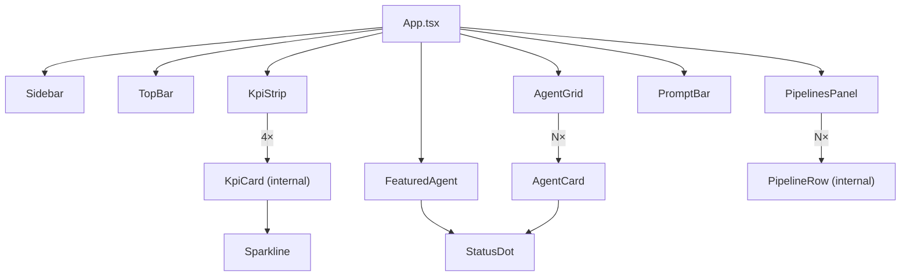

All UI components live in `src/components/`. They are presentational React
function components; shared logic is delegated to `src/lib/`. Each component
has a dedicated reference page linked below.

## Component map

## Layout chrome

| Component | File | Purpose |
|-----------|------|---------|
| [Sidebar](/sdlc-sample-worflow/frontend/components/sidebar/) | `Sidebar.tsx` | Fixed 240px left nav: workspace, nav items, recent sessions, user footer |
| [TopBar](/sdlc-sample-worflow/frontend/components/topbar/) | `TopBar.tsx` | 56px header: breadcrumb, search, environment switcher |
| [PromptBar](/sdlc-sample-worflow/frontend/components/promptbar/) | `PromptBar.tsx` | Pinned bottom textarea: model picker, send button, keyboard shortcuts |

## Dashboard panels

| Component | File | Data source | Backend? |
|-----------|------|------------|---------|
| [KpiStrip](/sdlc-sample-worflow/frontend/components/kpistrip/) | `KpiStrip.tsx` | `src/data/kpis.ts` | No |
| [FeaturedAgent](/sdlc-sample-worflow/frontend/components/featuredagent/) | `FeaturedAgent.tsx` | `Agent` prop | No |
| [PipelinesPanel](/sdlc-sample-worflow/frontend/components/pipelinespanel/) | `PipelinesPanel.tsx` | `GET /api/pipelines` | **Yes** |
| [AgentGrid](/sdlc-sample-worflow/frontend/components/agentgrid/) | `AgentGrid.tsx` | `Agent[]` prop | No |

## Primitives

| Component | File | Purpose |
|-----------|------|---------|
| [StatusDot](/sdlc-sample-worflow/frontend/components/statusdot/) | `StatusDot.tsx` | Colored status circle; `running` pulses |
| [Sparkline](/sdlc-sample-worflow/frontend/components/sparkline/) | `Sparkline.tsx` | Tiny SVG trend line for KPI cards |
| [AgentCard](/sdlc-sample-worflow/frontend/components/agentcard/) | `AgentCard.tsx` | Single agent tile in the grid |
| [icons](/sdlc-sample-worflow/frontend/components/icons/) | `icons.tsx` | 13 inline SVG icons, dependency-free |

## Design principles

All components are **presentational** — they receive data as props and emit
events via callbacks; they do not call the API directly (except `PipelinesPanel`,
which is the sole exception).

Non-visual logic — filtering, sorting, data fetching — lives in `src/lib/` so
it can be unit-tested independently of the component tree.
