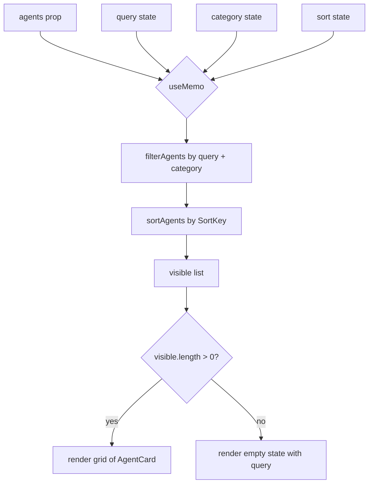

**File:** `src/components/AgentGrid.tsx` · **Lines:** 100

<!-- fill:file:summary -->
`AgentGrid.tsx` is the interactive agent browser: it owns the category tab, sort order, search query, and selection state, then renders the matching agents as a responsive grid of `AgentCard`s. It composes the pure helpers `filterAgents` and `sortAgents` (with `SORT_LABELS`/`SortKey`) from `../lib`, persists the category and sort across reloads via `usePersistentState`, and uses `AGENT_CATEGORIES` from `../data/agents` to build its tab list and `IconSearch` for the filter input. It is mounted by `App.tsx` with the full `agents` array and is exercised by `AgentGrid.test.tsx`.
<!-- /fill:file:summary -->

## Imports

This file pulls in the following modules. Relative imports point to other documented files; external imports are libraries from `node_modules`.

| Module | Imports | Kind |
| --- | --- | --- |
| `react` | `useMemo`, `useState` | external |
| `../data/agents` | `Agent` | type-only · internal |
| `../data/agents` | `AGENT_CATEGORIES` | internal |
| `../lib/filterAgents` | `filterAgents` | internal |
| `../lib/sortAgents` | `sortAgents`, `SORT_LABELS` | internal |
| `../lib/sortAgents` | `SortKey` | type-only · internal |
| `../lib/usePersistentState` | `usePersistentState` | internal |
| `./AgentCard` | `default as AgentCard` | internal |
| `./icons` | `IconSearch` | internal |


## Symbols

This file exports 1 symbol. Every export is documented below, in declaration order.

| Name | Kind | Default |
| --- | --- | --- |
| AgentGrid | component | yes |

## AgentGrid (default export)

**Kind:** `component`

```ts
export default function AgentGrid({ agents }: { agents: Agent[] }) { ... }
```

<!-- fill:sym:AgentGrid:summary -->
`AgentGrid` takes the full `agents` array and lets the user narrow and reorder it through a category tab strip, a sort `<select>`, and a search input. It derives a memoized `visible` list by piping the agents through `filterAgents` (by query and category) and then `sortAgents` (by the chosen `SortKey`), and renders each result as a selectable `AgentCard`. When nothing matches it shows a dashed empty-state panel that echoes the active query. The category and sort choices live in `usePersistentState` so they survive reloads, while the transient query and selection use plain `useState`.
<!-- /fill:sym:AgentGrid:summary -->

### Props

| Name | Type | Required | Description |
| --- | --- | --- | --- |
| agents | `Agent[]` | yes | The full pool of agents to display; the grid filters, sorts, and selects within this set. |

### Line-by-line walkthrough

Each top-level statement of `AgentGrid`, in execution order. The line numbers reference the source file as it appears today.

**Line 14 — `FirstStatement`**

```ts
const [category, setCategory] = usePersistentState<string>(
    'snabbit.agentGrid.category',
    'All',
  )
```

<!-- fill:sym:AgentGrid:walk:0 -->
Declares the active category tab as `[category, setCategory]` via `usePersistentState<string>`, keyed by `'snabbit.agentGrid.category'` and defaulting to `'All'`. Using the persistent hook rather than `useState` means the chosen tab is written to storage and restored on the next mount, so the user's filter survives reloads and remounts.
<!-- /fill:sym:AgentGrid:walk:0 -->

**Line 18 — `FirstStatement`**

```ts
const [sort, setSort] = usePersistentState<SortKey>(
    'snabbit.agentGrid.sort',
    'runs',
  )
```

<!-- fill:sym:AgentGrid:walk:1 -->
Declares the sort order as `[sort, setSort]` via `usePersistentState<SortKey>`, keyed by `'snabbit.agentGrid.sort'` and defaulting to `'runs'`. Typing the state as `SortKey` ties it to the keys of `SORT_LABELS`, and persisting it keeps the user's preferred ordering across sessions just like the category.
<!-- /fill:sym:AgentGrid:walk:1 -->

**Line 22 — `FirstStatement`**

```ts
const [query, setQuery] = useState('')
```

<!-- fill:sym:AgentGrid:walk:2 -->
Declares the search text as `[query, setQuery]` with plain `useState('')`. Unlike the category and sort, the query is intentionally transient — it starts empty on every mount and is not persisted, since a stale search box would be confusing on reload.
<!-- /fill:sym:AgentGrid:walk:2 -->

**Line 23 — `FirstStatement`**

```ts
const [selectedId, setSelectedId] = useState<string | null>(null)
```

<!-- fill:sym:AgentGrid:walk:3 -->
Declares `[selectedId, setSelectedId]` as `useState<string | null>(null)`, tracking which card is currently selected. It starts `null` (nothing selected); each `AgentCard` compares its own `agent.id` against this value and calls `setSelectedId` on click. It is local, transient state rather than persisted because selection is a UI focus, not a saved preference.
<!-- /fill:sym:AgentGrid:walk:3 -->

**Line 25 — `FirstStatement`**

```ts
const visible = useMemo(
    () => sortAgents(filterAgents(agents, { query, category }), sort),
    [agents, query, category, sort],
  )
```

<!-- fill:sym:AgentGrid:walk:4 -->
Computes the `visible` list inside `useMemo`: it first calls `filterAgents(agents, { query, category })` to drop non-matching agents, then pipes that into `sortAgents(..., sort)` to order them. The dependency array `[agents, query, category, sort]` means the (potentially expensive) filter-then-sort only re-runs when one of those inputs changes, avoiding redundant recomputation on unrelated re-renders such as selecting a card.
<!-- /fill:sym:AgentGrid:walk:4 -->

**Line 30 — `ReturnStatement`**

```ts
return (
    <section className="flex flex-col gap-3">
      <div className="flex flex-wrap items-center gap-x-3 gap-y-2">
        <h2 className="text-sm font-semibold">
          Agents <span className="text-text-faint">{visible.length}</span>
        </h2>

        <div className="flex flex-wrap gap-1">
          {TABS.map((tab) => (
            <button
              key={tab}
              type="button"
              onClick={() => setCategory(tab)}
              aria-pressed={category === tab}
              className={`rounded-md px-2.5 py-1 text-xs font-medium ${
                category === tab
                  ? 'bg-surface-3 text-text'
                  : 'text-text-muted hover:bg-surface hover:text-text'
              }`}
            >
              {tab}
            </button>
          ))}
        </div>

        <select
          value={sort}
          onChange={(e) => setSort(e.target.value as SortKey)}
          aria-label="Sort agents"
          className="ml-auto rounded-md border border-border bg-surface px-2 py-1.5 text-sm text-text-muted outline-none hover:border-border-strong focus:border-border-strong"
        >
          {(Object.keys(SORT_LABELS) as SortKey[]).map((key) => (
            <option key={key} value={key}>
              {SORT_LABELS[key]}
            </option>
          ))}
        </select>

        <label className="flex items-center gap-2 rounded-md border border-border bg-surface px-2.5 py-1.5 focus-within:border-border-strong">
          <IconSearch className="text-text-faint" />
          <input
            type="text"
            value={query}
            onChange={(e) => setQuery(e.target.value)}
            placeholder="Filter agents…"
            aria-label="Filter agents"
            className="w-40 bg-transparent text-sm outline-none placeholder:text-text-faint"
          />
        </label>
      </div>

      {visible.length > 0 ? (
        <div className="grid grid-cols-1 gap-3 sm:grid-cols-2 lg:grid-cols-3">
          {visible.map((agent) => (
            <AgentCard
              key={agent.id}
              agent={agent}
              selected={agent.id === selectedId}
              onSelect={setSelectedId}
            />
          ))}
        </div>
      ) : (
        <div className="rounded-lg border border-dashed border-border px-4 py-12 text-center text-sm text-text-faint">
          No agents match {query ? `“${query}”` : 'this filter'}.
        </div>
      )}
    </section>
  )
```

<!-- fill:sym:AgentGrid:walk:5 -->
Returns the UI. A header shows the title with the live `visible.length` count. The tab strip maps over `TABS` (`'All'`, `'Popular'`, plus the spread `AGENT_CATEGORIES`), rendering a button per tab whose `onClick` calls `setCategory(tab)` and whose `aria-pressed`/active styling reflect `category === tab`. The sort `<select>` is bound to `sort`, lists every `SORT_LABELS` entry as an `<option>`, and casts the changed value to `SortKey` in `setSort`. The search `<label>` wraps `IconSearch` and a controlled `<input>` bound to `query`/`setQuery`. Finally, the conditional renders the responsive `grid` of `AgentCard`s when `visible.length > 0` — each card marked `selected` when its id equals `selectedId` and wired to `setSelectedId` — otherwise it renders the dashed empty-state panel, interpolating the active `query` into the "No agents match" message.
<!-- /fill:sym:AgentGrid:walk:5 -->

### Examples

<!-- fill:sym:AgentGrid:example -->
```tsx
import AgentGrid from './components/AgentGrid'
import { agents } from './data/agents'

// In App.tsx — pass the full pool; the grid handles filtering, sorting, and selection.
<AgentGrid agents={agents} />
```

With this input the grid renders one `AgentCard` per agent (the test "renders a card for every agent" asserts exactly that), then narrows the list as the user types in the filter or clicks a category tab.
<!-- /fill:sym:AgentGrid:example -->

### Used by

- `src/App.tsx`
- `src/components/AgentGrid.test.tsx`

## Tests

| Suite | Test | Asserts |
| --- | --- | --- |
| <AgentGrid /> | renders a card for every agent | Every agent's name in `AGENTS` appears in the document. |
| <AgentGrid /> | filters agents by the search query | Typing "deploy" shows "Deploy Bot" and removes "PR Reviewer". |
| <AgentGrid /> | shows an empty state when nothing matches | Typing a non-matching query renders the "no agents match" panel. |
| <AgentGrid /> | filters agents by category tab | Clicking the "Deploy" tab shows "Deploy Bot" and hides "RCA Analyst". |
| <AgentGrid /> | marks a card as selected when clicked | A card's `aria-pressed` flips from "false" to "true" after a click. |
| <AgentGrid /> | keeps every agent visible after changing the sort | Selecting the "name" sort still shows all agent names. |
| <AgentGrid /> | remembers the selected category across remounts | After picking "Deploy", unmounting, and remounting, the "Deploy" tab is still `aria-pressed="true"` (persisted state). |

## Diagrams

<!-- fill:file:diagrams -->

<!-- /fill:file:diagrams -->
