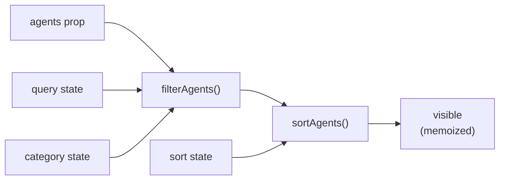

**File:** `src/components/AgentGrid.tsx`

The main agent catalogue — a filterable, sortable grid of `AgentCard` tiles.
Manages category tabs, sort order, free-text search, and single-card selection.
Category and sort preferences persist to `localStorage` via `usePersistentState`.

## Props

```ts
{ agents: Agent[] }
```

| Prop | Type | Purpose |
|------|------|---------|
| `agents` | `Agent[]` | The agent list to display. `App.tsx` passes all agents except the featured one. |

## State

```ts
const [category, setCategory] = usePersistentState<string>(
  'snabbit.agentGrid.category', 'All',
)
const [sort, setSort] = usePersistentState<SortKey>(
  'snabbit.agentGrid.sort', 'runs',
)
const [query, setQuery] = useState('')
const [selectedId, setSelectedId] = useState<string | null>(null)
```

| State | Initial | Persisted? | Purpose |
|-------|---------|-----------|---------|
| `category` | `'All'` | Yes (`localStorage`) | Active category tab |
| `sort` | `'runs'` | Yes (`localStorage`) | Active sort key |
| `query` | `''` | No | Free-text filter input |
| `selectedId` | `null` | No | Currently selected agent card ID |

`category` and `sort` use `usePersistentState` so the user's selections survive
page refreshes and component remounts. The `localStorage` keys are namespaced
(`snabbit.agentGrid.*`) to avoid collisions.

`query` is intentionally transient — a search term is not worth restoring
across sessions.

## Derived state

```ts
const visible = useMemo(
  () => sortAgents(filterAgents(agents, { query, category }), sort),
  [agents, query, category, sort],
)
```

`visible` is the final list of agents to render. It chains `filterAgents` →
`sortAgents` and is memoized so the potentially expensive sort + filter only
re-runs when its inputs change.



## Tab system

```ts
const TABS: string[] = ['All', 'Popular', ...AGENT_CATEGORIES]
// → ['All', 'Popular', 'Review', 'Deploy', 'Reliability', 'Quality', 'Docs']
```

The `All` and `Popular` tabs are prepended to the category list. `AGENT_CATEGORIES`
is imported from `src/data/agents.ts` and defines the canonical category order.

Each tab is a `<button>` with `aria-pressed` and distinct active/inactive styles:

```tsx
<button
  key={tab}
  type="button"
  onClick={() => setCategory(tab)}
  aria-pressed={category === tab}
  className={`rounded-md px-2.5 py-1 text-xs font-medium ${
    category === tab
      ? 'bg-surface-3 text-text'
      : 'text-text-muted hover:bg-surface hover:text-text'
  }`}
>
  {tab}
</button>
```

## Sort select

```tsx
<select
  value={sort}
  onChange={(e) => setSort(e.target.value as SortKey)}
  aria-label="Sort agents"
>
  {(Object.keys(SORT_LABELS) as SortKey[]).map((key) => (
    <option key={key} value={key}>{SORT_LABELS[key]}</option>
  ))}
</select>
```

The `<select>` is driven by the `SORT_LABELS` record from `sortAgents.ts`,
which defines four options: `runs` (Most runs), `success` (Success rate),
`name` (Name A–Z), `recent` (Recently run). The cast `as SortKey` is safe
because `Object.keys` iterates only over `SORT_LABELS`'s own keys.

## Search input

```tsx
<label className="flex items-center gap-2 rounded-md border border-border
                  bg-surface px-2.5 py-1.5 focus-within:border-border-strong">
  <IconSearch className="text-text-faint" />
  <input
    type="text"
    value={query}
    onChange={(e) => setQuery(e.target.value)}
    placeholder="Filter agents…"
    aria-label="Filter agents"
    className="w-40 bg-transparent text-sm outline-none placeholder:text-text-faint"
  />
</label>
```

The icon and input are wrapped in a `<label>` so clicking the icon focuses the
input. `focus-within:border-border-strong` upgrades the border when the input
is focused, without needing a separate focus handler. `bg-transparent` lets the
input inherit the panel background.

## Grid and empty state

```tsx
{visible.length > 0 ? (
  <div className="grid grid-cols-1 gap-3 sm:grid-cols-2 lg:grid-cols-3">
    {visible.map((agent) => (
      <AgentCard
        key={agent.id}
        agent={agent}
        selected={agent.id === selectedId}
        onSelect={setSelectedId}
      />
    ))}
  </div>
) : (
  <div className="rounded-lg border border-dashed border-border px-4 py-12 text-center
                  text-sm text-text-faint">
    No agents match {query ? `"${query}"` : 'this filter'}.
  </div>
)}
```

The responsive grid is 1 / 2 / 3 columns. The empty state names the active
query in quotes, or falls back to "this filter" when the empty state is caused
by a category tab with no agents.

## Selection

`AgentGrid` owns `selectedId`. It passes `selected={agent.id === selectedId}`
and `onSelect={setSelectedId}` to each `AgentCard`. Cards call `onSelect(id)`,
which always sets `selectedId` to the clicked card's ID — clicking the already-
selected card deselects would require a toggle, which is not implemented.

## Tests

`src/components/AgentGrid.test.tsx` — 7 tests:

| Test | Asserts |
|------|---------|
| renders a card for every agent | All 12 agent names present |
| filters agents by the search query | Typing "deploy" hides PR Reviewer |
| shows an empty state when nothing matches | "zzznotanagent" → empty state message |
| filters agents by category tab | "Deploy" tab hides RCA Analyst |
| marks a card as selected when clicked | `aria-pressed` flips `false` → `true` |
| keeps every agent visible after changing sort | Sort change preserves all 12 agents |
| remembers the selected category across remounts | "Deploy" tab survives unmount/remount |

## Used by

`App.tsx`:

```ts
const rest = AGENTS.filter((a) => a.id !== featured.id)
// ...
<AgentGrid agents={rest} />
```

The featured agent (PR Reviewer) is excluded so it does not appear twice.
