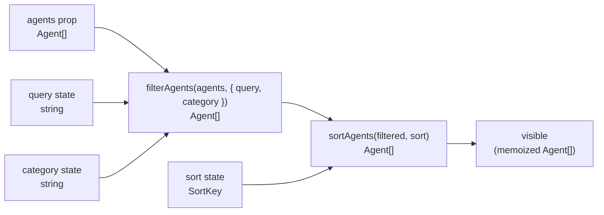

`AgentGrid` is the main agent catalogue: a filterable, sortable, pageless grid of `AgentCard` tiles. It owns four pieces of state (category tab, sort key, free-text query, and selected card ID) and derives the visible agent list through a memoised filter-then-sort pipeline.

**File:** `src/components/AgentGrid.tsx`

## Dependencies

| Import | Source | Purpose |
|--------|--------|---------|
| `useMemo`, `useState` | `react` | Derived state memoisation; transient state |
| `Agent` (type) | `../data/agents` | Agent data shape |
| `AGENT_CATEGORIES` | `../data/agents` | Canonical category list for building tabs |
| `filterAgents` | `../lib/filterAgents` | Filters by query string and category |
| `sortAgents`, `SORT_LABELS` | `../lib/sortAgents` | Sorts by a `SortKey`; provides display labels |
| `SortKey` (type) | `../lib/sortAgents` | Union of valid sort key strings |
| `usePersistentState` | `../lib/usePersistentState` | `useState` backed by `localStorage` |
| `AgentCard` | `./AgentCard` | Individual agent tile |
| `IconSearch` | `./icons` | Magnifying-glass icon in the search label |

## Props

```ts
{ agents: Agent[] }
```

| Prop | Type | Purpose |
|------|------|---------|
| `agents` | `Agent[]` | The full list of agents to display. Typically all agents except the featured one, filtered by `App.tsx`. |

## State

### Persistent state (survives page reload)

```ts
const [category, setCategory] = usePersistentState<string>(
  'snabbit.agentGrid.category',
  'All',
)
const [sort, setSort] = usePersistentState<SortKey>(
  'snabbit.agentGrid.sort',
  'runs',
)
```

| State var | `localStorage` key | Default | Type | Purpose |
|-----------|-------------------|---------|------|---------|
| `category` | `snabbit.agentGrid.category` | `'All'` | `string` | The currently active category tab; `'All'` shows every agent, `'Popular'` shows agents with high run counts, any other value filters by `agent.category` |
| `sort` | `snabbit.agentGrid.sort` | `'runs'` | `SortKey` | The active sort order applied after filtering |

`usePersistentState` is a thin wrapper around `useState` that also reads from and writes to `localStorage` under the given key. Both keys use the `snabbit.agentGrid.` namespace to avoid collisions with other features.

### Transient state (reset on page reload)

```ts
const [query, setQuery] = useState('')
const [selectedId, setSelectedId] = useState<string | null>(null)
```

| State var | Default | Purpose |
|-----------|---------|---------|
| `query` | `''` | Free-text search string typed into the filter input; intentionally not persisted — a search term from a previous session is not worth restoring |
| `selectedId` | `null` | The `id` of the currently selected `AgentCard`; `null` means no card is selected |

## The `TABS` constant

```ts
const TABS: string[] = ['All', 'Popular', ...AGENT_CATEGORIES]
```

`TABS` is a module-level constant (not inside the component function). It prepends the two synthetic tabs `'All'` and `'Popular'` to the canonical list imported from `src/data/agents.ts`. At the time of writing, `AGENT_CATEGORIES` is `['Review', 'Deploy', 'Reliability', 'Quality', 'Docs']`, producing:

```
['All', 'Popular', 'Review', 'Deploy', 'Reliability', 'Quality', 'Docs']
```

- **`'All'`** — `filterAgents` passes every agent through when `category === 'All'`.
- **`'Popular'`** — `filterAgents` applies a popularity heuristic (exact behaviour defined in `filterAgents.ts`).
- **Named categories** — `filterAgents` matches `agent.category === category`.

## Derived state: the filter-then-sort pipeline

```ts
const visible = useMemo(
  () => sortAgents(filterAgents(agents, { query, category }), sort),
  [agents, query, category, sort],
)
```

`visible` is recalculated only when one of its four inputs changes. The pipeline is:



1. `filterAgents(agents, { query, category })` — returns a new array containing only agents that match both the free-text query (name/description substring match, case-insensitive) and the selected category tab.
2. `sortAgents(filtered, sort)` — returns a sorted copy of the filtered array. The sort key maps to a comparator; the original array is not mutated.

The `useMemo` dependency array is exhaustive: any change to `agents`, `query`, `category`, or `sort` triggers a fresh computation.

## Sort select

```ts
<select
  value={sort}
  onChange={(e) => setSort(e.target.value as SortKey)}
  aria-label="Sort agents"
>
  {(Object.keys(SORT_LABELS) as SortKey[]).map((key) => (
    <option key={key} value={key}>{SORT_LABELS[key]}</option>
  ))}
</select>
```

`SORT_LABELS` is a `Record<SortKey, string>` that maps each `SortKey` to its display label. At the time of writing the four valid keys are:

| `SortKey` | Display label |
|-----------|--------------|
| `runs` | Most runs |
| `success` | Success rate |
| `name` | Name A–Z |
| `recent` | Recently run |

The `as SortKey` cast in `Object.keys(SORT_LABELS) as SortKey[]` is safe because iteration is over `SORT_LABELS`'s own keys. The `as SortKey` cast inside the `onChange` handler is also safe for the same reason.

`aria-label="Sort agents"` provides an accessible name for the `<select>` element, which has no visible `<label>` sibling.

## Category tabs

Each tab is rendered as a `<button>` with `aria-pressed`:

```tsx
<button
  key={tab}
  type="button"
  onClick={() => setCategory(tab)}
  aria-pressed={category === tab}
  className={`rounded-md px-2.5 py-1 text-xs font-medium ${
    category === tab
      ? 'bg-surface-3 text-text'
      : 'text-text-muted hover:bg-surface hover:text-text'
  }`}
>
  {tab}
</button>
```

| Attribute | Value | Purpose |
|-----------|-------|---------|
| `type="button"` | static | Prevents form submission |
| `aria-pressed` | `category === tab` | Communicates active/inactive state to screen readers |

Active tab: `bg-surface-3 text-text` (elevated surface, full-contrast text).
Inactive tab: `text-text-muted` with hover upgrades to `bg-surface text-text`.

## Search input

```tsx
<label className="flex items-center gap-2 rounded-md border border-border
                  bg-surface px-2.5 py-1.5 focus-within:border-border-strong">
  <IconSearch className="text-text-faint" />
  <input
    type="text"
    value={query}
    onChange={(e) => setQuery(e.target.value)}
    placeholder="Filter agents…"
    aria-label="Filter agents"
    className="w-40 bg-transparent text-sm outline-none placeholder:text-text-faint"
  />
</label>
```

The icon and `<input>` are wrapped in a `<label>` so clicking the icon focuses the input. `focus-within:border-border-strong` upgrades the border when the input is focused without a JavaScript focus handler. `bg-transparent` lets the input inherit the panel surface colour. `outline-none` removes the default browser focus ring; the border upgrade provides the focus affordance instead.

`aria-label="Filter agents"` labels the input directly because the `<label>` element wraps a visual icon rather than a text label, so its implicit label text would be empty.

## Rendered structure

```
<section>
  ├── <div>                        Toolbar row (flex-wrap)
  │     ├── <h2>                   "Agents {visible.length}"
  │     ├── <div>                  Tab strip (flex-wrap gap-1)
  │     │     └── {TABS.map} <button aria-pressed>
  │     ├── <select aria-label>    Sort selector
  │     └── <label>                Search label + input
  │           ├── <IconSearch />
  │           └── <input type=text aria-label>
  └── conditional:
        if visible.length > 0:
          <div grid>               Responsive 1/2/3-col grid
            └── {visible.map} <AgentCard selected onSelect />
        else:
          <div>                    Empty-state message
```

## Grid layout

```tsx
<div className="grid grid-cols-1 gap-3 sm:grid-cols-2 lg:grid-cols-3">
```

| Breakpoint | Columns |
|-----------|---------|
| Default (mobile) | 1 |
| `sm` (≥ 640px) | 2 |
| `lg` (≥ 1024px) | 3 |

`gap-3` (12px) between all cells in both directions.

## Selection behaviour

`AgentGrid` owns `selectedId`. It passes `selected={agent.id === selectedId}` and `onSelect={setSelectedId}` to each `AgentCard`. When a card is clicked, `setSelectedId` is called with that card's ID.

:::note
Clicking the already-selected card does not deselect it — `setSelectedId` is called with the same ID, resulting in no state change. Implement toggle logic by replacing `onSelect={setSelectedId}` with `onSelect={(id) => setSelectedId(prev => prev === id ? null : id)}` if deselection is required.
:::

## Empty state

```tsx
<div className="rounded-lg border border-dashed border-border px-4 py-12
                text-center text-sm text-text-faint">
  No agents match {query ? `"${query}"` : 'this filter'}.
</div>
```

When `visible.length === 0`:
- If `query` is non-empty, the message names the query in double quotes: `No agents match "zzznotanagent".`
- If `query` is empty (empty state caused by a category tab), the message reads: `No agents match this filter.`

The dashed border visually communicates "placeholder / empty" rather than a hard panel boundary.

## Styling notes

### Toolbar row

| Class | Purpose |
|-------|---------|
| `flex flex-wrap items-center gap-x-3 gap-y-2` | Horizontal toolbar that wraps gracefully on narrow screens |

### Header count

```tsx
<h2 className="text-sm font-semibold">
  Agents <span className="text-text-faint">{visible.length}</span>
</h2>
```

The visible count is shown inline, dimmed to `text-text-faint`. It reflects the filtered count, not the total.

### Sort select styles

```
rounded-md border border-border bg-surface px-2 py-1.5 text-sm text-text-muted
outline-none hover:border-border-strong focus:border-border-strong
```

`outline-none` removes the default focus ring; border upgrade on `:focus` serves as the focus indicator.

## Accessibility summary

| Element | Attribute | Value |
|---------|-----------|-------|
| `<button>` (tabs) | `aria-pressed` | `category === tab` |
| `<select>` | `aria-label` | `"Sort agents"` |
| `<input>` | `aria-label` | `"Filter agents"` |
| `<AgentCard>` (button) | `aria-pressed` | `agent.id === selectedId` |

## Edge cases and assumptions

- **`agents` prop is empty:** `filterAgents` returns `[]` and the empty-state message is shown immediately.
- **Stale `localStorage` value for `sort`:** If a future code change removes a `SortKey` that was previously persisted, `usePersistentState` will initialise `sort` with the stale value. `sortAgents` should handle unknown keys gracefully (e.g. fall back to default sort).
- **Stale `localStorage` value for `category`:** Similarly, if a category is removed from `AGENT_CATEGORIES`, the stored tab value will no longer match any tab. `filterAgents` should return an empty list rather than throwing.
- **`selectedId` survives filter changes:** If the selected agent is filtered out by a query or category change, `selectedId` still holds the ID. The card simply won't be in `visible`, so no card will appear selected. The ID is not cleared. This is intentional: if the user clears the filter, the previously selected card becomes selected again.
- **`useMemo` with spread operator in `filterAgents`/`sortAgents`:** If either library function creates new array references on every call regardless of inputs, the memo will still re-run only when its declared dependencies change, so the memoisation is correctly scoped.
