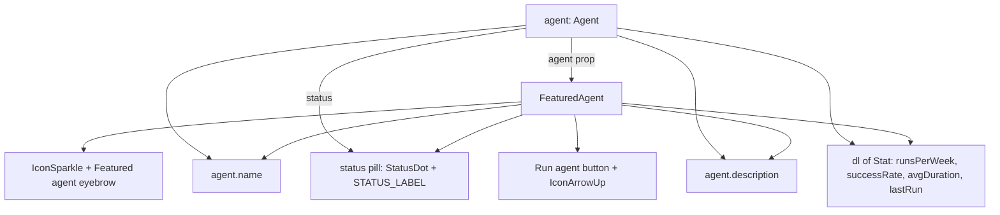

<!-- structure:5de0f4a8d9ec -->

**File:** `src/components/FeaturedAgent.tsx` · **Lines:** 58

<!-- fill:file:summary -->
`FeaturedAgent.tsx` renders a single highlighted agent as a hero banner with a gradient backdrop, status pill, description, key stats, and a "Run agent" call-to-action. It consumes the `Agent` type from `../data/agents`, reuses `StatusDot` and its `STATUS_LABEL` map to render the status pill, and pulls `IconSparkle` and `IconArrowUp` from `./icons`. It is placed at the top of the dashboard by `App.tsx`, which passes the agent to feature.
<!-- /fill:file:summary -->

## Imports

This file pulls in the following modules. Relative imports point to other documented files; external imports are libraries from `node_modules`.

| Module | Imports | Kind |
| --- | --- | --- |
| `../data/agents` | `Agent` | type-only · internal |
| `./icons` | `IconArrowUp`, `IconSparkle` | internal |
| `./StatusDot` | `default as StatusDot`, `STATUS_LABEL` | internal |


## Symbols

This file exports 1 symbol. Every export is documented below, in declaration order.

| Name | Kind | Default |
| --- | --- | --- |
| FeaturedAgent | component | yes |

## FeaturedAgent (default export)

**Kind:** `component`

```ts
export default function FeaturedAgent({ agent }: { agent: Agent }) { ... }
```

<!-- fill:sym:FeaturedAgent:summary -->
`FeaturedAgent` is a presentational hero card that showcases one `Agent`. It renders a "Featured agent" eyebrow with `IconSparkle`, the agent's name beside a status pill (`StatusDot` plus the human-readable `STATUS_LABEL[agent.status]`), the description, and a `<dl>` of stats — 7-day runs, success rate, average run, and last run — laid out by the local `Stat` helper. A "Run agent" button with `IconArrowUp` provides the primary action. It exists to give the dashboard a single prominent entry point above the full agent grid.
<!-- /fill:sym:FeaturedAgent:summary -->

### Props

| Name | Type | Required | Description |
| --- | --- | --- | --- |
| agent | `Agent` | yes | <FILL: what does agent control?> |

### Line-by-line walkthrough

Each top-level statement of `FeaturedAgent`, in execution order. The line numbers reference the source file as it appears today.

**Line 15 — `ReturnStatement`**

```ts
return (
    <section className="relative overflow-hidden rounded-lg border border-border bg-surface">
      <div
        className="pointer-events-none absolute inset-0"
        style={{
          background:
            'linear-gradient(135deg, var(--color-accent-subtle), transparent 55%)',
        }}
      />
      <div className="relative flex flex-col gap-4 p-5 sm:flex-row sm:items-center">
        <div className="min-w-0 flex-1">
          <p className="flex items-center gap-1.5 text-xs font-medium uppercase tracking-wide text-accent">
            <IconSparkle className="h-3.5 w-3.5" />
            Featured agent
          </p>
          <h2 className="mt-1.5 flex flex-wrap items-center gap-2 text-lg font-semibold">
            {agent.name}
            <span className="flex items-center gap-1.5 rounded-full border border-border bg-bg/60 px-2 py-0.5 text-xs font-normal text-text-muted">
              <StatusDot status={agent.status} />
              {STATUS_LABEL[agent.status]}
            </span>
          </h2>
          <p className="mt-1.5 max-w-xl text-sm text-text-muted">{agent.description}</p>
          <dl className="mt-3 flex flex-wrap gap-x-6 gap-y-1 text-sm">
            <Stat label="Runs · 7d" value={agent.runsPerWeek.toLocaleString()} />
            <Stat label="Success" value={`${agent.successRate}%`} />
            <Stat label="Avg run" value={agent.avgDuration} />
            <Stat label="Last run" value={agent.lastRun} />
          </dl>
        </div>
        <div className="shrink-0">
          <button
            type="button"
            className="flex items-center gap-2 rounded-md bg-accent px-4 py-2 text-sm font-semibold text-white hover:bg-accent-hover"
          >
            Run agent
            <IconArrowUp className="h-4 w-4" />
          </button>
        </div>
      </div>
    </section>
  )
```

<!-- fill:sym:FeaturedAgent:walk:0 -->
The single return builds the banner. A relatively-positioned `<section>` holds an absolutely-positioned, `pointer-events-none` `<div>` whose inline `style` paints the diagonal accent-to-transparent gradient backdrop. Above it, a content column shows the `IconSparkle` "Featured agent" eyebrow, then an `<h2>` with `{agent.name}` followed by a pill combining `<StatusDot status={agent.status} />` and `{STATUS_LABEL[agent.status]}` to render the status in words. `{agent.description}` is shown, and the `<dl>` instantiates four `Stat` components — `agent.runsPerWeek.toLocaleString()`, `${agent.successRate}%`, `agent.avgDuration`, and `agent.lastRun`. A right-aligned, non-shrinking "Run agent" `<button>` with `IconArrowUp` completes the layout. There is no state or branching; the component is a pure function of `agent`.
<!-- /fill:sym:FeaturedAgent:walk:0 -->

### Behavior

<!-- fill:sym:FeaturedAgent:behavior -->
<FILL: walk the rendered JSX, the event handlers, the accessibility attributes (aria-*, role), and the styling decisions in a few short paragraphs or a bulleted list. Quote real lines from the source. Cover: top-level element + key children, where each prop ends up in the DOM, what each event handler does, and any conditional/computed class logic. Aim for 6-15 sentences — small files get richer prose because the walkthrough alone is too compact.>
<!-- /fill:sym:FeaturedAgent:behavior -->

### Examples

<!-- fill:sym:FeaturedAgent:example -->
```tsx
import FeaturedAgent from './components/FeaturedAgent'
import { agents } from './data/agents'

// Feature the first agent at the top of the dashboard.
<FeaturedAgent agent={agents[0]} />
```

Given an agent, this renders the hero banner with that agent's name, a worded status pill, and its runs/success/avg-run/last-run stats.
<!-- /fill:sym:FeaturedAgent:example -->

### Used by

- `src/App.tsx`

## Diagrams

<!-- fill:file:diagrams -->
The diagram below shows how the `agent` prop feeds each part of the rendered hero banner.


<!-- /fill:file:diagrams -->
