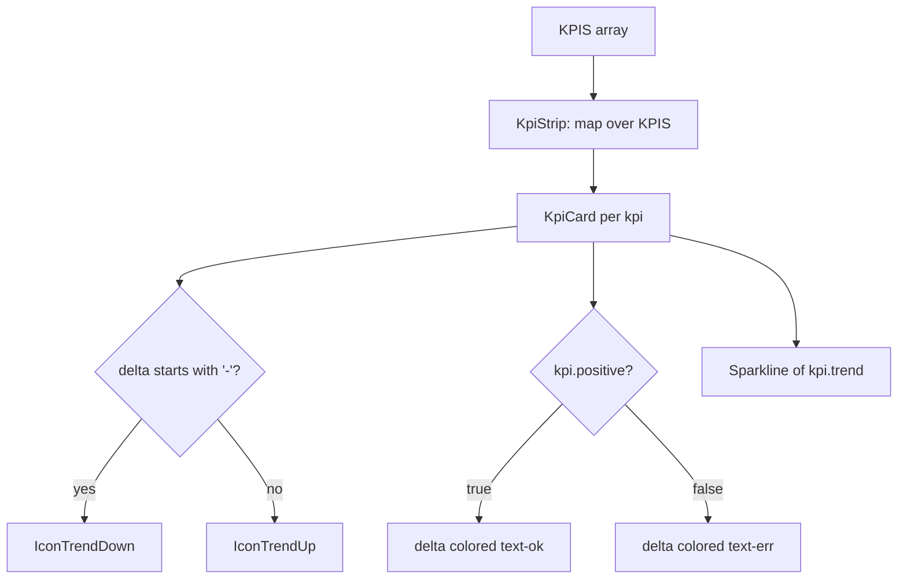

<!-- structure:dd55eff38be8 -->

**File:** `src/components/KpiStrip.tsx` · **Lines:** 45

<!-- fill:file:summary -->
`KpiStrip.tsx` renders the dashboard's row of key-metric cards. It reads the static `KPIS` array (and `Kpi` type) from `../data/kpis`, draws each metric's trend with the `Sparkline` component, and picks a trend arrow (`IconTrendUp`/`IconTrendDown`) from `./icons`. The exported `KpiStrip` is mounted by `App.tsx`; the per-card rendering is handled by the local `KpiCard` helper.
<!-- /fill:file:summary -->

## Imports

This file pulls in the following modules. Relative imports point to other documented files; external imports are libraries from `node_modules`.

| Module | Imports | Kind |
| --- | --- | --- |
| `../data/kpis` | `KPIS` | internal |
| `../data/kpis` | `Kpi` | type-only · internal |
| `./icons` | `IconTrendDown`, `IconTrendUp` | internal |
| `./Sparkline` | `default as Sparkline` | internal |


## Symbols

This file exports 1 symbol. Every export is documented below, in declaration order.

| Name | Kind | Default |
| --- | --- | --- |
| KpiStrip | component | yes |

## KpiStrip (default export)

**Kind:** `component`

```ts
export default function KpiStrip() { ... }
```

<!-- fill:sym:KpiStrip:summary -->
`KpiStrip` is a zero-prop component that lays out every entry in the `KPIS` dataset as a responsive grid of cards (1 / 2 / 4 columns across breakpoints). Each card is delegated to the local `KpiCard`, which shows the label, value, a delta colored by `kpi.positive`, a trend arrow chosen from the delta's sign, a `Sparkline` of `kpi.trend`, and a hint. It exists to give the dashboard an at-a-glance metrics summary above the rest of the content.
<!-- /fill:sym:KpiStrip:summary -->

### Line-by-line walkthrough

Each top-level statement of `KpiStrip`, in execution order. The line numbers reference the source file as it appears today.

**Line 34 — `ReturnStatement`**

```ts
return (
    <section
      aria-label="Key metrics"
      className="grid grid-cols-1 gap-3 sm:grid-cols-2 lg:grid-cols-4"
    >
      {KPIS.map((kpi) => (
        <KpiCard key={kpi.id} kpi={kpi} />
      ))}
    </section>
  )
```

<!-- fill:sym:KpiStrip:walk:0 -->
The single return renders a `<section aria-label="Key metrics">` whose grid classes step from one column to two (`sm:`) to four (`lg:`). It maps over the imported `KPIS` array, rendering one `<KpiCard key={kpi.id} kpi={kpi} />` per metric. There is no local state — the data is static — so iterating the module-level constant is sufficient, and the `aria-label` names the region for assistive tech.
<!-- /fill:sym:KpiStrip:walk:0 -->

### Behavior

<!-- fill:sym:KpiStrip:behavior -->
- **Container.** The exported `KpiStrip` returns a single `<section aria-label="Key metrics">`; the label names the region so screen readers and the App test (`getByRole('region', { name: /key metrics/i })`) can find it.
- **Responsive grid.** The class `grid grid-cols-1 gap-3 sm:grid-cols-2 lg:grid-cols-4` lays cards out one-up on mobile, two-up at the `sm` breakpoint, and four-up at `lg`.
- **Iteration.** `KPIS.map((kpi) => <KpiCard key={kpi.id} kpi={kpi} />)` renders one card per metric, keyed by the stable `kpi.id`. There is no state or event handler — the data is the module-level `KPIS` constant.
- **Per-card logic (in `KpiCard`).** `const isDown = kpi.delta.trim().startsWith('-')` picks the arrow component (`IconTrendDown` vs `IconTrendUp`) from the delta's sign, while `const deltaColor = kpi.positive ? 'text-ok' : 'text-err'` colors the delta from the semantic `positive` flag — so a falling-but-good metric (e.g. time-to-merge) still shows green.
- **Card content.** Each card shows the uppercase `kpi.label`, the large `kpi.value`, the arrow + `kpi.delta`, a `<Sparkline points={kpi.trend} positive={kpi.positive} />`, and the muted `kpi.hint`.
<!-- /fill:sym:KpiStrip:behavior -->

### Examples

<!-- fill:sym:KpiStrip:example -->
```tsx
import KpiStrip from './components/KpiStrip'

// Takes no props — it reads the KPIS dataset itself.
<KpiStrip />
```

This renders one card per entry in `KPIS`, each with its value, signed delta, trend sparkline, and hint.
<!-- /fill:sym:KpiStrip:example -->

### Used by

- `src/App.tsx`

## Diagrams

<!-- fill:file:diagrams -->

<!-- /fill:file:diagrams -->
