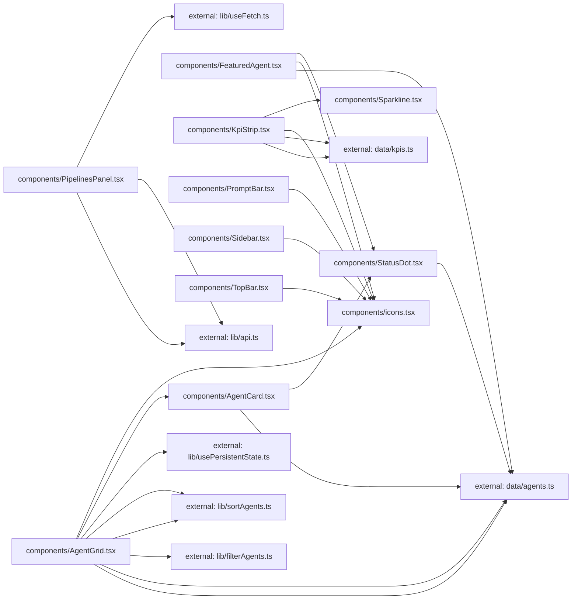

**Folder:** `src/components/`

<!-- fill:folder:summary -->
`src/components/` holds the presentational React components that make up the agent console UI — layout chrome (`Sidebar`, `TopBar`), the agent views (`FeaturedAgent`, `AgentGrid`, `AgentCard`), the metrics strip (`KpiStrip`, `Sparkline`), the live `PipelinesPanel`, the `PromptBar` composer, and shared primitives (`StatusDot`, `icons`). These modules render UI and own only local view state; reusable data-fetching, filtering, and sorting logic lives in `src/lib/`, and static datasets live in `src/data/`. Page-level composition belongs in `App.tsx`, not here.
<!-- /fill:folder:summary -->

## Files

| File | Hint |
| --- | --- |
| [`AgentCard.tsx`](../components/agentcard) | Selectable card showing one agent's status, name, category, description, and metrics. |
| [`AgentGrid.tsx`](../components/agentgrid) | Interactive grid that filters, sorts, and selects agents, rendering each as an AgentCard. |
| [`FeaturedAgent.tsx`](../components/featuredagent) | Hero banner spotlighting a single agent with its stats and a run action. |
| [`icons.tsx`](../components/icons) | Minimal inline icon set — 16px, stroke-based, currentColor. |
| [`KpiStrip.tsx`](../components/kpistrip) | Responsive grid of key-metric cards with deltas and trend sparklines. |
| [`PipelinesPanel.tsx`](../components/pipelinespanel) | Live CI/CD panel that fetches and lists pipeline runs with loading/error states. |
| [`PromptBar.tsx`](../components/promptbar) | Bottom composer with a controlled textarea and Enter-to-send prompt submission. |
| [`Sidebar.tsx`](../components/sidebar) | Fixed left navigation rail with nav links, recent sessions, and user footer. |
| [`Sparkline.tsx`](../components/sparkline) | Small inline SVG line chart used to render KPI trends. |
| [`StatusDot.tsx`](../components/statusdot) | Colored dot (and label map) indicating an agent's status. |
| [`TopBar.tsx`](../components/topbar) | Header bar with breadcrumb, search trigger, and environment switcher. |

## Dependencies

### Module dependency subgraph

## Key flows

<!-- fill:folder:flows -->
As the module dependency subgraph above shows, `App.tsx` is the entry point that assembles the layout: `Sidebar` and `TopBar` frame the page, while `KpiStrip`, `FeaturedAgent`, `AgentGrid`, `PipelinesPanel`, and `PromptBar` fill the content column.

- Agent browsing: `AgentGrid` reads state, runs `filterAgents`/`sortAgents` from `lib/`, and renders the results as `AgentCard`s; both `AgentCard` and `FeaturedAgent` reuse `StatusDot` for status, and the grid pulls `IconSearch` from `icons`.
- Metrics: `KpiStrip` maps the `data/kpis` dataset into cards, each drawing its trend with `Sparkline` and a trend arrow from `icons`.
- Live data: `PipelinesPanel` fetches from `lib/api` through `lib/useFetch`, cycling through loading, error, empty, and populated states.
<!-- /fill:folder:flows -->
