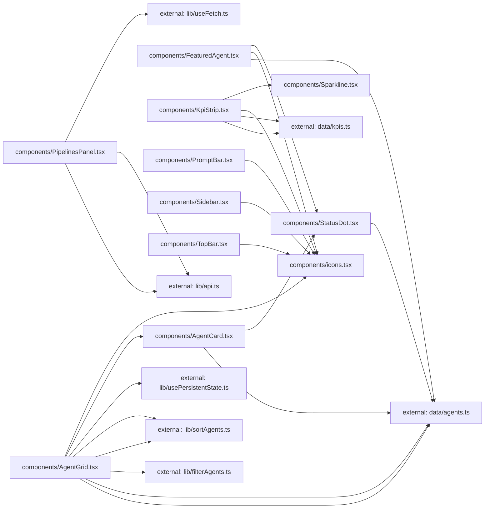

**Folder:** `src/components/`

<!-- fill:folder:summary -->
This folder holds every React component that paints something on the Agent Console — both the chrome (`Sidebar`, `TopBar`, `PromptBar`) and the dashboard surface (`KpiStrip`, `FeaturedAgent`, `PipelinesPanel`, `AgentGrid`, `AgentCard`, `Sparkline`, `StatusDot`) — plus the inline SVG icon set in `icons.tsx`. Components stay presentational: they pull data from `../data/`, call helpers from `../lib/`, and lift selection state to their parents rather than owning network or persistence themselves. Pure logic that has no JSX (filtering, sorting, hooks) belongs in `../lib/`; new bundled fixture data belongs in `../data/`.
<!-- /fill:folder:summary -->

## Files

| File | Hint |
| --- | --- |
| [`AgentCard.tsx`](../components/agentcard) | Clickable card showing one agent's status, name, category, description, and run/success/last-run metrics. |
| [`AgentGrid.tsx`](../components/agentgrid) | Tabbed, searchable, sortable grid of `AgentCard`s; persists the chosen category and sort to `localStorage`. |
| [`FeaturedAgent.tsx`](../components/featuredagent) | Hero card for the spotlighted agent — status pill, stats grid, and a Run-agent CTA. |
| [`icons.tsx`](../components/icons) | Minimal inline icon set — 16px, stroke-based, currentColor. |
| [`KpiStrip.tsx`](../components/kpistrip) | Renders the four headline KPI cards from `data/kpis.ts`, each with a delta arrow and `Sparkline`. |
| [`PipelinesPanel.tsx`](../components/pipelinespanel) | Live CI/CD pipeline list fetched from the backend with loading, error, empty, and reload states. |
| [`PromptBar.tsx`](../components/promptbar) | Bottom-anchored prompt input — textarea, model picker, send button, and Enter-to-send keybinding. |
| [`Sidebar.tsx`](../components/sidebar) | Left navigation rail — workspace switcher, "New session" CTA, primary nav, recent sessions, user footer. |
| [`Sparkline.tsx`](../components/sparkline) | Axis-free SVG trend line for KPI cards; colors green when `positive`, red otherwise. |
| [`StatusDot.tsx`](../components/statusdot) | Small colored dot for `AgentStatus` — pulses pink while `running`, amber for `attention`, grey for `idle`. |
| [`TopBar.tsx`](../components/topbar) | Top header — breadcrumb, search trigger (⌘K), and environment selector. |

## Dependencies

### Module dependency subgraph

## Key flows

<!-- fill:folder:flows -->
- **Agent browsing:** `AgentGrid` reads its `agents` prop from `App`, filters via `lib/filterAgents`, sorts via `lib/sortAgents`, then maps each result to an `AgentCard` that delegates its colored indicator to `StatusDot`.
- **KPI render:** `KpiStrip` iterates over `data/kpis.ts` and builds one card per KPI, picking `IconTrendUp`/`IconTrendDown` from `icons.tsx` based on the `delta` sign and embedding a `Sparkline` for the trend series.
- **Pipelines fetch:** `PipelinesPanel` calls `useFetch(fetchPipelines)` from `lib/`, then renders either a loading message, an error message, an empty state, or one `PipelineRow` per pipeline; the Refresh button calls the hook's `reload`.
<!-- /fill:folder:flows -->
