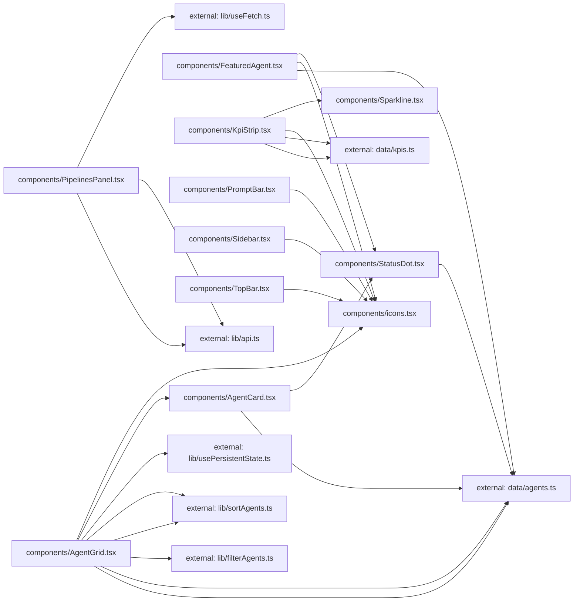

**Folder:** `src/components/`

<!-- fill:folder:summary -->
<FILL: 2-4 sentences on what this folder is for, what kinds of modules belong here, and what does NOT belong here.>
<!-- /fill:folder:summary -->

## Files

| File | Hint |
| --- | --- |
| [`AgentCard.tsx`](../components/agentcard) | <FILL: one-line purpose for AgentCard.tsx> |
| [`AgentGrid.tsx`](../components/agentgrid) | <FILL: one-line purpose for AgentGrid.tsx> |
| [`FeaturedAgent.tsx`](../components/featuredagent) | <FILL: one-line purpose for FeaturedAgent.tsx> |
| [`icons.tsx`](../components/icons) | Minimal inline icon set — 16px, stroke-based, currentColor. |
| [`KpiStrip.tsx`](../components/kpistrip) | <FILL: one-line purpose for KpiStrip.tsx> |
| [`PipelinesPanel.tsx`](../components/pipelinespanel) | <FILL: one-line purpose for PipelinesPanel.tsx> |
| [`PromptBar.tsx`](../components/promptbar) | <FILL: one-line purpose for PromptBar.tsx> |
| [`Sidebar.tsx`](../components/sidebar) | <FILL: one-line purpose for Sidebar.tsx> |
| [`Sparkline.tsx`](../components/sparkline) | <FILL: one-line purpose for Sparkline.tsx> |
| [`StatusDot.tsx`](../components/statusdot) | <FILL: one-line purpose for StatusDot.tsx> |
| [`TopBar.tsx`](../components/topbar) | <FILL: one-line purpose for TopBar.tsx> |

## Dependencies

### Module dependency subgraph

## Key flows

<!-- fill:folder:flows -->
<FILL: 1-3 short descriptions of how modules in this folder cooperate at runtime.>
<!-- /fill:folder:flows -->
