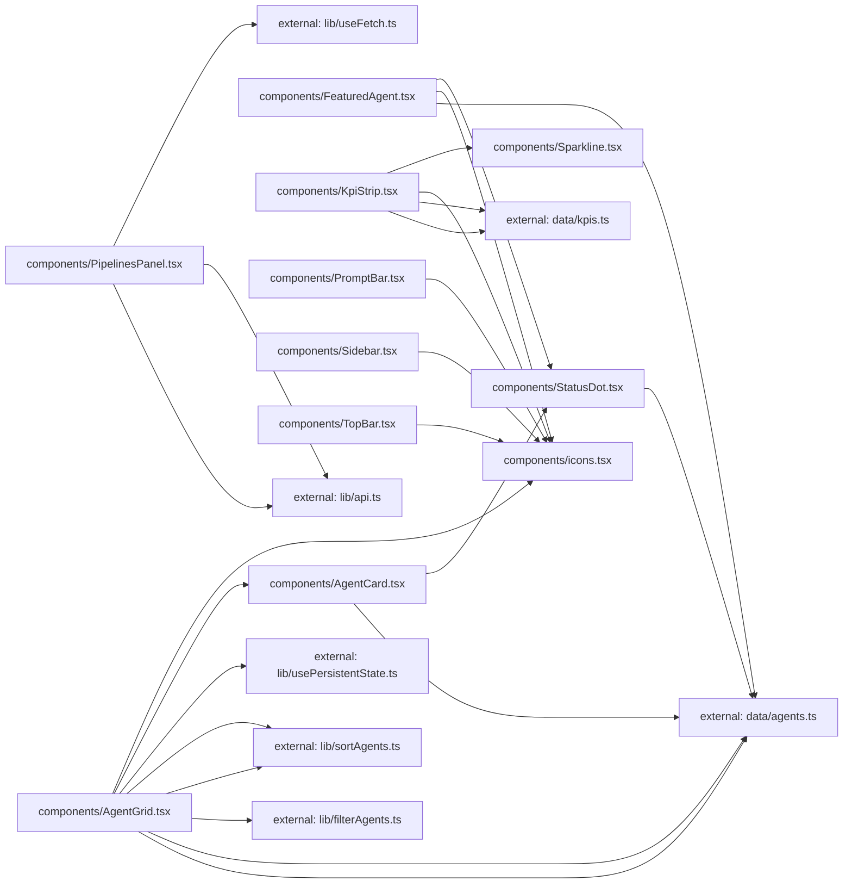

**Folder:** `src/components/`

<!-- fill:folder:summary -->
Every React component that renders dashboard chrome or content lives here. Top-level sections (`Sidebar`, `TopBar`, `KpiStrip`, `FeaturedAgent`, `PipelinesPanel`, `AgentGrid`, `PromptBar`) are mounted directly by `App.tsx`; small leaf components (`AgentCard`, `Sparkline`, `StatusDot`) and the inline `icons.tsx` set are imported by the sections. Pure functions, hooks, and the API client do not belong here — they live in `lib/`; static seed data belongs in `data/`.
<!-- /fill:folder:summary -->

## Files

| File | Hint |
| --- | --- |
| [`AgentCard.tsx`](../components/agentcard) | Single agent tile — status dot, name, category badge, description, and run/success/last-run stats; toggles selection via `onSelect`. |
| [`AgentGrid.tsx`](../components/agentgrid) | Agent list section — category tabs, sort menu, search input, and the responsive grid of `AgentCard`s with category and sort persisted to `localStorage`. |
| [`FeaturedAgent.tsx`](../components/featuredagent) | Hero card at the top of the dashboard — name, status, description, the four headline stats, and a Run-agent button. |
| [`icons.tsx`](../components/icons) | Minimal inline icon set — 16px, stroke-based, currentColor. |
| [`KpiStrip.tsx`](../components/kpistrip) | KPI cards row — renders one card per entry in `KPIS`, each with label, value, delta arrow, sparkline, and hint. |
| [`PipelinesPanel.tsx`](../components/pipelinespanel) | Live CI/CD section — loads pipelines from `GET /api/pipelines` via `useFetch` and handles the loading, error, empty, and populated states. |
| [`PromptBar.tsx`](../components/promptbar) | Bottom prompt input — textarea with model picker; Enter submits, Shift+Enter inserts a newline; submission currently logs to the console. |
| [`Sidebar.tsx`](../components/sidebar) | Left navigation column — workspace switcher, new-session button, nav list, recent sessions, and the user badge. |
| [`Sparkline.tsx`](../components/sparkline) | Tiny axis-free SVG trend line for the KPI cards; colour picked from `positive`. |
| [`StatusDot.tsx`](../components/statusdot) | Coloured dot indicating an agent's `AgentStatus`; `'running'` animates a pulse, the others render a static dot. |
| [`TopBar.tsx`](../components/topbar) | Top header — breadcrumbs, the ⌘K search affordance, and the production-environment picker. |

## Dependencies

### Module dependency subgraph

## Key flows

<!-- fill:folder:flows -->
- **Page composition.** `App.tsx` (outside this folder) mounts `Sidebar`, `TopBar`, `KpiStrip`, `FeaturedAgent`, `PipelinesPanel`, `AgentGrid`, and `PromptBar` in that order. Each is self-contained — the parent passes only the static `agent` and `agents` props derived from the catalogue.
- **Status rendering.** `AgentCard` and `FeaturedAgent` both render an agent's status by importing `StatusDot`, which decides between the pulsing accent dot and a static dot using `AgentStatus` from `data/agents.ts`.
- **KPI strip.** `KpiStrip` maps over `KPIS` and renders a `KpiCard` for each entry; the card uses `Sparkline` (positive colour driven by `kpi.positive`) and one of `IconTrendUp`/`IconTrendDown` chosen from the sign of `kpi.delta`.
<!-- /fill:folder:flows -->
