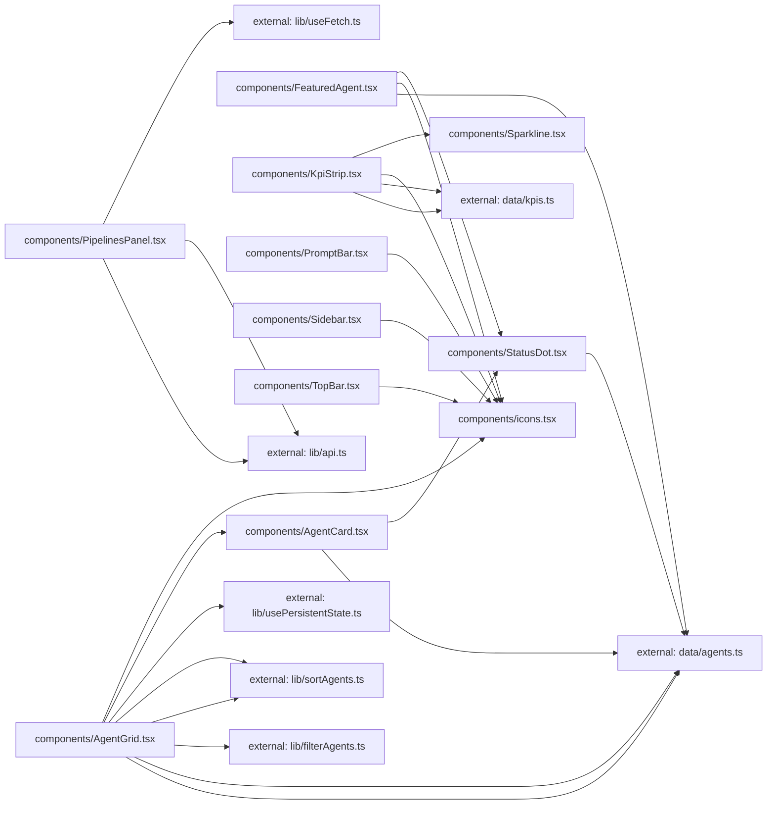

**Folder:** `src/components/`

<!-- fill:folder:summary -->
`src/components/` holds the dashboard's React presentation layer — the chrome (`Sidebar`, `TopBar`, `PromptBar`), the content widgets (`KpiStrip`, `FeaturedAgent`, `PipelinesPanel`, `AgentGrid`/`AgentCard`), and the shared leaf components (`StatusDot`, `Sparkline`, and the `icons.tsx` glyph set). As the dependency subgraph shows, these components consume types and seed data from `data/` and pure logic/hooks from `lib/`; the data transforms, API client, and persistence hooks themselves live under `src/lib/`, not here. Anything that renders markup belongs in this folder; anything that is pure logic or state does not.
<!-- /fill:folder:summary -->

## Files

| File | Hint |
| --- | --- |
| [`AgentCard.tsx`](../components/agentcard) | Renders one agent as a selectable card with status, metrics, and description. |
| [`AgentGrid.tsx`](../components/agentgrid) | Interactive agent browser with category tabs, sort, search, and selection. |
| [`FeaturedAgent.tsx`](../components/featuredagent) | Hero banner highlighting a single featured agent with stats and a CTA. |
| [`icons.tsx`](../components/icons) | Minimal inline icon set — 16px, stroke-based, currentColor. |
| [`KpiStrip.tsx`](../components/kpistrip) | Grid of headline KPI cards, each with a delta and a sparkline. |
| [`PipelinesPanel.tsx`](../components/pipelinespanel) | Live CI/CD pipelines panel fed by the backend API via `useFetch`. |
| [`PromptBar.tsx`](../components/promptbar) | Bottom prompt input for asking an agent or describing a task. |
| [`Sidebar.tsx`](../components/sidebar) | Left navigation rail with nav items, recent sessions, and user footer. |
| [`Sparkline.tsx`](../components/sparkline) | Tiny axis-free SVG trend line used inside KPI cards. |
| [`StatusDot.tsx`](../components/statusdot) | Small colored status indicator; the running state pulses. |
| [`TopBar.tsx`](../components/topbar) | Top header with breadcrumb, search trigger, and environment switcher. |

## Dependencies

### Module dependency subgraph

## Key flows

<!-- fill:folder:flows -->
- **Agent browsing:** `AgentGrid` filters and sorts the agent pool (via `lib/filterAgents` and `lib/sortAgents`) and renders each result as an `AgentCard`, which in turn delegates its status indicator to `StatusDot`.
- **Metrics strip:** `KpiStrip` maps the `data/kpis` seed into cards, each drawing its trend through `Sparkline` and its delta direction through the `IconTrendUp`/`IconTrendDown` glyphs from `icons.tsx`.
- **Live pipelines:** `PipelinesPanel` pulls data through `useFetch(fetchPipelines)` and renders loading, error, empty, and populated states from a single `useFetch` result.
<!-- /fill:folder:flows -->
