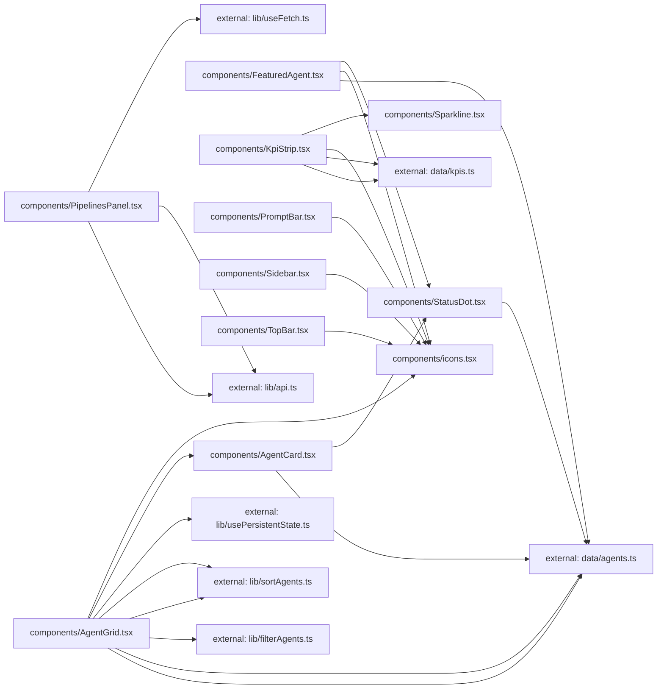

**Folder:** `src/components/`

<!-- fill:folder:summary -->
`src/components/` holds the React presentational and container components that make up the Agent Console UI — the chrome (`Sidebar`, `TopBar`, `PromptBar`), the dashboard widgets (`KpiStrip`, `FeaturedAgent`, `PipelinesPanel`, `AgentGrid`), and the small reusable building blocks (`AgentCard`, `StatusDot`, `Sparkline`, plus the inline `icons` set). New `.tsx` files that render UI and are composed into the page belong here. Pure data-shaping logic (filtering, sorting), hooks, and the typed API client live in `lib/`, and the static seed data lives in `data/`, so those do not belong here even when a component is their only consumer. See the module dependency subgraph below: components depend outward on `lib/` and `data/`, never the reverse. The most important entry point is `AgentGrid`, the primary interactive surface.
<!-- /fill:folder:summary -->

## Files

| File | Hint |
| --- | --- |
| [`AgentCard.tsx`](../components/agentcard) | Clickable card for a single agent, showing status, name, category, and stats; reports selection via `onSelect`. |
| [`AgentGrid.tsx`](../components/agentgrid) | Interactive agent grid with category tabs, search, and sort, rendering filtered/sorted `AgentCard`s. |
| [`FeaturedAgent.tsx`](../components/featuredagent) | Hero banner highlighting one agent with its status, description, stats, and a "Run agent" action. |
| [`icons.tsx`](../components/icons) | Minimal inline icon set — 16px, stroke-based, currentColor. |
| [`KpiStrip.tsx`](../components/kpistrip) | Row of KPI cards from `data/kpis`, each with a value, trend delta, and `Sparkline`. |
| [`PipelinesPanel.tsx`](../components/pipelinespanel) | Live CI/CD pipelines panel that fetches from the API and renders loading/error/empty/list states. |
| [`PromptBar.tsx`](../components/promptbar) | Bottom prompt textarea with Enter-to-send handling (backend wiring still pending). |
| [`Sidebar.tsx`](../components/sidebar) | Left navigation rail with nav items, recent sessions, and a new-session action. |
| [`Sparkline.tsx`](../components/sparkline) | Tiny axis-free SVG trend line used inside KPI cards. |
| [`StatusDot.tsx`](../components/statusdot) | Small colored status indicator (running pulses) plus the `STATUS_LABEL` map. |
| [`TopBar.tsx`](../components/topbar) | Top header with breadcrumb, search trigger, and environment selector. |

## Dependencies

### Module dependency subgraph

## Key flows

<!-- fill:folder:flows -->
- Agent browsing: [`AgentGrid`](../components/agentgrid) keeps its category/sort in `usePersistentState` and query in local state, runs the agents through `filterAgents` then `sortAgents`, and renders the result as [`AgentCard`](../components/agentcard)s; clicking a card calls `onSelect` to update the highlighted selection.
- Pipeline fetching: [`PipelinesPanel`](../components/pipelinespanel) drives `fetchPipelines` through `useFetch`, switching between loading, error, empty, and list states, with its Refresh button calling the hook's `reload`.
- Shared presentation: [`StatusDot`](../components/statusdot) (used by `AgentCard` and `FeaturedAgent`), [`Sparkline`](../components/sparkline) (used by `KpiStrip`), and the [`icons`](../components/icons) set are reused across the chrome and widgets to keep status, trends, and iconography consistent.
<!-- /fill:folder:flows -->
