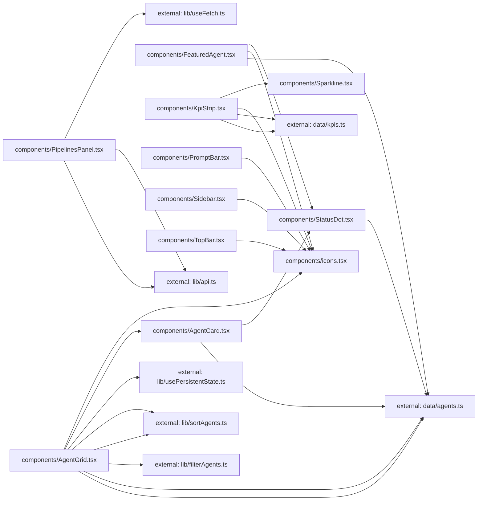

**Folder:** `src/components/`

<!-- fill:folder:summary -->
This folder holds the React UI components of the Agent Console dashboard. It includes the app chrome (`Sidebar`, `TopBar`, `PromptBar`), content panels (`AgentGrid`, `FeaturedAgent`, `KpiStrip`, `PipelinesPanel`), reusable presentational pieces (`AgentCard`, `Sparkline`, `StatusDot`), and the dependency-free `icons` set. Pure data fixtures live in `data/`, and reusable hooks, filtering, sorting, and API helpers live in `lib/` — those do not belong here.
<!-- /fill:folder:summary -->

## Files

| File | Hint |
| --- | --- |
| [`AgentCard.tsx`](../components/agentcard) | Selectable card showing one agent's status, name, category, description, and run stats. |
| [`AgentGrid.tsx`](../components/agentgrid) | Searchable, tabbed, sortable grid of `AgentCard`s with persisted category and sort. |
| [`FeaturedAgent.tsx`](../components/featuredagent) | Hero panel highlighting one agent with its stats and a Run action. |
| [`icons.tsx`](../components/icons) | Minimal inline icon set — 16px, stroke-based, currentColor. |
| [`KpiStrip.tsx`](../components/kpistrip) | Responsive grid of KPI cards rendering value, delta trend, and a `Sparkline`. |
| [`PipelinesPanel.tsx`](../components/pipelinespanel) | Live CI/CD pipeline list fetched from the backend API via `useFetch`. |
| [`PromptBar.tsx`](../components/promptbar) | Bottom prompt input with a model picker and Enter-to-send behavior. |
| [`Sidebar.tsx`](../components/sidebar) | Left navigation rail with workspace switcher, nav items, and recent sessions. |
| [`Sparkline.tsx`](../components/sparkline) | Tiny axis-free SVG trend line used inside KPI cards. |
| [`StatusDot.tsx`](../components/statusdot) | Small colored status indicator that pulses for the running state. |
| [`TopBar.tsx`](../components/topbar) | Top header with breadcrumb, search trigger, and environment switcher. |

## Dependencies

### Module dependency subgraph

## Key flows

<!-- fill:folder:flows -->
- `AgentGrid` reads from `data/agents`, runs the list through `lib/filterAgents` and `lib/sortAgents`, persists the chosen category and sort with `lib/usePersistentState`, and renders one `AgentCard` per match — each card delegating its indicator to `StatusDot`.
- `KpiStrip` maps over `data/kpis`, drawing each metric's trend with `Sparkline` and its delta direction with the `IconTrendUp`/`IconTrendDown` glyphs from `icons`.
- `PipelinesPanel` calls `lib/api.fetchPipelines` through `lib/useFetch`, surfacing loading, empty, and error states and rendering a row per returned pipeline.
<!-- /fill:folder:flows -->
