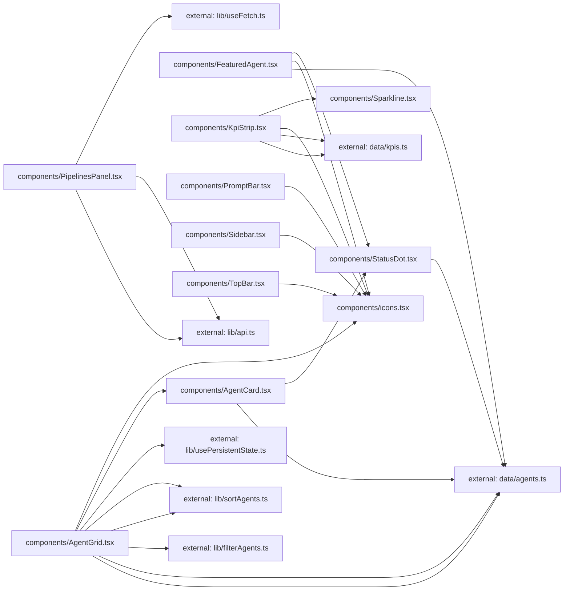

**Folder:** `src/components/`

<!-- fill:folder:summary -->
`src/components/` holds every React UI component for the Agent Console, from the page-level sections (`Sidebar`, `TopBar`, `KpiStrip`, `FeaturedAgent`, `PipelinesPanel`, `AgentGrid`, `PromptBar`) down to leaf primitives (`AgentCard`, `StatusDot`, `Sparkline`) and the shared `icons.tsx` set. As the dependency subgraph shows, components consume data from `data/agents.ts` and `data/kpis.ts` and logic from `src/lib/`, but they own only presentation — JSX, Tailwind classes, and local view state. Pure data transforms, the API client, and reusable hooks live in `src/lib/` and do NOT belong here, nor does the seed data itself.
<!-- /fill:folder:summary -->

## Files

| File | Hint |
| --- | --- |
| [`AgentCard.tsx`](../components/agentcard) | Selectable card showing one agent's status, name, category, description, and run stats. |
| [`AgentGrid.tsx`](../components/agentgrid) | Filterable, sortable grid of agent cards with category tabs, a sort menu, and search. |
| [`FeaturedAgent.tsx`](../components/featuredagent) | Highlighted banner for the single featured agent with its key stats and a Run action. |
| [`icons.tsx`](../components/icons) | Minimal inline icon set — 16px, stroke-based, currentColor. |
| [`KpiStrip.tsx`](../components/kpistrip) | Responsive row of KPI cards, each with a value, delta, sparkline, and hint. |
| [`PipelinesPanel.tsx`](../components/pipelinespanel) | Live CI/CD panel that fetches pipelines and renders loading, error, empty, and list states. |
| [`PromptBar.tsx`](../components/promptbar) | Bottom prompt input with model picker and keyboard submit (backend wiring pending). |
| [`Sidebar.tsx`](../components/sidebar) | Left navigation rail with workspace switcher, nav links, recent sessions, and user footer. |
| [`Sparkline.tsx`](../components/sparkline) | Tiny axis-free SVG trend line used inside KPI cards. |
| [`StatusDot.tsx`](../components/statusdot) | Small colored status indicator; the running state pulses in Snabbit pink. |
| [`TopBar.tsx`](../components/topbar) | Header bar with breadcrumb, command-palette search trigger, and environment switcher. |

## Dependencies

### Module dependency subgraph

## Key flows

<!-- fill:folder:flows -->
- **Agent browsing:** `AgentGrid` runs its `agents` prop through `filterAgents` and `sortAgents`, persists the tab/sort choice via `usePersistentState`, and renders one `AgentCard` per match; each card shows a `StatusDot` and reports selection back up.
- **Metrics row:** `KpiStrip` maps over `data/kpis.ts`, rendering a card per KPI with a trend `Sparkline` and a `IconTrend*` arrow chosen by the delta sign.
- **Live pipelines:** `PipelinesPanel` loads `fetchPipelines` through `useFetch`, then switches between loading, error, empty, and populated row states; the Refresh button calls the hook's `reload`.
<!-- /fill:folder:flows -->
