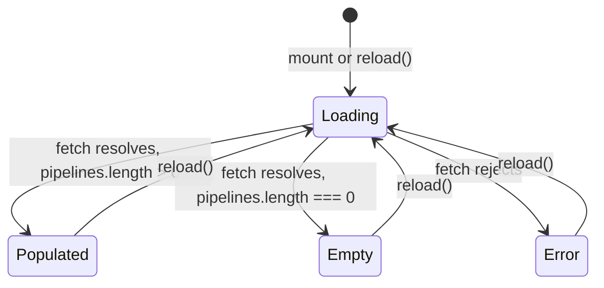

`PipelinesPanel` is the only frontend component that makes a network request. It fetches live CI/CD pipeline data from the backend API via the `useFetch` hook and renders one of four mutually exclusive states: loading, error, empty, or a populated list of pipeline rows.

**File:** `src/components/PipelinesPanel.tsx`

## Dependencies

| Import | Source | Purpose |
|--------|--------|---------|
| `fetchPipelines` | `../lib/api` | API call function; returns a `PipelinesResponse` |
| `Pipeline` (type) | `../lib/api` | Shape of a single pipeline record |
| `useFetch` | `../lib/useFetch` | Data-fetching hook with loading/error/reload state |

## `Pipeline` type (from `src/lib/api.ts`)

`PipelineRow` consumes all fields of `Pipeline`. The expected shape is:

| Field | Type | Purpose |
|-------|------|---------|
| `id` | `string` | React `key` for list rendering |
| `name` | `string` | Human-readable pipeline name, e.g. `"CI / unit tests"` |
| `status` | `"passing" \| "failing" \| "running"` | Current pipeline status |
| `branch` | `string` | Git branch name, e.g. `"main"`, `"feat/chatbot"` |
| `durationSeconds` | `number` | Elapsed run time in whole seconds |
| `triggeredBy` | `string` | Username or event that triggered the run, e.g. `"guna"`, `"schedule"` |

The API response also includes a `summary` object and a `provider` string:

| Field | Type | Purpose |
|-------|------|---------|
| `summary.passRate` | `number` | Percentage of pipelines currently passing |
| `summary.running` | `number` | Count of pipelines currently running |
| `provider` | `string` | CI provider name, e.g. `"GitHub Actions"` |

## Internal utilities

### `STATUS_STYLES`

```ts
const STATUS_STYLES: Record<Pipeline['status'], { dot: string; label: string }> = {
  passing: { dot: 'bg-ok',     label: 'Passing' },
  failing: { dot: 'bg-err',    label: 'Failing' },
  running: { dot: 'bg-accent', label: 'Running' },
}
```

A module-level lookup table that maps each pipeline status value to:
- **`dot`** — a Tailwind background-colour class for the 8×8px status circle
- **`label`** — a human-readable string used as the `title` attribute on the dot (tooltip + accessibility hint)

This centralises all status-to-style mappings so `PipelineRow` avoids a conditional chain. Adding a new status requires only a new entry here.

| Status | `dot` class | Hex colour | `label` |
|--------|------------|-----------|---------|
| `passing` | `bg-ok` | `#3fb950` (green) | `"Passing"` |
| `failing` | `bg-err` | `#f85149` (red) | `"Failing"` |
| `running` | `bg-accent` | `#f70f79` (pink) | `"Running"` |

### `formatDuration(seconds)`

```ts
function formatDuration(seconds: number): string {
  const minutes = Math.floor(seconds / 60)
  const rest = seconds % 60
  return minutes > 0 ? `${minutes}m ${rest}s` : `${rest}s`
}
```

**Parameters:** `seconds` — non-negative integer representing elapsed time.

**Returns:** A compact human-readable duration string.

**Behaviour:**
- When `minutes > 0`: returns `"${minutes}m ${rest}s"` (e.g. `"3m 4s"`)
- When `minutes === 0`: returns `"${rest}s"` (e.g. `"47s"`)

**Examples:**

| Input (`seconds`) | `minutes` | `rest` | Output |
|-------------------|-----------|--------|--------|
| `184` | `3` | `4` | `"3m 4s"` |
| `47` | `0` | `47` | `"47s"` |
| `0` | `0` | `0` | `"0s"` |
| `60` | `1` | `0` | `"1m 0s"` |
| `904` | `15` | `4` | `"15m 4s"` |

:::note
`formatDuration` does not handle durations of one hour or more. The longest known pipeline in the mock data is `904s = 15m 4s`. If real pipelines could exceed 59 minutes 59 seconds, the function would still produce output like `"75m 0s"` rather than `"1h 15m 0s"`.
:::

### `PanelMessage`

```ts
function PanelMessage({ children }: { children: React.ReactNode }): JSX.Element
```

Not exported. A centered, faint-text paragraph used for all three non-data states.

```tsx
<p className="px-3.5 py-10 text-center text-sm text-text-faint">{children}</p>
```

`py-10` (40px vertical padding) gives the empty panel a visible height so it does not collapse to nothing.

### `PipelineRow`

```ts
function PipelineRow({ pipeline }: { pipeline: Pipeline }): JSX.Element
```

Not exported. Renders a single horizontal row in the pipeline list.

**Rendered structure:**

```
<li flex items-center gap-3 px-3.5 py-2.5>
  ├── <span>  Status dot  (h-2 w-2 rounded-full, bg from STATUS_STYLES, title=label)
  ├── <span>  Pipeline name  (truncate text-sm font-medium)
  ├── <span>  Branch chip  (rounded border border-border font-mono text-[11px] text-text-muted)
  ├── <span>  Duration  (ml-auto shrink-0 font-mono text-[11px] text-text-faint)
  └── <span>  Triggered by  (hidden shrink-0 text-xs text-text-faint sm:inline)
```

**Layout notes:**
- The status dot uses `title={style.label}` for a hover tooltip.
- `truncate` on the pipeline name clips long names; all other items are `shrink-0`.
- `ml-auto` on the duration pushes it (and everything after it) to the right, creating a left/right split between name+branch and duration+triggered-by.
- `triggeredBy` is `hidden sm:inline` — hidden on mobile to keep the row compact, visible on ≥ 640px viewports.

## Component signature

```ts
export default function PipelinesPanel(): JSX.Element
```

**Parameters:** None.

**Returns:** A `<section>` element.

**Side effects:** Makes a `GET /api/pipelines` request on mount. Re-requests when the Refresh button is clicked.

## `useFetch` integration

```ts
const { data, loading, error, reload } = useFetch(fetchPipelines)
```

`useFetch` accepts a fetch function and returns:

| Returned value | Type | Description |
|----------------|------|-------------|
| `data` | `PipelinesResponse \| null` | The parsed API response, or `null` while loading or on error |
| `loading` | `boolean` | `true` while the request is in flight |
| `error` | `string \| null` | Error message string on failure, or `null` on success |
| `reload` | `() => void` | Increments an internal nonce, causing the effect to re-run and re-fetch |

## The four render states

The panel content is determined by the combination of `loading`, `error`, `data`, and `data.pipelines.length`:



### State decision table

| `loading` | `error` | `data` | `data.pipelines.length` | Rendered |
|-----------|---------|--------|------------------------|----------|
| `true` | any | any | any | `"Loading pipelines…"` |
| `false` | non-null | any | any | Error message with error string |
| `false` | null | non-null | `0` | `"No recent pipeline runs."` |
| `false` | null | non-null | `> 0` | `<ul>` of `PipelineRow` |

**Loading is checked first.** The `loading` check unconditionally renders the loading message even if stale `data` exists from a previous load. This prevents showing outdated pipeline rows during a refresh.

**Error uses `!loading` guard.** The error check includes `&& !loading` so that if a reload is triggered from an error state, the loading message replaces the error message immediately rather than showing both.

### Loading state

```tsx
{loading && <PanelMessage>Loading pipelines…</PanelMessage>}
```

### Error state

```tsx
{error && !loading && (
  <PanelMessage>
    Could not reach the API ({error}). Is the server running on port 3001?
  </PanelMessage>
)}
```

The error string from `useFetch` (typically `err.message`, e.g. `"Failed to fetch"`) is embedded in parentheses. The hint about port 3001 points developers to the likely cause in local development.

### Empty state

```tsx
{data && !loading && !error && data.pipelines.length === 0 && (
  <PanelMessage>No recent pipeline runs.</PanelMessage>
)}
```

### Populated state

```tsx
{data && !loading && !error && data.pipelines.length > 0 && (
  <ul className="divide-y divide-border">
    {data.pipelines.map((pipeline) => (
      <PipelineRow key={pipeline.id} pipeline={pipeline} />
    ))}
  </ul>
)}
```

`divide-y divide-border` adds a 1px horizontal divider between each `<li>` row using Tailwind's divide utilities. `pipeline.id` is the React key.

## Header section

```tsx
<div className="flex flex-wrap items-center gap-x-2 gap-y-1">
  <h2 className="text-sm font-semibold">CI/CD pipelines</h2>
  {data && (
    <span className="text-xs text-text-faint">
      {data.summary.passRate}% pass rate · {data.summary.running} running · {data.provider}
    </span>
  )}
  <button type="button" onClick={reload}
    className="ml-auto rounded-md border border-border px-2 py-1
               text-xs text-text-muted hover:border-border-strong hover:text-text">
    Refresh
  </button>
</div>
```

The summary line is only rendered when `data` is available (it is `null` during the initial load). The Refresh button calls `reload()` which triggers a new fetch regardless of the current state.

`ml-auto` on the Refresh button pushes it to the far right of the header row.

## Full rendered structure

```
<section flex flex-col gap-3>
  ├── <div>  Header row (flex-wrap)
  │     ├── <h2>  "CI/CD pipelines"
  │     ├── <span>  Summary line (only when data available)
  │     └── <button onClick={reload}>  "Refresh"  (ml-auto)
  └── <div>  Panel body (rounded-lg border border-border bg-surface)
        ├── [loading]    <PanelMessage>Loading pipelines…</PanelMessage>
        ├── [error]      <PanelMessage>Could not reach the API…</PanelMessage>
        ├── [empty]      <PanelMessage>No recent pipeline runs.</PanelMessage>
        └── [populated]  <ul divide-y>
                           └── {pipelines.map} <PipelineRow key=id />
```

## Styling notes

| Token / class | Element | Purpose |
|---------------|---------|---------|
| `bg-surface` | Panel body | Card surface colour |
| `border-border` | Panel body | Card border |
| `rounded-lg` | Panel body | 8px corner radius |
| `divide-y divide-border` | `<ul>` | 1px row dividers using Tailwind divide utilities |
| `bg-ok` | Status dot | Green for passing |
| `bg-err` | Status dot | Red for failing |
| `bg-accent` | Status dot | Pink for running |
| `font-mono text-[11px]` | Branch chip, duration | Monospaced for branch names and durations |
| `truncate` | Pipeline name | Clips long names |
| `hidden sm:inline` | `triggeredBy` | Responsive visibility |

## Edge cases and assumptions

- **Initial load:** `data` is `null` and `loading` is `true`. Only the loading message is shown; the header summary line is hidden.
- **Reload while loading:** The Refresh button remains visible and clickable during loading. Clicking it again triggers another `reload()` call. The `useFetch` implementation should debounce or ignore rapid calls, but this is not enforced at the component level.
- **Partial data on error:** If the API returns a 200 but with an unexpected body, `fetchPipelines` (in `src/lib/api.ts`) is responsible for throwing so that `useFetch` catches it and sets `error`. `PipelinesPanel` trusts the fetch function to do so.
- **`durationSeconds` is a float:** `formatDuration` calls `Math.floor` and `% 60` on the input. Float inputs will be floored correctly (e.g. `184.9` → `3m 4s`).
- **`durationSeconds` is negative:** `Math.floor(-1 / 60)` is `-1`, producing `"-1m 59s"`. The data layer is expected to always provide non-negative values.
