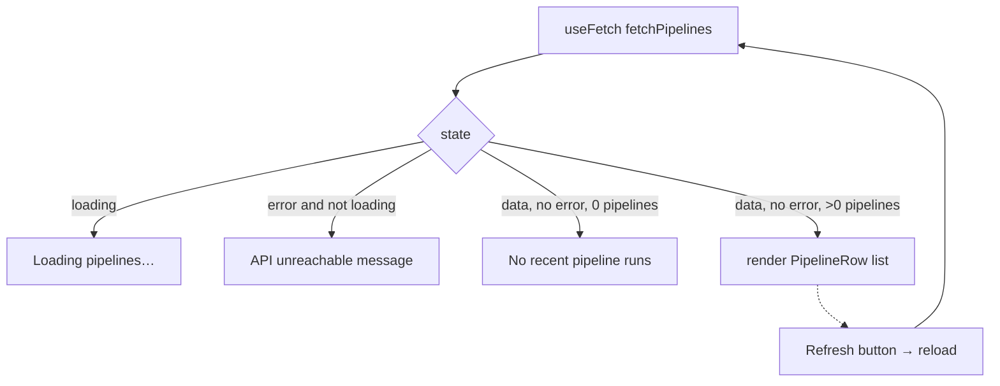

<!-- structure:4d1c27003e01 -->

**File:** `src/components/PipelinesPanel.tsx` · **Lines:** 93

<!-- fill:file:summary -->
`PipelinesPanel.tsx` is the live CI/CD pipelines widget, fetching pipeline data from the backend and rendering it as a list with loading, error, and empty states plus a refresh button. It calls `fetchPipelines` (and uses the `Pipeline` type) from `../lib/api`, driving the request through the `useFetch` hook from `../lib/useFetch`. Local helpers (`STATUS_STYLES`, `formatDuration`, `PanelMessage`, `PipelineRow`) handle per-row presentation. It is mounted by `App.tsx` and tested in `PipelinesPanel.test.tsx`.
<!-- /fill:file:summary -->

## Imports

This file pulls in the following modules. Relative imports point to other documented files; external imports are libraries from `node_modules`.

| Module | Imports | Kind |
| --- | --- | --- |
| `../lib/api` | `fetchPipelines` | internal |
| `../lib/api` | `Pipeline` | type-only · internal |
| `../lib/useFetch` | `useFetch` | internal |


## Symbols

This file exports 1 symbol. Every export is documented below, in declaration order.

| Name | Kind | Default |
| --- | --- | --- |
| PipelinesPanel | component | yes |

## PipelinesPanel (default export)

**Kind:** `component`

```ts
export default function PipelinesPanel() { ... }
```

> Live CI/CD pipeline panel — data comes from the backend API.

### Line-by-line walkthrough

Each top-level statement of `PipelinesPanel`, in execution order. The line numbers reference the source file as it appears today.

**Line 47 — `FirstStatement`**

```ts
const { data, loading, error, reload } = useFetch(fetchPipelines)
```

<!-- fill:sym:PipelinesPanel:walk:0 -->
Destructures `{ data, loading, error, reload }` from `useFetch(fetchPipelines)`. The hook invokes the async `fetchPipelines` request (typically on mount), exposing the resolved payload as `data`, the in-flight flag as `loading`, any failure message as `error`, and a `reload` callback to re-run the request. Centralizing the async lifecycle in `useFetch` keeps this component free of manual `useEffect`/state plumbing.
<!-- /fill:sym:PipelinesPanel:walk:0 -->

**Line 49 — `ReturnStatement`**

```ts
return (
    <section className="flex flex-col gap-3">
      <div className="flex flex-wrap items-center gap-x-2 gap-y-1">
        <h2 className="text-sm font-semibold">CI/CD pipelines</h2>
        {data && (
          <span className="text-xs text-text-faint">
            {data.summary.passRate}% pass rate · {data.summary.running} running ·{' '}
            {data.provider}
          </span>
        )}
        <button
          type="button"
          onClick={reload}
          className="ml-auto rounded-md border border-border px-2 py-1 text-xs text-text-muted hover:border-border-strong hover:text-text"
        >
          Refresh
        </button>
      </div>

      <div className="rounded-lg border border-border bg-surface">
        {loading && <PanelMessage>Loading pipelines…</PanelMessage>}

        {error && !loading && (
          <PanelMessage>
            Could not reach the API ({error}). Is the server running on port
            3001?
          </PanelMessage>
        )}

        {data && !loading && !error && data.pipelines.length === 0 && (
          <PanelMessage>No recent pipeline runs.</PanelMessage>
        )}

        {data && !loading && !error && data.pipelines.length > 0 && (
          <ul className="divide-y divide-border">
            {data.pipelines.map((pipeline) => (
              <PipelineRow key={pipeline.id} pipeline={pipeline} />
            ))}
          </ul>
        )}
      </div>
    </section>
  )
```

<!-- fill:sym:PipelinesPanel:walk:1 -->
Returns the panel. The header shows the "CI/CD pipelines" title; when `data` is present it appends a summary line (`data.summary.passRate`% pass rate, `data.summary.running` running, and `data.provider`), and a right-aligned "Refresh" button wires `onClick` to `reload`. The body is a sequence of mutually exclusive conditionals: `loading` shows a "Loading pipelines…" `PanelMessage`; `error && !loading` shows a reachability message interpolating `error`; `data && !loading && !error && data.pipelines.length === 0` shows "No recent pipeline runs."; and the success branch (`data.pipelines.length > 0`) renders a `<ul>` mapping each pipeline to a `PipelineRow`. The guard chain ensures exactly one state renders at a time.
<!-- /fill:sym:PipelinesPanel:walk:1 -->

### Behavior

<!-- fill:sym:PipelinesPanel:behavior -->
- The component delegates its async lifecycle to `useFetch(fetchPipelines)`. Passing the module-level `fetchPipelines` (a stable reference) is required — passing an inline arrow would re-fire the effect every render.
- The header has three slots in a `flex-wrap` row: the `<h2>`, a conditional summary (`data && …`) interpolating `passRate`, `running`, and `provider`, and an `ml-auto` Refresh button that calls `reload()` on click.
- The body is a four-way conditional, written as a chain of mutually exclusive `{…}` JSX expressions so React only renders one branch at a time:
  - `loading` → `<PanelMessage>Loading pipelines…</PanelMessage>`
  - `error && !loading` → an unreachable-API message that interpolates the `error` string and prompts to check port 3001.
  - `data && !loading && !error && data.pipelines.length === 0` → `<PanelMessage>No recent pipeline runs.</PanelMessage>`
  - `data && !loading && !error && data.pipelines.length > 0` → a `<ul className="divide-y divide-border">` mapping each `pipeline` to a `<PipelineRow>`.
- Each `PipelineRow` looks up its styling in `STATUS_STYLES` (`passing` → `bg-ok`, `failing` → `bg-err`, `running` → `bg-accent`) and formats `durationSeconds` via the local `formatDuration` helper.
- The test "renders pipelines returned by the API" stubs `fetch` and asserts both pipeline names appear; "shows an error state when the API is unreachable" rejects the fetch and asserts the `/could not reach the api/i` message renders.
- No ARIA roles are added — the `<ul>`/`<li>`/`<button>` semantics are enough; the `title` attribute on the status dot provides a hover tooltip for screen readers.
<!-- /fill:sym:PipelinesPanel:behavior -->

### Examples

<!-- fill:sym:PipelinesPanel:example -->
```tsx
import PipelinesPanel from './components/PipelinesPanel'

// Takes no props — it fetches its own data via useFetch(fetchPipelines).
<PipelinesPanel />
```

On mount it shows "Loading pipelines…", then either lists the pipelines returned by the API (test "renders pipelines returned by the API") or, if the request fails, the error message asking whether the server is running on port 3001 (test "shows an error state when the API is unreachable").
<!-- /fill:sym:PipelinesPanel:example -->

### Used by

- `src/App.tsx`
- `src/components/PipelinesPanel.test.tsx`

## Tests

| Suite | Test | Asserts |
| --- | --- | --- |
| <PipelinesPanel /> | renders pipelines returned by the API | Stubs `fetch` to resolve with a two-pipeline payload and asserts both "CI · build & test" and "E2E suite" rows appear in the rendered list. |
| <PipelinesPanel /> | shows an error state when the API is unreachable | Stubs `fetch` to reject with `'network down'` and asserts the `/could not reach the api/i` `PanelMessage` renders, confirming the error branch. |

## Diagrams

<!-- fill:file:diagrams -->

<!-- /fill:file:diagrams -->
