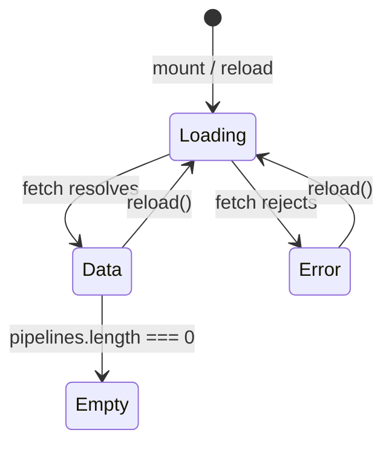

**File:** `src/components/PipelinesPanel.tsx`

The only frontend component that makes a network call. Fetches pipeline data
from `GET /api/pipelines` via `useFetch` and renders one of four states:
loading, error, empty, or a list of pipeline rows.

## Internal utilities

### `STATUS_STYLES`

```ts
const STATUS_STYLES: Record<Pipeline['status'], { dot: string; label: string }> = {
  passing: { dot: 'bg-ok',     label: 'Passing' },
  failing: { dot: 'bg-err',    label: 'Failing' },
  running: { dot: 'bg-accent', label: 'Running' },
}
```

Maps each pipeline status to the CSS class for the colored dot and a tooltip
label. Centralised here so `PipelineRow` avoids a conditional chain.

### `formatDuration(seconds)`

```ts
function formatDuration(seconds: number): string {
  const minutes = Math.floor(seconds / 60)
  const rest = seconds % 60
  return minutes > 0 ? `${minutes}m ${rest}s` : `${rest}s`
}
```

**Parameters:** `seconds: number` — elapsed seconds as a non-negative integer.

**Returns:** Human-readable duration string.

**Examples:**

| Input | Output |
|-------|--------|
| `184` | `'3m 4s'` |
| `47` | `'47s'` |
| `0` | `'0s'` |
| `60` | `'1m 0s'` |

Outputs `${minutes}m ${rest}s` when `minutes > 0`, otherwise just `${rest}s`.
Does not handle hours; the longest mock pipeline (`Nightly regression`) is
`904s = 15m 4s`.

### `PanelMessage`

```ts
function PanelMessage({ children }: { children: React.ReactNode })
```

A centered, faint-text paragraph used for all three non-data states (loading,
error, empty). Not exported.

### `PipelineRow`

```ts
function PipelineRow({ pipeline }: { pipeline: Pipeline })
```

Renders a single row in the pipeline list. Not exported.

**Layout:**
```
<li flex items-center gap-3 px-3.5 py-2.5>
  ├── Status dot  (h-2 w-2 rounded-full, color from STATUS_STYLES)
  ├── Pipeline name  (truncate font-medium)
  ├── Branch chip  (border font-mono text-[11px])
  ├── Duration  (ml-auto font-mono text-[11px])  (ml-auto)
  └── Triggered by  (hidden sm:inline text-xs)
```

`triggeredBy` is hidden on mobile (`hidden sm:inline`) to keep the row compact
on small screens.

## Component

```ts
export default function PipelinesPanel()
```

**Parameters:** None.

**Returns:** A `<section>` element.

**Side effects:** Makes a network request to `GET /api/pipelines` on mount.
Re-requests when the Refresh button is clicked.

## State machine



The four display states are driven by `{ data, loading, error }` from `useFetch`:

| `loading` | `error` | `data` | `data.pipelines.length` | Rendered |
|-----------|---------|--------|------------------------|----------|
| `true` | any | any | any | "Loading pipelines…" |
| `false` | non-null | any | any | Error message with error string |
| `false` | null | non-null | `0` | "No recent pipeline runs." |
| `false` | null | non-null | `> 0` | List of `PipelineRow`s |

### Loading state priority

The loading check comes first in the JSX:

```tsx
{loading && <PanelMessage>Loading pipelines…</PanelMessage>}

{error && !loading && (
  <PanelMessage>
    Could not reach the API ({error}). Is the server running on port 3001?
  </PanelMessage>
)}
```

The error message includes the actual error string in parentheses, which
typically comes from `useFetch`'s `err.message` (e.g. `"Failed to fetch"`).
`!loading` prevents briefly showing the error while a reload is in progress.

## Header section

```tsx
<div className="flex flex-wrap items-center gap-x-2 gap-y-1">
  <h2 className="text-sm font-semibold">CI/CD pipelines</h2>
  {data && (
    <span className="text-xs text-text-faint">
      {data.summary.passRate}% pass rate · {data.summary.running} running · {data.provider}
    </span>
  )}
  <button type="button" onClick={reload} className="ml-auto ...">
    Refresh
  </button>
</div>
```

The summary line (`{passRate}% pass rate · {running} running · {provider}`) is
only shown when `data` is available. The Refresh button calls `useFetch`'s
`reload()`, which increments the nonce, re-triggering the effect.

## Tests

`src/components/PipelinesPanel.test.tsx`:

| Test | Asserts |
|------|---------|
| renders pipelines returned by the API | Fetches succeed → pipeline names visible |
| shows an error state when the API is unreachable | Fetch rejects → error message visible |

Both tests stub `global.fetch` with `vi.stubGlobal`.

## Used by

`App.tsx` — rendered as the third panel inside the scrollable `<main>`.
