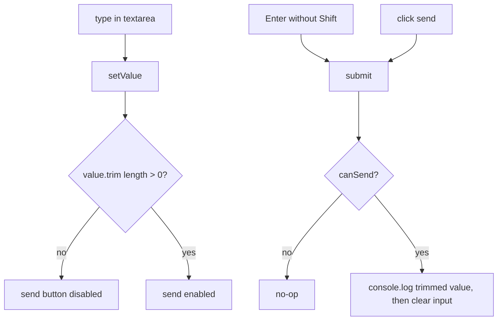

**File:** `src/components/PromptBar.tsx` · **Lines:** 58

<!-- fill:file:summary -->
`PromptBar.tsx` is the sticky composer at the bottom of the console where the user types a prompt for an agent. It manages the textarea's value with local `useState`, enables the send button only for non-empty input, and submits on click or on Enter (Shift+Enter inserts a newline). It pulls `IconSparkle`, `IconChevronDown`, and `IconArrowUp` from `./icons` for the model selector and send button, and is mounted by `App.tsx`. Backend wiring is a placeholder (tracked in `BACKLOG.md`); for now submitting logs to the console and clears the input.
<!-- /fill:file:summary -->

## Imports

This file pulls in the following modules. Relative imports point to other documented files; external imports are libraries from `node_modules`.

| Module | Imports | Kind |
| --- | --- | --- |
| `react` | `useState` | external |
| `./icons` | `IconArrowUp`, `IconChevronDown`, `IconSparkle` | internal |


## Symbols

This file exports 1 symbol. Every export is documented below, in declaration order.

| Name | Kind | Default |
| --- | --- | --- |
| PromptBar | component | yes |

## PromptBar (default export)

**Kind:** `component`

```ts
export default function PromptBar() { ... }
```

<!-- fill:sym:PromptBar:summary -->
`PromptBar` is a zero-prop component that renders a controlled `<textarea>` plus a footer with a model-picker button ("Opus 4.7"), a keyboard hint, and a send button. It tracks the input in `value` state and derives `canSend` from whether the trimmed value is non-empty, which both disables the send button and short-circuits `submit`. Pressing Enter without Shift triggers `submit`, which currently logs the trimmed prompt and resets the field — a stand-in until the backend is wired up.
<!-- /fill:sym:PromptBar:summary -->

### Line-by-line walkthrough

Each top-level statement of `PromptBar`, in execution order. The line numbers reference the source file as it appears today.

**Line 5 — `FirstStatement`**

```ts
const [value, setValue] = useState('')
```

<!-- fill:sym:PromptBar:walk:0 -->
Declares `[value, setValue] = useState('')`, the controlled state backing the textarea. It starts empty and is updated on every `onChange`, making React the single source of truth for the prompt text.
<!-- /fill:sym:PromptBar:walk:0 -->

**Line 6 — `FirstStatement`**

```ts
const canSend = value.trim().length > 0
```

<!-- fill:sym:PromptBar:walk:1 -->
Computes `canSend = value.trim().length > 0`, a derived boolean that is `true` only when the input has non-whitespace content. It is recomputed each render from `value` (no separate state needed) and gates both the send button's `disabled` attribute and the early return inside `submit`, preventing empty or whitespace-only submissions.
<!-- /fill:sym:PromptBar:walk:1 -->

**Line 8 — `FunctionDeclaration`**

```ts
function submit() {
    if (!canSend) return
    // Backend wiring is tracked in BACKLOG.md; for now this clears the input.
    console.log('Prompt submitted:', value.trim())
    setValue('')
  }
```

<!-- fill:sym:PromptBar:walk:2 -->
Defines `submit()`, the send handler shared by the button click and the Enter key. It first guards with `if (!canSend) return` so empty input is a no-op, then `console.log`s the trimmed value (a placeholder for the real backend call noted in `BACKLOG.md`), and finally `setValue('')` clears the textarea. Declaring it as a named inner function keeps the logic in one place for both invocation paths.
<!-- /fill:sym:PromptBar:walk:2 -->

**Line 15 — `ReturnStatement`**

```ts
return (
    <div className="shrink-0 border-t border-border bg-bg px-4 py-3">
      <div className="rounded-lg border border-border bg-surface focus-within:border-border-strong">
        <textarea
          value={value}
          onChange={(e) => setValue(e.target.value)}
          onKeyDown={(e) => {
            if (e.key === 'Enter' && !e.shiftKey) {
              e.preventDefault()
              submit()
            }
          }}
          rows={2}
          placeholder="Ask an agent or describe a task…"
          aria-label="Prompt input"
          className="block w-full resize-none bg-transparent px-3 py-2.5 text-sm outline-none placeholder:text-text-faint"
        />
        <div className="flex items-center gap-2 px-2.5 py-2">
          <button
            type="button"
            className="flex items-center gap-1.5 rounded-md border border-border px-2 py-1 text-xs text-text-muted hover:border-border-strong hover:text-text"
          >
            <IconSparkle className="h-3.5 w-3.5 text-accent" />
            Opus 4.7
            <IconChevronDown className="h-3.5 w-3.5" />
          </button>
          <span className="hidden text-xs text-text-faint sm:inline">
            Enter to send · Shift+Enter for newline
          </span>
          <button
            type="button"
            onClick={submit}
            disabled={!canSend}
            aria-label="Send prompt"
            className="ml-auto grid h-7 w-7 place-items-center rounded-md bg-accent text-white hover:bg-accent-hover disabled:cursor-not-allowed disabled:opacity-40"
          >
            <IconArrowUp className="h-4 w-4" />
          </button>
        </div>
      </div>
    </div>
  )
```

<!-- fill:sym:PromptBar:walk:3 -->
Returns the composer UI. The bordered container holds a controlled `<textarea>` bound to `value`/`setValue` with an `onKeyDown` that intercepts Enter without Shift — calling `e.preventDefault()` and `submit()` so Enter sends while Shift+Enter still inserts a newline. The footer row contains the model-selector button (`IconSparkle`, "Opus 4.7", `IconChevronDown`), an `sm:`-only hint ("Enter to send · Shift+Enter for newline"), and the send `<button>` whose `onClick` is `submit`, `disabled={!canSend}`, and styled to dim/disable when empty. `aria-label`s on the textarea and send button keep it accessible.
<!-- /fill:sym:PromptBar:walk:3 -->

### Examples

<!-- fill:sym:PromptBar:example -->
```tsx
import PromptBar from './components/PromptBar'

// Pinned at the bottom of the layout; takes no props.
<PromptBar />
```

Typing "Summarize the failing runs" and pressing Enter logs `Prompt submitted: Summarize the failing runs` and clears the textarea; an empty or whitespace-only field leaves the send button disabled and `submit` a no-op.
<!-- /fill:sym:PromptBar:example -->

### Used by

- `src/App.tsx`

## Diagrams

<!-- fill:file:diagrams -->

<!-- /fill:file:diagrams -->

## Source

Full file source for `src/components/PromptBar.tsx` (58 lines). The line-by-line walkthroughs above reference these line numbers.

<details>
<summary>View source (58 lines)</summary>

````tsx
import { useState } from 'react'
import { IconArrowUp, IconChevronDown, IconSparkle } from './icons'

export default function PromptBar() {
  const [value, setValue] = useState('')
  const canSend = value.trim().length > 0

  function submit() {
    if (!canSend) return
    // Backend wiring is tracked in BACKLOG.md; for now this clears the input.
    console.log('Prompt submitted:', value.trim())
    setValue('')
  }

  return (
    <div className="shrink-0 border-t border-border bg-bg px-4 py-3">
      <div className="rounded-lg border border-border bg-surface focus-within:border-border-strong">
        <textarea
          value={value}
          onChange={(e) => setValue(e.target.value)}
          onKeyDown={(e) => {
            if (e.key === 'Enter' && !e.shiftKey) {
              e.preventDefault()
              submit()
            }
          }}
          rows={2}
          placeholder="Ask an agent or describe a task…"
          aria-label="Prompt input"
          className="block w-full resize-none bg-transparent px-3 py-2.5 text-sm outline-none placeholder:text-text-faint"
        />
        <div className="flex items-center gap-2 px-2.5 py-2">
          <button
            type="button"
            className="flex items-center gap-1.5 rounded-md border border-border px-2 py-1 text-xs text-text-muted hover:border-border-strong hover:text-text"
          >
            <IconSparkle className="h-3.5 w-3.5 text-accent" />
            Opus 4.7
            <IconChevronDown className="h-3.5 w-3.5" />
          </button>
          <span className="hidden text-xs text-text-faint sm:inline">
            Enter to send · Shift+Enter for newline
          </span>
          <button
            type="button"
            onClick={submit}
            disabled={!canSend}
            aria-label="Send prompt"
            className="ml-auto grid h-7 w-7 place-items-center rounded-md bg-accent text-white hover:bg-accent-hover disabled:cursor-not-allowed disabled:opacity-40"
          >
            <IconArrowUp className="h-4 w-4" />
          </button>
        </div>
      </div>
    </div>
  )
}

````

</details>
