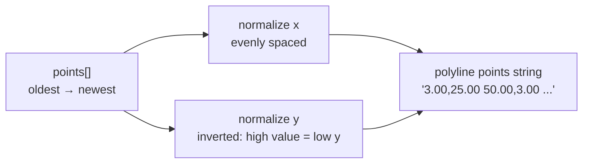

**File:** `src/components/Sparkline.tsx`

A minimal SVG sparkline that renders a series of numbers as a trend line.
Used exclusively inside `KpiCard` (within `KpiStrip`) to visualize each KPI's
7-point history.

## Interface

```ts
interface SparklineProps {
  points: number[]
  positive: boolean
  className?: string
}
```

| Prop | Type | Purpose |
|------|------|---------|
| `points` | `number[]` | Data series, **oldest first**. Must have at least two values to render. |
| `positive` | `boolean` | Controls stroke color. `true` → `--color-ok` (green), `false` → `--color-err` (red). |
| `className` | `string?` | Optional CSS class applied to the `<svg>`. Defaults to `'h-7 w-full'`. |

## Component

```ts
export default function Sparkline({ points, positive, className }: SparklineProps)
```

**Returns:** An `<svg>` element containing a `<polyline>`, or `null` if
`points.length < 2`.

**Side effects:** None. Pure rendering.

## Implementation walkthrough

### Early return guard

```ts
if (points.length < 2) return null
```

A single point cannot form a line. Returning `null` avoids a degenerate SVG
with no visual output and prevents division-by-zero in the normalization step.

### Coordinate system

```ts
const width = 100
const height = 28
const pad = 3
```

The SVG uses a fixed logical coordinate space of 100 × 28 units.
A 3-unit padding on all sides prevents the line from being clipped at the
edges of the viewport. The `preserveAspectRatio="none"` attribute on the `<svg>`
stretches these logical units to fill whatever CSS size is applied.

### Normalization

```ts
const min = Math.min(...points)
const max = Math.max(...points)
const range = max - min || 1
```

`range` is clamped to 1 when all values are identical (a flat series), which
would otherwise produce division by zero.

### Coordinate mapping

```ts
const coords = points
  .map((value, i) => {
    const x = pad + (i / (points.length - 1)) * (width - pad * 2)
    const y = height - pad - ((value - min) / range) * (height - pad * 2)
    return `${x.toFixed(2)},${y.toFixed(2)}`
  })
  .join(' ')
```

**X axis** — evenly distributes points across `[pad, width - pad]`. The first
point maps to `x = pad` (3); the last maps to `x = width - pad` (97).

**Y axis** — normalized `(value - min) / range` produces 0.0 (min) to 1.0
(max). This is then scaled and **inverted** because SVG Y increases downward:
`height - pad - normalised * (height - pad * 2)` maps 0.0 to `height - pad`
(bottom) and 1.0 to `pad` (top), so higher values are visually higher.

`toFixed(2)` keeps the SVG attribute string compact without sacrificing visual
quality.

### Polyline element

```ts
<polyline
  points={coords}
  fill="none"
  stroke={positive ? 'var(--color-ok)' : 'var(--color-err)'}
  strokeWidth="1.5"
  strokeLinecap="round"
  strokeLinejoin="round"
  vectorEffect="non-scaling-stroke"
/>
```

`fill="none"` prevents the area under the line from being filled.

`vectorEffect="non-scaling-stroke"` is the key detail: because
`preserveAspectRatio="none"` stretches the SVG to fill its container, the
stroke width would normally scale with the viewport and look thick or thin
depending on the container size. `non-scaling-stroke` keeps the visual stroke
width at a constant 1.5px regardless of the element's rendered dimensions.

`aria-hidden="true"` on the outer `<svg>` excludes the element from the
accessibility tree — the KpiCard provides a text `hint` beneath the sparkline
that conveys the same information.

## Coordinate calculation example

For `points = [10, 20, 15]` with the default 100×28 viewport (pad=3):

| i | value | x | y |
|---|-------|---|---|
| 0 | 10 | 3.00 | 25.00 |
| 1 | 20 | 50.00 | 3.00 |
| 2 | 15 | 97.00 | 14.00 |



## Edge cases

| Scenario | Behavior |
|----------|----------|
| `points.length === 0` | Returns `null` (guard fires) |
| `points.length === 1` | Returns `null` (guard fires) |
| All values equal | `range` is clamped to 1; produces a flat horizontal line at vertical center |
| `positive` is `false` | Stroke becomes `var(--color-err)` (red); tested in `Sparkline.test.tsx` |

## Tests

`src/components/Sparkline.test.tsx` covers three cases:

| Test | Asserts |
|------|---------|
| renders a polyline with one coordinate per value | 4-point series → `<polyline>` with 4 whitespace-separated coordinates |
| renders nothing when given fewer than two points | Single-point series → no `<polyline>` in the DOM |
| uses the error color when not positive | `positive={false}` → stroke attribute contains `color-err` |

## Used by

- `KpiCard` (internal subcomponent of `KpiStrip`) — passes `kpi.trend` as
  `points` and `kpi.positive` as `positive`.
