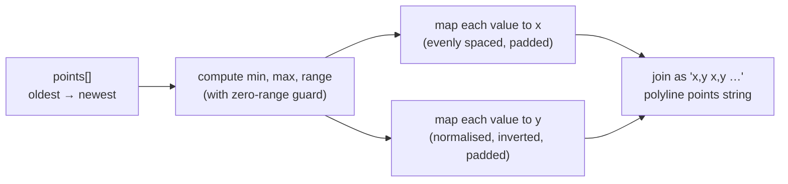

`Sparkline` renders a minimal SVG trend line from an array of numbers. It uses a fixed 100×28 logical viewport with 3-unit padding, maps data points to polyline coordinates, and stretches to fill whatever CSS size is applied. It is used exclusively inside `KpiCard` (within `KpiStrip`) to visualise each KPI's historical trend.

**File:** `src/components/Sparkline.tsx`

## Props interface

```ts
interface SparklineProps {
  points: number[]
  positive: boolean
  className?: string
}
```

| Prop | Type | Required | Purpose |
|------|------|----------|---------|
| `points` | `number[]` | Yes | Data series, **oldest first, newest last**. Must contain at least 2 values; returns `null` for 0 or 1 points. |
| `positive` | `boolean` | Yes | Controls stroke colour. `true` → `var(--color-ok)` (green); `false` → `var(--color-err)` (red). |
| `className` | `string` | No | CSS class applied to the `<svg>` element. Defaults to `'h-7 w-full'` when `undefined`. |

## Component signature

```ts
export default function Sparkline({ points, positive, className }: SparklineProps): JSX.Element | null
```

**Returns:** An `<svg>` element containing a `<polyline>`, or `null` if `points.length < 2`.

**Side effects:** None. Pure rendering with no state or effects.

## Early return guard

```ts
if (points.length < 2) return null
```

A single point cannot form a line segment. Returning `null`:
- Avoids a degenerate `<polyline points="">` with no visual output.
- Prevents division-by-zero at `i / (points.length - 1)` where `points.length - 1` would be `0`.

## Coordinate system constants

```ts
const width  = 100
const height = 28
const pad    = 3
```

The SVG uses a **fixed logical coordinate space** of 100 × 28 units. These numbers are the viewBox dimensions and have no relationship to CSS pixels. The `preserveAspectRatio="none"` attribute on the `<svg>` scales this logical space to fill whatever CSS size is applied (e.g. `h-7 w-full` from `KpiCard`).

The `pad = 3` value reserves 3 units of margin on all four edges. Without padding, the polyline endpoints would sit exactly on the SVG boundary and the `strokeWidth="1.5"` stroke would be visually clipped in half. With `pad = 3`, the drawable area is:

- X: from `3` to `97` (100 − 3 − 3 = 94 units wide)
- Y: from `3` to `25` (28 − 3 − 3 + 28 = 22 units tall, noting the Y formula below)

## Normalization

```ts
const min   = Math.min(...points)
const max   = Math.max(...points)
const range = max - min || 1
```

- `min` and `max` are the extremes of the data series.
- `range = max - min` is the total span of values.
- `|| 1` is a division-by-zero guard: when all values are identical (`max === min`), `range` would be `0`, causing `NaN` in the Y formula. Clamping to `1` instead produces a flat horizontal line at the vertical midpoint.

## Coordinate mapping

```ts
const coords = points.map((value, i) => {
  const x = pad + (i / (points.length - 1)) * (width - pad * 2)
  const y = height - pad - ((value - min) / range) * (height - pad * 2)
  return `${x.toFixed(2)},${y.toFixed(2)}`
}).join(' ')
```

### X axis calculation

```
x = pad + (i / (points.length - 1)) * (width - pad * 2)
  = 3   + (i / (N - 1))             * 94
```

| `i` | `N` | `x` |
|-----|-----|-----|
| 0 (first point) | any | `3.00` (left edge + padding) |
| `N−1` (last point) | any | `97.00` (right edge − padding) |
| middle | e.g. `7` | evenly interpolated between 3 and 97 |

Points are evenly distributed across the drawable horizontal span regardless of the actual index values or time intervals between them. The chart is a shape chart, not a time-scaled chart.

### Y axis calculation

```
y = height - pad - ((value - min) / range) * (height - pad * 2)
  = 28     - 3   - normalised              * 22
  = 25            - normalised             * 22
```

| Normalised value | `y` | Position |
|-----------------|-----|----------|
| `0.0` (minimum) | `25.00` | Near bottom (25 out of 28 units down) |
| `1.0` (maximum) | `3.00` | Near top (3 units down — the padding amount) |
| `0.5` (midpoint) | `14.00` | Vertical centre |

**SVG Y-axis inversion:** In SVG, Y=0 is at the top and increases downward. A higher data value should appear visually higher (lower Y coordinate). The formula achieves this by starting from `height - pad` (the bottom of the drawable area) and subtracting the normalised value scaled to the drawable height. Higher normalised values subtract more, producing a lower Y (higher visual position).

### `toFixed(2)`

Rounds coordinates to 2 decimal places. This keeps the `points` attribute string compact (an 8-point series produces ≈ 80 characters) without any visible precision loss at display sizes of roughly 200–400px wide.

## Full worked example

For `points = [10, 20, 15]` with the 100×28 viewport and `pad = 3`:

```
min = 10, max = 20, range = 10
drawable width  = 94 (= 100 - 3*2)
drawable height = 22 (= 28  - 3*2)
```

| `i` | `value` | x calculation | y calculation | Output |
|-----|---------|--------------|--------------|--------|
| 0 | 10 | 3 + (0/2) × 94 = 3.00 | 25 − (0/10 × 22) = 25.00 | `"3.00,25.00"` |
| 1 | 20 | 3 + (1/2) × 94 = 50.00 | 25 − (10/10 × 22) = 3.00 | `"50.00,3.00"` |
| 2 | 15 | 3 + (2/2) × 94 = 97.00 | 25 − (5/10 × 22) = 14.00 | `"97.00,14.00"` |

Result: `points="3.00,25.00 50.00,3.00 97.00,14.00"`



## `<svg>` element

```tsx
<svg
  viewBox={`0 0 ${width} ${height}`}
  preserveAspectRatio="none"
  aria-hidden="true"
  className={className ?? 'h-7 w-full'}
>
```

| Attribute | Value | Purpose |
|-----------|-------|---------|
| `viewBox` | `"0 0 100 28"` | Declares the logical coordinate space |
| `preserveAspectRatio` | `"none"` | Stretches the 100×28 space to fill the CSS bounding box without maintaining aspect ratio — allows a wide/narrow layout to stretch the chart horizontally |
| `aria-hidden` | `"true"` | Excludes the SVG from the accessibility tree; the `KpiCard`'s hint text conveys the same information in text form |
| `className` | `className ?? 'h-7 w-full'` | Uses the passed class if provided, otherwise defaults to `h-7 w-full` |

## `<polyline>` element

```tsx
<polyline
  points={coords}
  fill="none"
  stroke={positive ? 'var(--color-ok)' : 'var(--color-err)'}
  strokeWidth="1.5"
  strokeLinecap="round"
  strokeLinejoin="round"
  vectorEffect="non-scaling-stroke"
/>
```

| Attribute | Value | Purpose |
|-----------|-------|---------|
| `points` | computed `coords` string | The polyline vertex coordinates |
| `fill` | `"none"` | Prevents the area under the line from being filled |
| `stroke` | `var(--color-ok)` or `var(--color-err)` | Green for positive metrics, red for negative; uses CSS custom properties so it respects the active theme |
| `strokeWidth` | `"1.5"` | Line thickness in SVG user units — but see `vectorEffect` |
| `strokeLinecap` | `"round"` | Rounded ends at each point, avoids sharp caps |
| `strokeLinejoin` | `"round"` | Rounded joins between line segments |
| `vectorEffect` | `"non-scaling-stroke"` | **Critical:** because `preserveAspectRatio="none"` stretches the SVG, the stroke would normally scale with the viewport. `non-scaling-stroke` keeps the stroke visually 1.5px wide regardless of the element's rendered size. Without this, a narrow card would show a very thin line and a very wide card would show a thick line. |

## Colour tokens

| `positive` | CSS variable | Expected colour |
|-----------|-------------|-----------------|
| `true` | `var(--color-ok)` | `#3fb950` (green) |
| `false` | `var(--color-err)` | `#f85149` (red) |

These are CSS custom properties, not Tailwind classes, because `stroke` is an SVG attribute that does not accept Tailwind utility values.

## Accessibility

`aria-hidden="true"` on the `<svg>` element removes the chart from the accessibility tree entirely. This is the correct approach here because:
1. The `KpiCard` component renders a textual `hint` beneath the sparkline (e.g. `"vs previous 7 days"`).
2. A screen reader cannot meaningfully interpret a trend shape from a `<polyline>` element.

If a textual description of the trend is required, it should be added as visible text or an `aria-label` on a wrapping element in `KpiCard`, not within `Sparkline` itself.

## Edge cases

| Scenario | Behaviour |
|----------|-----------|
| `points.length === 0` | Returns `null` (guard: `< 2`) |
| `points.length === 1` | Returns `null` (guard: `< 2`) |
| `points.length === 2` | Renders a single line segment (valid `<polyline>`) |
| All values equal (flat) | `range = 0 || 1 = 1`; all Y coords compute to `25 - 0 = 25`; renders a horizontal line at the bottom of the drawable area |
| Single outlier value | Polyline scales to fit all values; the outlier maps to y=3 (top), normal values map close to y=25 (bottom). The sparkline may appear flat for the non-outlier region. |
| `points` contains `NaN` | `Math.min`/`Math.max` propagate `NaN`; all coordinates become `NaN`; the `<polyline>` renders nothing visible. Data validation is the responsibility of the data layer. |
| `points` contains `Infinity` | Same `NaN` propagation risk. |
| `className` is `""` (empty string) | `"" ?? 'h-7 w-full'` evaluates to `'h-7 w-full'` because `""` is falsy. An empty string class name would be intentionally replaced with the default. |
