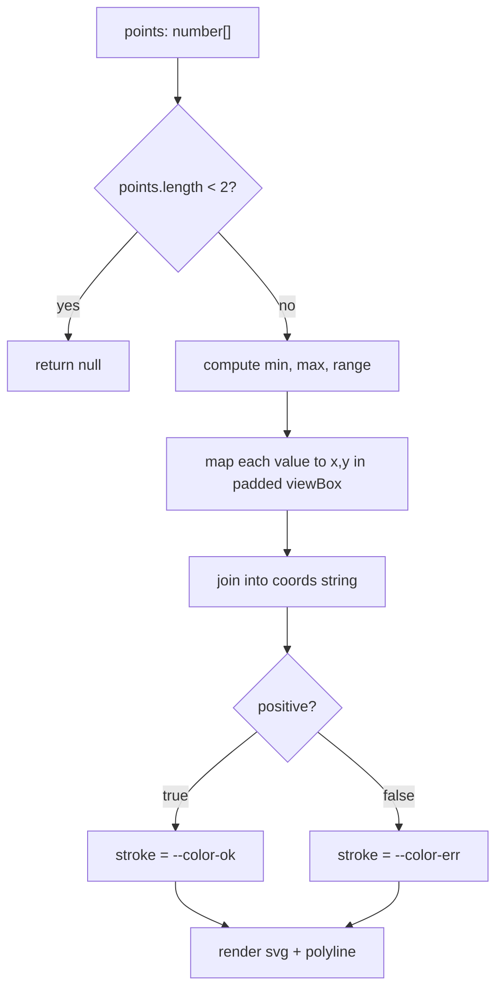

<!-- structure:15aa312e7307 -->

**File:** `src/components/Sparkline.tsx` · **Lines:** 47

<!-- fill:file:summary -->
This file defines `Sparkline`, a tiny axis-free trend line that turns an array of numbers into an inline SVG `<polyline>`. It normalizes the series into a fixed 100×28 viewBox, picks a green or red stroke based on the `positive` flag, and scales to its container via `preserveAspectRatio="none"` and a non-scaling stroke. It is rendered inside the KPI cards of `KpiStrip.tsx`, and its behaviour is exercised by `Sparkline.test.tsx`.
<!-- /fill:file:summary -->

## Symbols

This file exports 1 symbol. Every export is documented below, in declaration order.

| Name | Kind | Default |
| --- | --- | --- |
| Sparkline | component | yes |

## Sparkline (default export)

**Kind:** `component`

```ts
export default function Sparkline({ points, positive, className }: SparklineProps) { ... }
```

> A tiny, axis-free trend line for KPI cards.

### Props

| Name | Type | Required | Description |
| --- | --- | --- | --- |
| points | `number[]` | yes | Series values, oldest first. Needs at least two points to render. |
| positive | `boolean` | yes | Drives the line color: ok (green) when true, err (red) when false. |
| className | `string` | no | <FILL: what does className control?> |

### Line-by-line walkthrough

Each top-level statement of `Sparkline`, in execution order. The line numbers reference the source file as it appears today.

**Line 11 — `IfStatement`**

```ts
if (points.length < 2) return null
```

<!-- fill:sym:Sparkline:walk:0 -->
A guard clause: a line needs at least two points, so if `points` has fewer than two entries the component returns `null` and renders nothing. This also protects the later math — `points.length - 1` would be `0` (a divide-by-zero) with a single point — so bailing early keeps the coordinate calculation safe.
<!-- /fill:sym:Sparkline:walk:0 -->

**Line 13 — `FirstStatement`**

```ts
const width = 100
```

<!-- fill:sym:Sparkline:walk:1 -->
Sets the SVG coordinate-space width to a fixed `100` units. Because the `<svg>` uses `preserveAspectRatio="none"`, this is just an internal grid — the element stretches to its CSS width regardless — so a round `100` keeps the x-axis math (`width - pad * 2`) simple.
<!-- /fill:sym:Sparkline:walk:1 -->

**Line 14 — `FirstStatement`**

```ts
const height = 28
```

<!-- fill:sym:Sparkline:walk:2 -->
Sets the coordinate-space height to `28` units. This feeds the y-axis math (`height - pad - ...`) and matches the default `h-7` (28px) CSS class, so one viewBox unit maps roughly to one pixel of vertical space when the default sizing is used.
<!-- /fill:sym:Sparkline:walk:2 -->

**Line 15 — `FirstStatement`**

```ts
const pad = 3
```

<!-- fill:sym:Sparkline:walk:3 -->
Defines a `3`-unit padding inset applied on all sides. It keeps the line and its rounded stroke caps from being clipped at the edges of the viewBox; both the x and y formulas subtract `pad * 2` from the drawable area and offset by `pad`.
<!-- /fill:sym:Sparkline:walk:3 -->

**Line 16 — `FirstStatement`**

```ts
const min = Math.min(...points)
```

<!-- fill:sym:Sparkline:walk:4 -->
Finds the smallest value in `points` by spreading the array into `Math.min`. `min` becomes the baseline that the y-scaling subtracts from each value, so the lowest point sits at the bottom of the chart.
<!-- /fill:sym:Sparkline:walk:4 -->

**Line 17 — `FirstStatement`**

```ts
const max = Math.max(...points)
```

<!-- fill:sym:Sparkline:walk:5 -->
Finds the largest value in `points` via `Math.max`. Together with `min` it defines the data range used to normalize each point into the `[0, 1]` band that maps onto the chart height.
<!-- /fill:sym:Sparkline:walk:5 -->

**Line 18 — `FirstStatement`**

```ts
const range = max - min || 1
```

<!-- fill:sym:Sparkline:walk:6 -->
Computes the data span `max - min`, then uses `|| 1` to substitute `1` when the span is `0` (i.e. every value is identical). This avoids a divide-by-zero in the y formula; a flat series simply renders as a straight horizontal line.
<!-- /fill:sym:Sparkline:walk:6 -->

**Line 20 — `FirstStatement`**

```ts
const coords = points
    .map((value, i) => {
      const x = pad + (i / (points.length - 1)) * (width - pad * 2)
      const y = height - pad - ((value - min) / range) * (height - pad * 2)
      return `${x.toFixed(2)},${y.toFixed(2)}`
    })
    .join(' ')
```

<!-- fill:sym:Sparkline:walk:7 -->
Builds the `<polyline>` `points` string. Each value is mapped to an `x,y` pair: `x` spreads the index evenly across the padded width (`i / (points.length - 1)` gives `0..1`), and `y` normalizes the value by `(value - min) / range` then inverts it (`height - pad - ...`) because SVG's y-axis grows downward, so higher data values sit higher on screen. Coordinates are rounded to two decimals via `toFixed(2)` and the pairs are joined with spaces into the single attribute string.
<!-- /fill:sym:Sparkline:walk:7 -->

**Line 28 — `ReturnStatement`**

```ts
return (
    <svg
      viewBox={`0 0 ${width} ${height}`}
      preserveAspectRatio="none"
      aria-hidden="true"
      className={className ?? 'h-7 w-full'}
    >
      <polyline
        points={coords}
        fill="none"
        stroke={positive ? 'var(--color-ok)' : 'var(--color-err)'}
        strokeWidth="1.5"
        strokeLinecap="round"
        strokeLinejoin="round"
        vectorEffect="non-scaling-stroke"
      />
    </svg>
  )
```

<!-- fill:sym:Sparkline:walk:8 -->
Returns the SVG. The `viewBox` uses the computed `width`/`height`, `preserveAspectRatio="none"` lets it stretch freely to the CSS box, and `aria-hidden="true"` hides this purely decorative chart from screen readers. The `<polyline>` draws the `coords`, with `stroke` chosen by `positive` (`--color-ok` vs `--color-err`) and `vectorEffect="non-scaling-stroke"` so the 1.5-unit line keeps a constant pixel thickness despite the non-uniform scaling.
<!-- /fill:sym:Sparkline:walk:8 -->

### Behavior

<!-- fill:sym:Sparkline:behavior -->
- The component is a pure function — no `useState`, no `useEffect`, no event handlers. Every render recomputes the geometry from `points`.
- The single guard `if (points.length < 2) return null` keeps it safe to call with any series; the test "renders nothing when given fewer than two points" pins this contract.
- Coordinates are normalized into a fixed 100×28 viewBox with a 3-unit inset. The `range = max - min || 1` substitution prevents a flat series from triggering a divide-by-zero.
- The `<svg>` uses `viewBox={"0 0 100 28"}` together with `preserveAspectRatio="none"`, so the rendered chart fills whatever CSS box `className` defines. `vectorEffect="non-scaling-stroke"` on the polyline keeps the 1.5-unit line at a constant pixel width despite the non-uniform scaling.
- Accessibility: `aria-hidden="true"` excludes the decorative chart from screen readers. The numeric value, delta, and hint live in the surrounding `KpiCard` and are what assistive tech actually reads.
- Colour is theme-driven: `stroke={positive ? 'var(--color-ok)' : 'var(--color-err)'}` reads CSS variables defined in `index.css`, so light/dark mode tweaks happen there rather than here.
<!-- /fill:sym:Sparkline:behavior -->

### Examples

<!-- fill:sym:Sparkline:example -->
```tsx
<Sparkline points={[4, 9, 6, 12, 8, 15]} positive />
```

This renders a green `<polyline>` with six coordinates spread across the 100×28 viewBox. Passing fewer than two points (e.g. `points={[5]}`) renders nothing.
<!-- /fill:sym:Sparkline:example -->

### Used by

- `src/components/KpiStrip.tsx`
- `src/components/Sparkline.test.tsx`

## Tests

| Suite | Test | Asserts |
| --- | --- | --- |
| <Sparkline /> | renders a polyline with one coordinate per value | <FILL: assertion summary> |
| <Sparkline /> | renders nothing when given fewer than two points | <FILL: assertion summary> |
| <Sparkline /> | uses the error color when not positive | <FILL: assertion summary> |

## Diagrams

<!-- fill:file:diagrams -->

<!-- /fill:file:diagrams -->
