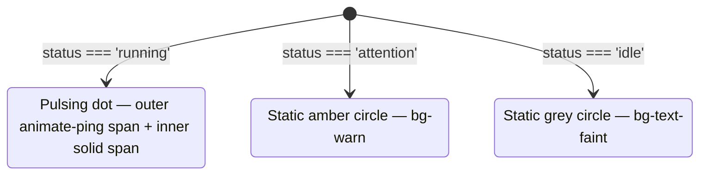

`StatusDot` is a small coloured circle that communicates an agent's current status. The `running` state renders a pulsing animated dot; `attention` renders a static amber dot; `idle` renders a static faint-grey dot. The module also exports `STATUS_LABEL`, a lookup map used by `FeaturedAgent` to display a text label alongside the dot.

**File:** `src/components/StatusDot.tsx`

## Dependencies

| Import | Source | Purpose |
|--------|--------|---------|
| `AgentStatus` (type) | `../data/agents` | Union type `"running" \| "idle" \| "attention"` |

## Exports

This module has two exports: the named constant `STATUS_LABEL` and the default component `StatusDot`.

### `STATUS_LABEL` (named export)

```ts
export const STATUS_LABEL: Record<AgentStatus, string> = {
  running:   'Running',
  idle:      'Idle',
  attention: 'Needs attention',
}
```

A complete mapping from every `AgentStatus` value to a human-readable English label. Exported so consumers can render the label text alongside the dot without duplicating the mapping:

| Key | Value |
|-----|-------|
| `running` | `"Running"` |
| `idle` | `"Idle"` |
| `attention` | `"Needs attention"` |

**Consumers:**
- `FeaturedAgent` — renders `STATUS_LABEL[agent.status]` inside the status pill alongside the dot.
- `StatusDot` itself — uses `STATUS_LABEL` to populate the `title` attribute on the dot spans.

### `StatusDot` (default export)

```ts
export default function StatusDot({ status }: { status: AgentStatus }): JSX.Element
```

**Parameters:**

| Param | Type | Purpose |
|-------|------|---------|
| `status` | `AgentStatus` | One of `"running"`, `"idle"`, `"attention"` |

**Returns:** A `<span>` element (or nested pair of `<span>` elements for `running`).

**Side effects:** None. Pure rendering.

## State rendering

The component branches on `status` and returns different JSX for each value.



### Running state

```tsx
if (status === 'running') {
  return (
    <span className="relative flex h-2 w-2" title={STATUS_LABEL.running}>
      <span className="absolute inline-flex h-full w-full animate-ping rounded-full
                       bg-accent opacity-60" />
      <span className="relative inline-flex h-2 w-2 rounded-full bg-accent" />
    </span>
  )
}
```

This is the only status that uses two nested spans:

| Element | Classes | Purpose |
|---------|---------|---------|
| Outer `<span>` | `relative flex h-2 w-2` | 8×8px container with `relative` positioning context; `flex` prevents the inner absolute span from collapsing the container height |
| Ping `<span>` (outer) | `absolute inline-flex h-full w-full animate-ping rounded-full bg-accent opacity-60` | The pulsing halo — see animation detail below |
| Dot `<span>` (inner) | `relative inline-flex h-2 w-2 rounded-full bg-accent` | The solid foreground dot |

**`animate-ping` animation detail:**

`animate-ping` is a Tailwind utility that applies the CSS keyframe animation:

```css
@keyframes ping {
  75%, 100% {
    transform: scale(2);
    opacity: 0;
  }
}
```

- Starts at `scale(1)` and `opacity-60` (via the class).
- At 75% of the animation cycle, begins scaling up to `scale(2)` and fading to `opacity: 0`.
- At 100%, returns to `scale(1)` and the cycle repeats (default `animation-iteration-count: infinite`).

The visual effect is a circle that appears to "radiate" outward from the solid dot, like a sonar ping or a heartbeat pulse. The solid inner dot remains stationary at all times; only the halo animates.

Both spans use `bg-accent` (`var(--color-accent)`, `#f70f79`, Snabbit pink). The outer span has `opacity-60` to make the halo softer than the solid dot.

`title={STATUS_LABEL.running}` adds `"Running"` as a tooltip on the outer container. Screen readers may read this; sighted users see it on hover.

### Non-running states

```ts
const color = status === 'attention' ? 'bg-warn' : 'bg-text-faint'
return (
  <span
    className={`h-2 w-2 shrink-0 rounded-full ${color}`}
    title={STATUS_LABEL[status]}
  />
)
```

Both `attention` and `idle` render a single static `<span>`:

| Status | `color` class | CSS variable | Hex value | Meaning |
|--------|--------------|-------------|-----------|---------|
| `attention` | `bg-warn` | `--color-warn` | `#d29922` | Amber — needs human intervention |
| `idle` | `bg-text-faint` | `--color-text-faint` | `#6a6a72` | Faint grey — inactive, no action needed |

**`shrink-0`** prevents the dot from being compressed in flex containers. This class is not applied to the `running` state because the `running` outer span uses `flex h-2 w-2` which establishes a fixed-size flex container.

**`title={STATUS_LABEL[status]}`** provides:
- A mouse-hover tooltip for sighted users.
- A minimal accessibility hint that some screen readers (particularly on hover elements) will announce.

:::note
`title` alone is not a reliable accessibility mechanism for visually hidden information. If a visible text label is required for accessibility compliance, use `STATUS_LABEL` in the parent component to render text alongside the dot, as `FeaturedAgent` does.
:::

## Colour reference

| Status | Token | CSS variable | Hex | Semantic meaning |
|--------|-------|-------------|-----|-----------------|
| `running` | `bg-accent` | `--color-accent` | `#f70f79` | Active — agent is currently running |
| `attention` | `bg-warn` | `--color-warn` | `#d29922` | Warning — agent needs attention |
| `idle` | `bg-text-faint` | `--color-text-faint` | `#6a6a72` | Inactive — agent is not running |

## Accessibility

| Attribute | Element | Value | Purpose |
|-----------|---------|-------|---------|
| `title` | `<span>` | `STATUS_LABEL[status]` | Hover tooltip with human-readable status label |

The dot itself carries no `role` or `aria-label`. In `AgentCard`, it is used purely decoratively alongside visible text (the agent name, and the category badge). In `FeaturedAgent`, it is paired with the `STATUS_LABEL` text rendered explicitly as a sibling node.

If `StatusDot` were used without any accompanying text label, an `aria-label` should be added to the outer span to describe the status meaningfully.

## Size and layout

The dot is `h-2 w-2` (8×8px). `shrink-0` (on non-running variants) is important in flex containers: without it, Flexbox's default `align-items: stretch` or `min-width: auto` can compress the dot below its declared size.

The dot is inline-sized — it does not include any margin. Parent components are responsible for adding `gap` between the dot and adjacent text.

## Usage examples

```tsx
// In AgentCard — dot next to agent name
<StatusDot status={agent.status} />
<span>{agent.name}</span>

// In FeaturedAgent — dot inside a status pill with text label
<span className="...pill styles...">
  <StatusDot status={agent.status} />
  {STATUS_LABEL[agent.status]}
</span>
```

## Edge cases and assumptions

- **TypeScript exhaustiveness:** The `if (status === 'running')` branch + the `color` ternary together handle all three `AgentStatus` values. TypeScript enforces this via the `AgentStatus` type constraint — passing an unrecognized string would be a compile-time error.
- **New status values:** Adding a fourth `AgentStatus` (e.g. `"disabled"`) would cause the `idle` branch to render a grey dot with a `"Needs attention"` title (since `STATUS_LABEL[status]` would return `undefined`, rendering as empty). Both the `STATUS_LABEL` map and the `color` ternary would need updating.
- **`animate-ping` performance:** CSS animations are GPU-accelerated in modern browsers and do not cause JavaScript overhead. However, many simultaneously-running animated dots (e.g. a grid of 50+ running agents) could impact CPU usage on low-powered devices.
- **Reduced motion:** `animate-ping` is a continuous looping animation. It does not check `prefers-reduced-motion`. A fully accessible implementation would wrap the animation in a `@media (prefers-reduced-motion: no-preference)` query or use Tailwind's `motion-safe:animate-ping` variant.
