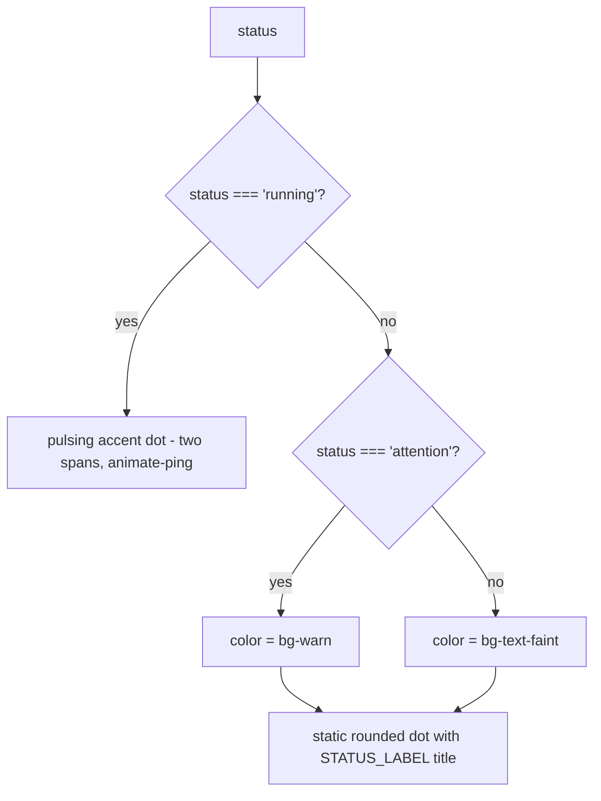

<!-- structure:e04781d7f59b -->

**File:** `src/components/StatusDot.tsx` · **Lines:** 28

<!-- fill:file:summary -->
This file renders `StatusDot`, a small colored dot that visualizes an agent's `AgentStatus` (`running`, `idle`, or `attention`). The `running` state shows an animated pinging dot in the accent color, while `attention` and `idle` render a static warn- or faint-colored dot. It also exports the `STATUS_LABEL` map used for the dot's `title` tooltip. The `AgentStatus` type comes from `../data/agents`, and the component is consumed by `FeaturedAgent.tsx` and `AgentCard.tsx`.
<!-- /fill:file:summary -->

## Imports

This file pulls in the following modules. Relative imports point to other documented files; external imports are libraries from `node_modules`.

| Module | Imports | Kind |
| --- | --- | --- |
| `../data/agents` | `AgentStatus` | type-only · internal |


## Symbols

This file exports 2 symbols. Every export is documented below, in declaration order.

| Name | Kind | Default |
| --- | --- | --- |
| StatusDot | component | yes |
| STATUS_LABEL | const | no |

## StatusDot (default export)

**Kind:** `component`

```ts
export default function StatusDot({ status }: { status: AgentStatus }) { ... }
```

> Small colored status indicator. The running state pulses in Snabbit pink.

### Props

| Name | Type | Required | Description |
| --- | --- | --- | --- |
| status | `AgentStatus` | yes | The agent's runtime state — selects the pulsing accent dot for `running`, amber for `attention`, or muted grey for `idle`, and is used to look up the `title` tooltip. |

### Line-by-line walkthrough

Each top-level statement of `StatusDot`, in execution order. The line numbers reference the source file as it appears today.

**Line 11 — `IfStatement`**

```ts
if (status === 'running') {
    return (
      <span className="relative flex h-2 w-2" title={STATUS_LABEL.running}>
        <span className="absolute inline-flex h-full w-full animate-ping rounded-full bg-accent opacity-60" />
        <span className="relative inline-flex h-2 w-2 rounded-full bg-accent" />
      </span>
    )
  }
```

<!-- fill:sym:StatusDot:walk:0 -->
Handles the `running` case with an early return. It renders a relatively-positioned wrapper `<span>` holding two stacked dots: an absolutely-positioned `bg-accent` circle with Tailwind's `animate-ping` and `opacity-60` for the expanding pulse, plus a solid `bg-accent` dot on top. The `title` is set from `STATUS_LABEL.running` for a hover tooltip. Returning early keeps this richer, animated markup separate from the simpler static branch below.
<!-- /fill:sym:StatusDot:walk:0 -->

**Line 20 — `FirstStatement`**

```ts
const color = status === 'attention' ? 'bg-warn' : 'bg-text-faint'
```

<!-- fill:sym:StatusDot:walk:1 -->
Reached only for the non-running states. A ternary picks the Tailwind background class: `bg-warn` (amber) when the status is `attention`, otherwise `bg-text-faint` (the muted grey used for `idle`). This `color` string is interpolated into the static dot's className below.
<!-- /fill:sym:StatusDot:walk:1 -->

**Line 21 — `ReturnStatement`**

```ts
return (
    <span
      className={`h-2 w-2 shrink-0 rounded-full ${color}`}
      title={STATUS_LABEL[status]}
    />
  )
```

<!-- fill:sym:StatusDot:walk:2 -->
Returns the static dot: a single 2×2 `rounded-full` `<span>` whose color comes from the `color` computed above, with `shrink-0` so it keeps its size in flex layouts. The `title` is looked up dynamically via `STATUS_LABEL[status]`, giving an `Idle` or `Needs attention` tooltip depending on the current state.
<!-- /fill:sym:StatusDot:walk:2 -->

### Behavior

<!-- fill:sym:StatusDot:behavior -->
- The component is a single switch on `status` with no state and no event handlers — it always renders one `<span>` tree.
- For `'running'` it returns a `<span className="relative flex h-2 w-2">` containing two children: an absolutely-positioned `bg-accent opacity-60` circle with Tailwind's `animate-ping` class to give a continuously expanding ring, and a solid `relative bg-accent` dot on top so the centre stays visible while the ring expands.
- For the other two states it computes `const color = status === 'attention' ? 'bg-warn' : 'bg-text-faint'` and returns a single `<span className="h-2 w-2 shrink-0 rounded-full ${color}" />`. `shrink-0` is important — without it, the dot would collapse when placed in a flex row next to long agent names.
- Accessibility is handled with `title={STATUS_LABEL[status]}`, giving each variant a hover tooltip (`"Running"`, `"Needs attention"`, `"Idle"`). No `aria-label` or `role` is set; the dot is purely visual and the label appears separately in `FeaturedAgent` for screen readers.
- The accent and warn colours come from CSS custom properties (`bg-accent` resolves to the Snabbit pink, `bg-warn` to amber), so theme tweaks happen in `index.css` rather than here.
<!-- /fill:sym:StatusDot:behavior -->

### Examples

<!-- fill:sym:StatusDot:example -->
```tsx
<StatusDot status="running" />   // pulsing accent dot, title "Running"
<StatusDot status="attention" /> // static amber dot, title "Needs attention"
<StatusDot status="idle" />      // static faint dot, title "Idle"
```
<!-- /fill:sym:StatusDot:example -->

### Used by

- `src/components/FeaturedAgent.tsx`
- `src/components/AgentCard.tsx`

## STATUS_LABEL

**Kind:** `const`

```ts
const STATUS_LABEL: Record<AgentStatus, string>
```

<!-- fill:sym:STATUS_LABEL:summary -->
A `Record<AgentStatus, string>` mapping each status key to a human-readable label: `running` → "Running", `idle` → "Idle", and `attention` → "Needs attention". `StatusDot` uses it to set the dot's `title` tooltip, and it is exported so other components such as `FeaturedAgent.tsx` can show the same label as text. Typing it against `AgentStatus` guarantees every status value has a label.
<!-- /fill:sym:STATUS_LABEL:summary -->

### Used by

- `src/components/FeaturedAgent.tsx`

## Diagrams

<!-- fill:file:diagrams -->

<!-- /fill:file:diagrams -->
