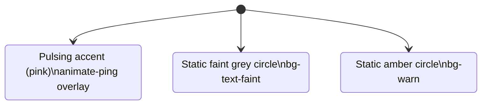

**File:** `src/components/StatusDot.tsx`

A small colored circle that communicates an agent's current status at a glance.
The `running` state renders a pulsing animation; `attention` renders amber;
`idle` renders faint grey.

## Exports

### `STATUS_LABEL`

```ts
export const STATUS_LABEL: Record<AgentStatus, string> = {
  running: 'Running',
  idle: 'Idle',
  attention: 'Needs attention',
}
```

A lookup table mapping `AgentStatus` values to human-readable labels. Exported
so `FeaturedAgent` can show the label text alongside the dot without duplicating
the mapping.

### `StatusDot` (default export)

```ts
export default function StatusDot({ status }: { status: AgentStatus })
```

**Parameters:**

| Param | Type | Purpose |
|-------|------|---------|
| `status` | `AgentStatus` | The agent status to visualize. One of `'running' \| 'idle' \| 'attention'`. |

**Returns:** A `<span>` element styled as a colored circle, or a nested
`<span>` pair for the pulsing running state.

**Side effects:** None. Pure rendering.

## State rendering



### Running state

```tsx
if (status === 'running') {
  return (
    <span className="relative flex h-2 w-2" title={STATUS_LABEL.running}>
      <span className="absolute inline-flex h-full w-full animate-ping rounded-full bg-accent opacity-60" />
      <span className="relative inline-flex h-2 w-2 rounded-full bg-accent" />
    </span>
  )
}
```

Two concentric `<span>` elements: the outer one uses Tailwind's `animate-ping`
(a scale + fade-out animation) to create a pulse halo; the inner one is the
solid dot underneath. Both are `bg-accent` (Snabbit pink, `#f70f79`). The
outer's `opacity-60` softens the halo.

### Non-running states

```ts
const color = status === 'attention' ? 'bg-warn' : 'bg-text-faint'
return (
  <span
    className={`h-2 w-2 shrink-0 rounded-full ${color}`}
    title={STATUS_LABEL[status]}
  />
)
```

A simple 8×8px `rounded-full` span. The color is `bg-warn` (`#d29922`, amber)
for `attention` or `bg-text-faint` (`#6a6a72`, grey) for `idle`.

`shrink-0` prevents the dot from being compressed in flex containers.

`title` provides a tooltip (and a minimal accessibility hint) with the human
label via `STATUS_LABEL`.

## Color reference

| Status | Color token | Hex value | Meaning |
|--------|-------------|-----------|---------|
| `running` | `--color-accent` | `#f70f79` | Active, pulsing pink |
| `attention` | `--color-warn` | `#d29922` | Needs human attention |
| `idle` | `--color-text-faint` | `#6a6a72` | Inactive |

## Used by

- `AgentCard` — shows the dot alongside the agent name and category chip.
- `FeaturedAgent` — shows the dot inside a status pill, paired with the label
  from `STATUS_LABEL`.
