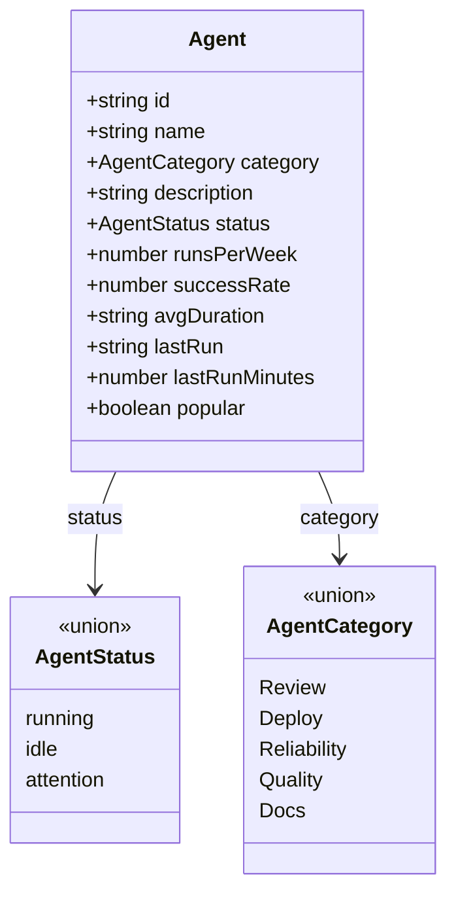

<!-- structure:35ef7402c7aa -->

**File:** `src/data/agents.ts` · **Lines:** 211

<!-- fill:file:summary -->
This module holds the static seed catalogue of SDLC agents for the Snabbit Agent Console. It defines the `AgentStatus` and `AgentCategory` string-literal unions, the `Agent` interface that shapes each entry, and exports the `AGENTS` array along with `FEATURED_AGENT_ID` and the `AGENT_CATEGORIES` list. `src/App.tsx` reads `AGENTS` and `FEATURED_AGENT_ID` to split out the featured agent from the rest, while `AgentGrid`, `AgentCard`, `FeaturedAgent`, `StatusDot`, and the `filterAgents`/`sortAgents` helpers consume the exported types. In a real deployment this data would be fetched from the backend rather than hard-coded here.
<!-- /fill:file:summary -->

## Symbols

This file exports 6 symbols. Every export is documented below, in declaration order.

| Name | Kind | Default |
| --- | --- | --- |
| AgentStatus | type | no |
| AgentCategory | type | no |
| Agent | interface | no |
| AGENTS | const | no |
| FEATURED_AGENT_ID | const | no |
| AGENT_CATEGORIES | const | no |

## AgentStatus

**Kind:** `type`

```ts
export type AgentStatus = 'running' | 'idle' | 'attention'
```

<!-- fill:sym:AgentStatus:summary -->
`AgentStatus` is a string-literal union narrowing an agent's operational state to exactly `'running'`, `'idle'`, or `'attention'`. It backs the `status` field of every `Agent` and is consumed by `StatusDot.tsx`, which maps each value to a colored indicator. Constraining the set to these three literals lets the type system reject invalid status strings at compile time.
<!-- /fill:sym:AgentStatus:summary -->

### Used by

- `src/components/StatusDot.tsx`

## AgentCategory

**Kind:** `type`

```ts
export type AgentCategory = 'Review' | 'Deploy' | 'Reliability' | 'Quality' | 'Docs'
```

<!-- fill:sym:AgentCategory:summary -->
`AgentCategory` is a string-literal union restricting an agent's category to one of `'Review'`, `'Deploy'`, `'Reliability'`, `'Quality'`, or `'Docs'`. It types the `category` field of `Agent` and is the element type of the `AGENT_CATEGORIES` list used to build the grid's category filter. Defining the categories as a closed union keeps the catalogue, filter UI, and any category-keyed logic in sync.
<!-- /fill:sym:AgentCategory:summary -->

## Agent

**Kind:** `interface`

```ts
export interface Agent { ... }
```

<!-- fill:sym:Agent:summary -->
`Agent` is the interface describing a single entry in the console catalogue, combining identity (`id`, `name`), classification (`category`, `status`), and metrics (`runsPerWeek`, `successRate`, `avgDuration`, `lastRun`, `lastRunMinutes`, `popular`). It is the element type of the `AGENTS` array and the prop type passed to `AgentCard` and `FeaturedAgent`. The `filterAgents` and `sortAgents` helpers operate over `Agent` values, relying on fields like `popular`, `category`, and `lastRunMinutes` to drive their behavior.
<!-- /fill:sym:Agent:summary -->

### Shape

| Name | Type | Description |
| --- | --- | --- |
| id | `string` | Stable slug uniquely identifying the agent (e.g. `pr-reviewer`), matched against `FEATURED_AGENT_ID` and used as a React key. |
| name | `string` | Display name shown on the card and featured panel, such as `PR Reviewer` or `Deploy Bot`. |
| category | `AgentCategory` | One of the five known categories (`Review`, `Deploy`, `Reliability`, `Quality`, `Docs`) that drives the `AgentGrid` category filter. |
| description | `string` | One-sentence summary of what the agent does, rendered on the card and featured panel. |
| status | `AgentStatus` | Current lifecycle state — `running`, `idle`, or `attention` — visualized by `StatusDot`. |
| runsPerWeek | `number` | Approximate runs over the last 7 days. |
| successRate | `number` | Successful-run percentage, 0–100. |
| avgDuration | `string` | Human-readable average run duration. |
| lastRun | `string` | Human-readable time since the last run. |
| lastRunMinutes | `number` | Minutes since the last run — orderable companion to `lastRun`. |
| popular | `boolean` | Whether the agent appears under the "Popular" filter. |

### Used by

- `src/components/FeaturedAgent.tsx`
- `src/lib/filterAgents.ts`
- `src/lib/sortAgents.ts`
- `src/components/AgentCard.tsx`
- `src/components/AgentGrid.tsx`
- `src/lib/filterAgents.test.ts`
- `src/lib/sortAgents.test.ts`

## AGENTS

**Kind:** `const`

```ts
const AGENTS: Agent[]
```

<!-- fill:sym:AGENTS:summary -->
`AGENTS` is the seed array of twelve `Agent` records that populates the console — covering review, deploy, reliability, quality, and docs agents. `App.tsx` consumes it to pick the featured agent and pass the remainder to `AgentGrid`, and `AgentGrid.test.tsx` and `agents.test.ts` exercise it directly. As static seed data, it stands in for what a real deployment would fetch from the backend.
<!-- /fill:sym:AGENTS:summary -->

### Used by

- `src/App.tsx`
- `src/components/AgentGrid.test.tsx`
- `src/data/agents.test.ts`

## FEATURED_AGENT_ID

**Kind:** `const`

```ts
const FEATURED_AGENT_ID: "pr-reviewer"
```

> The agent surfaced in the featured slot at the top of the console.

### Used by

- `src/App.tsx`
- `src/data/agents.test.ts`

## AGENT_CATEGORIES

**Kind:** `const`

```ts
const AGENT_CATEGORIES: AgentCategory[]
```

<!-- fill:sym:AGENT_CATEGORIES:summary -->
`AGENT_CATEGORIES` is an ordered list of every `AgentCategory` value (`Review`, `Deploy`, `Reliability`, `Quality`, `Docs`). `AgentGrid.tsx` iterates it to render the category filter controls, giving the UI a single source of truth for the available categories and their display order. `agents.test.ts` also references it to assert that no agent uses a category outside this set.
<!-- /fill:sym:AGENT_CATEGORIES:summary -->

### Used by

- `src/components/AgentGrid.tsx`
- `src/data/agents.test.ts`

## Tests

| Suite | Test | Asserts |
| --- | --- | --- |
| agent catalogue | has at least one agent | Asserts `AGENTS.length` is greater than 0. |
| agent catalogue | gives every agent a unique id | Asserts the `Set` of all `id` values has the same size as the array, so no id repeats. |
| agent catalogue | includes the featured agent | Asserts some agent's `id` equals `FEATURED_AGENT_ID`. |
| agent catalogue | only uses known categories | Asserts `AGENT_CATEGORIES` contains every agent's `category`. |
| agent catalogue | keeps success rates between 0 and 100 | Asserts each agent's `successRate` is `>= 0` and `<= 100`. |
| agent catalogue | gives every agent a non-empty name and description | Asserts each agent's trimmed `name` and `description` have length greater than 0. |

## Diagrams

<!-- fill:file:diagrams -->
The `Agent` interface ties together the two string-literal unions and is collected into the `AGENTS` seed array:


<!-- /fill:file:diagrams -->
