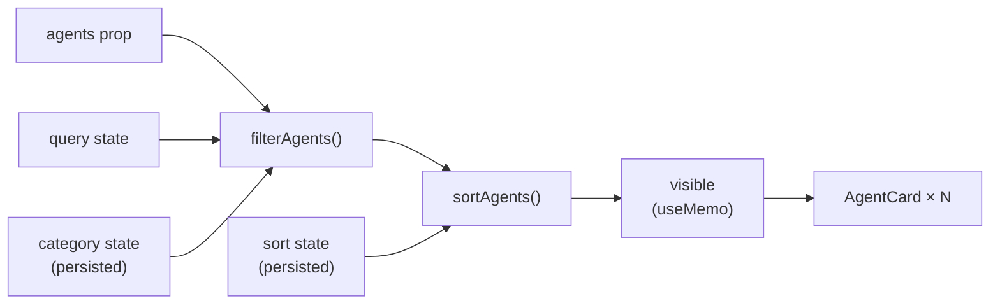

`src/lib/` holds the frontend's non-visual logic: the typed API client, two
React hooks, and two pure list-transformation functions. Keeping this code out
of components makes it directly unit-testable.

## Files

| File | Purpose |
|------|---------|
| [api.ts](/sdlc-sample-worflow/frontend/lib/api/) | Typed HTTP client for the backend |
| [useFetch.ts](/sdlc-sample-worflow/frontend/lib/usefetch/) | Generic data-fetching hook |
| [usePersistentState.ts](/sdlc-sample-worflow/frontend/lib/usepersistentstate/) | `useState` with `localStorage` persistence |
| [filterAgents.ts](/sdlc-sample-worflow/frontend/lib/filteragents/) | Category + query filter (pure) |
| [sortAgents.ts](/sdlc-sample-worflow/frontend/lib/sortagents/) | Four sort strategies (pure) |

## Quick reference

### `fetchPipelines(signal?)`

```ts
async function fetchPipelines(signal?: AbortSignal): Promise<PipelinesResponse>
```

Fetches `GET /api/pipelines`. The base URL defaults to `http://localhost:3001`;
override with `VITE_API_URL` at build time.

### `useFetch(fetcher)`

```ts
function useFetch<T>(fetcher: (signal: AbortSignal) => Promise<T>): FetchState<T>
```

Runs `fetcher` on mount, exposes `{ data, loading, error, reload }`. Cancels
in-flight requests on unmount. `reload()` triggers a re-fetch. The fetcher must
be referentially stable (module-level function).

### `usePersistentState(key, initial)`

```ts
function usePersistentState<T>(key: string, initial: T): [T, (value: T) => void]
```

Like `useState`, but mirrors value to `localStorage` under `key`. Storage
failures fall back to `initial` silently.

### `filterAgents(agents, filter)`

```ts
function filterAgents(agents: Agent[], filter: AgentFilter): Agent[]
```

Filters by `filter.category` (`'All'`, `'Popular'`, or a category name) and
`filter.query` (case-insensitive substring match on name and description). Pure.

### `sortAgents(agents, key)`

```ts
function sortAgents(agents: Agent[], key: SortKey): Agent[]
```

Returns a new sorted array. `key` is one of `'runs'`, `'success'`, `'name'`,
`'recent'`. Does not mutate input. Pure.

## Data flow in AgentGrid


