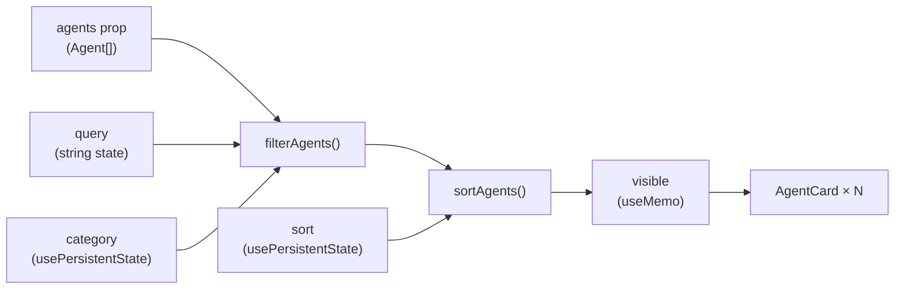

`src/lib/` holds the frontend's non-visual logic: a typed API client, two React hooks, and two pure list-transformation functions. Keeping this code outside of components makes each module directly unit-testable without rendering any UI.

## Files

| File | Kind | Purpose |
|---|---|---|
| [api.ts](./lib/api) | Module | Typed HTTP client — `fetchPipelines` and the `Pipeline*` types |
| [useFetch.ts](./lib/usefetch) | React hook | Generic data-fetching hook with loading/error/data state, AbortController cleanup, and a `reload()` trigger |
| [usePersistentState.ts](./lib/usepersistentstate) | React hook | `useState` drop-in that mirrors its value to `localStorage` and restores it on the next mount |
| [filterAgents.ts](./lib/filteragents) | Pure function | Filters an `Agent[]` by category (`All`, `Popular`, or exact category) and free-text query |
| [sortAgents.ts](./lib/sortagents) | Pure function | Returns a new sorted `Agent[]` using one of four sort strategies |

## Quick reference

### `fetchPipelines(signal?)`

```ts
export async function fetchPipelines(
  signal?: AbortSignal,
): Promise<PipelinesResponse>
```

Fetches `GET /api/pipelines`. The base URL defaults to `http://localhost:3001`; override with `VITE_API_URL` at build time. Throws `Error("API responded <status>")` on non-2xx responses. Must be passed as a module-level reference to `useFetch` to avoid infinite re-fetching.

### `useFetch<T>(fetcher)`

```ts
export function useFetch<T>(
  fetcher: (signal: AbortSignal) => Promise<T>,
): FetchState<T>
```

Runs `fetcher` on mount and exposes `{ data, loading, error, reload }`. Cancels in-flight requests on unmount via `AbortController`. Calling `reload()` increments an internal nonce that re-triggers the effect. The `fetcher` argument must be referentially stable (module-level function, not an inline arrow).

### `usePersistentState<T>(key, initial)`

```ts
export function usePersistentState<T>(
  key: string,
  initial: T,
): [T, (value: T) => void]
```

Identical API to `useState`. Reads from `localStorage` on first render (lazy initializer); writes back via `useEffect` on every value change. Storage failures (quota exceeded, private browsing, malformed JSON) all fall back to `initial` silently. `T` must be JSON-serializable.

### `filterAgents(agents, filter)`

```ts
export function filterAgents(agents: Agent[], filter: AgentFilter): Agent[]
```

Filters by `filter.category` — three branches: `'All'` passes everything; `'Popular'` passes agents where `agent.popular === true`; any other value is an exact match against `agent.category`. Then filters by `filter.query`: trimmed, lowercased substring match against `agent.name` and `agent.description`. Pure — does not mutate input.

### `sortAgents(agents, key)`

```ts
export function sortAgents(agents: Agent[], key: SortKey): Agent[]
```

Returns a new array sorted by `key`. Copies input with `[...agents]` before sorting to avoid mutating the prop. Keys: `'runs'` (runsPerWeek desc), `'success'` (successRate desc), `'name'` (localeCompare asc), `'recent'` (lastRunMinutes asc). Pure — does not mutate input.

## Data flow in AgentGrid



The entire pipeline runs inside a `useMemo` in `AgentGrid`, so it only recomputes when `agents`, `query`, `category`, or `sort` changes.
