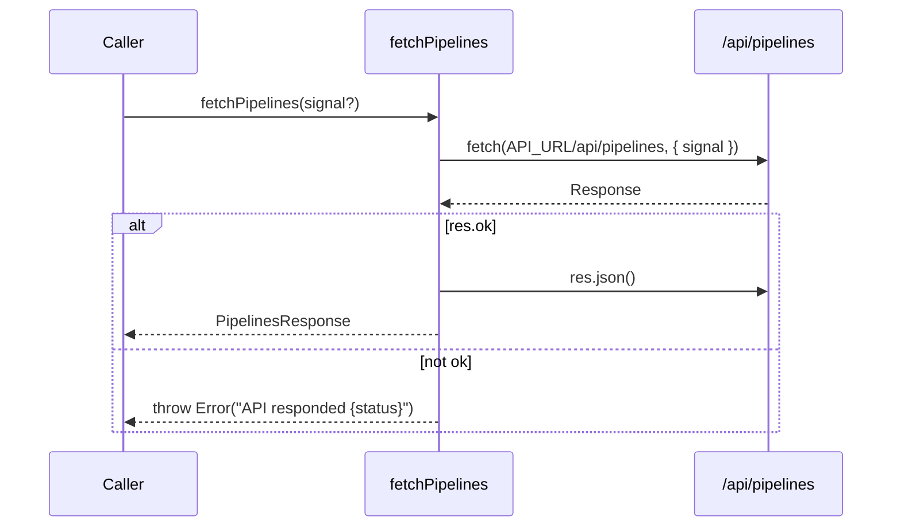

**File:** `src/lib/api.ts` · **Lines:** 44

<!-- fill:file:summary -->
This module is the typed HTTP client for the Snabbit Agent Console API. It defines the wire-format types (`Pipeline`, `PipelineSummary`, `PipelinesResponse`) and exposes `fetchPipelines`, the single network call into the `/api/pipelines` endpoint. The base URL is read once from the `VITE_API_URL` env var (falling back to `http://localhost:3001`). `PipelinesPanel.tsx` is the only consumer; it drives `fetchPipelines` through the `useFetch` hook so that loading, error, and abort handling are managed for it.
<!-- /fill:file:summary -->

## Symbols

This file exports 5 symbols. Every export is documented below, in declaration order.

| Name | Kind | Default |
| --- | --- | --- |
| fetchPipelines | function | no |
| PipelineStatus | type | no |
| Pipeline | interface | no |
| PipelineSummary | interface | no |
| PipelinesResponse | interface | no |

## fetchPipelines

**Kind:** `function`

```ts
export async function fetchPipelines(
  signal?: AbortSignal,
): Promise<PipelinesResponse> { ... }
```

<!-- fill:sym:fetchPipelines:summary -->
`fetchPipelines` performs a `GET` against `${API_URL}/api/pipelines` and resolves to a typed `PipelinesResponse`. It exists to centralize the one network call the dashboard needs, so callers never construct URLs or parse JSON themselves. It accepts an optional `AbortSignal` so an in-flight request can be cancelled, and it throws on any non-2xx response rather than returning a partial result.
<!-- /fill:sym:fetchPipelines:summary -->

### Parameters

| Name | Type | Default | Required | Purpose |
| --- | --- | --- | --- | --- |
| signal | `AbortSignal` | — | no | Optional signal forwarded to `fetch` so the request can be aborted (e.g. on unmount or reload). |

**Returns:** `Promise<PipelinesResponse>`

<!-- fill:sym:fetchPipelines:return -->
A `Promise` that resolves to a `PipelinesResponse` — the parsed JSON body containing the provider name, aggregate `summary`, and the full `pipelines` array. It never resolves to `null`: if the response status is not OK the promise rejects with an `Error` carrying the status code, and if the request is aborted the promise rejects with the abort error from `fetch`.
<!-- /fill:sym:fetchPipelines:return -->

### Line-by-line walkthrough

Each top-level statement of `fetchPipelines`, in execution order. The line numbers reference the source file as it appears today.

**Line 38 — `FirstStatement`**

```ts
const res = await fetch(`${API_URL}/api/pipelines`, { signal })
```

<!-- fill:sym:fetchPipelines:walk:0 -->
Issues the network request with `fetch`, building the URL from the module-level `API_URL` constant and the `/api/pipelines` path, and forwarding the caller's `signal` in the options object so the request participates in abort handling. `await` suspends until the response headers arrive, binding the resulting `Response` to `res`.
<!-- /fill:sym:fetchPipelines:walk:0 -->

**Line 39 — `IfStatement`**

```ts
if (!res.ok) {
    throw new Error(`API responded ${res.status}`)
  }
```

<!-- fill:sym:fetchPipelines:walk:1 -->
`fetch` only rejects on network failure, not on HTTP error status, so this guard inspects `res.ok` and throws an `Error` for any non-2xx response. The message interpolates `res.status` so callers (and the `useFetch` error state) get a meaningful "API responded 500"-style string instead of silently treating an error body as valid data.
<!-- /fill:sym:fetchPipelines:walk:1 -->

**Line 42 — `ReturnStatement`**

```ts
return res.json() as Promise<PipelinesResponse>
```

<!-- fill:sym:fetchPipelines:walk:2 -->
Parses the response body as JSON and returns the resulting promise. The `as Promise<PipelinesResponse>` assertion tells TypeScript to treat the otherwise-`any` JSON as the typed response; it is a compile-time cast only, so the shape is trusted rather than validated at runtime.
<!-- /fill:sym:fetchPipelines:walk:2 -->

### Examples

<!-- fill:sym:fetchPipelines:example -->
Typically called indirectly through `useFetch`, which supplies the abort signal:

```ts
const { data, loading, error, reload } = useFetch(fetchPipelines)
// data === null while loading; on success:
// {
//   provider: 'github-actions',
//   summary: { total: 12, passing: 9, failing: 2, running: 1, passRate: 0.75 },
//   pipelines: [ /* Pipeline[] */ ],
// }
```

Called directly with manual cancellation:

```ts
const controller = new AbortController()
const response = await fetchPipelines(controller.signal)
console.log(response.summary.passRate) // e.g. 0.75
```
<!-- /fill:sym:fetchPipelines:example -->

### Used by

- `src/components/PipelinesPanel.tsx`

## PipelineStatus

**Kind:** `type`

```ts
export type PipelineStatus = 'passing' | 'failing' | 'running'
```

<!-- fill:sym:PipelineStatus:summary -->
`PipelineStatus` is a string-literal union enumerating the three states a pipeline run can be in: `'passing'`, `'failing'`, or `'running'`. It exists to keep the `status` field on `Pipeline` constrained to known values so the UI can map each state to a colour or badge without handling arbitrary strings.
<!-- /fill:sym:PipelineStatus:summary -->

## Pipeline

**Kind:** `interface`

```ts
export interface Pipeline { ... }
```

<!-- fill:sym:Pipeline:summary -->
`Pipeline` describes a single CI/CD pipeline run as returned by the API. It carries identity (`id`, `name`), the source provider and branch, the current `status`, how long the run took, who triggered it, and when it was last updated. It is the element type of the `pipelines` array in `PipelinesResponse` and is rendered row-by-row in `PipelinesPanel.tsx`.
<!-- /fill:sym:Pipeline:summary -->

### Shape

| Name | Type | Description |
| --- | --- | --- |
| id | `string` | Stable unique identifier for the pipeline run, used as the React list key. |
| name | `string` | Human-readable pipeline name shown in the UI. |
| provider | `"github-actions" \| "jenkins"` | Which CI system produced the run. |
| branch | `string` | Git branch the run was executed against. |
| status | `PipelineStatus` | Current run state: passing, failing, or running. |
| durationSeconds | `number` | Wall-clock duration of the run in seconds. |
| triggeredBy | `string` | Identity (user or event) that initiated the run. |
| updatedAt | `string` | ISO timestamp of the last status update. |

### Used by

- `src/components/PipelinesPanel.tsx`

## PipelineSummary

**Kind:** `interface`

```ts
export interface PipelineSummary { ... }
```

<!-- fill:sym:PipelineSummary:summary -->
`PipelineSummary` holds the pre-aggregated counts for a set of pipelines: the `total`, how many are `passing`/`failing`/`running`, and the derived `passRate`. It exists so the dashboard can show headline metrics without recomputing them client-side. It is the type of the `summary` field on `PipelinesResponse`.
<!-- /fill:sym:PipelineSummary:summary -->

### Shape

| Name | Type | Description |
| --- | --- | --- |
| total | `number` | Total number of pipelines in the response. |
| passing | `number` | Count of pipelines currently passing. |
| failing | `number` | Count of pipelines currently failing. |
| running | `number` | Count of pipelines currently running. |
| passRate | `number` | Fraction of pipelines passing (0–1). |

## PipelinesResponse

**Kind:** `interface`

```ts
export interface PipelinesResponse { ... }
```

<!-- fill:sym:PipelinesResponse:summary -->
`PipelinesResponse` is the top-level shape of the `/api/pipelines` JSON body and the resolved value of `fetchPipelines`. It bundles the `provider` string, the aggregate `summary`, and the full `pipelines` array so a single request gives the panel both headline metrics and the per-run detail it renders.
<!-- /fill:sym:PipelinesResponse:summary -->

### Shape

| Name | Type | Description |
| --- | --- | --- |
| provider | `string` | Name of the CI provider the data was sourced from. |
| summary | `PipelineSummary` | Aggregate pass/fail/running counts and pass rate. |
| pipelines | `Pipeline[]` | The individual pipeline runs. |

## Diagrams

<!-- fill:file:diagrams -->

<!-- /fill:file:diagrams -->

## Source

Full file source for `src/lib/api.ts` (44 lines). The line-by-line walkthroughs above reference these line numbers.

<details>
<summary>View source (44 lines)</summary>

````ts
/*
 * Typed client for the Snabbit Agent Console API.
 * The base URL can be overridden with the VITE_API_URL env var.
 */

const API_URL = import.meta.env.VITE_API_URL ?? 'http://localhost:3001'

export type PipelineStatus = 'passing' | 'failing' | 'running'

export interface Pipeline {
  id: string
  name: string
  provider: 'github-actions' | 'jenkins'
  branch: string
  status: PipelineStatus
  durationSeconds: number
  triggeredBy: string
  updatedAt: string
}

export interface PipelineSummary {
  total: number
  passing: number
  failing: number
  running: number
  passRate: number
}

export interface PipelinesResponse {
  provider: string
  summary: PipelineSummary
  pipelines: Pipeline[]
}

export async function fetchPipelines(
  signal?: AbortSignal,
): Promise<PipelinesResponse> {
  const res = await fetch(`${API_URL}/api/pipelines`, { signal })
  if (!res.ok) {
    throw new Error(`API responded ${res.status}`)
  }
  return res.json() as Promise<PipelinesResponse>
}

````

</details>
