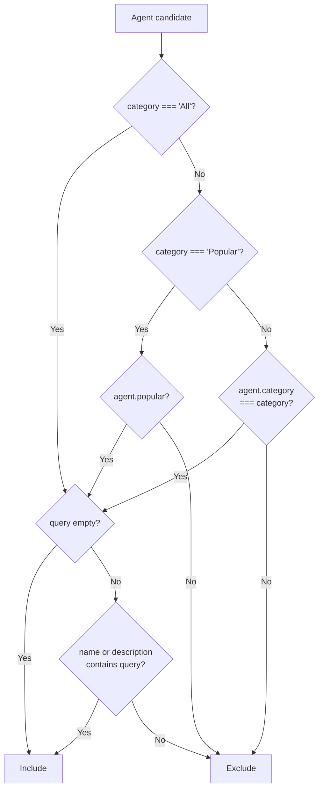

**File:** `src/lib/filterAgents.ts`

A pure, side-effect-free function that filters an array of `Agent` objects by category tab and free-text search query. Lives in `src/lib/` (not inside a component) so it can be unit-tested independently of any UI.

## `AgentFilter` interface

```ts
export interface AgentFilter {
  query: string
  category: string
}
```

| Field | Type | Purpose |
|---|---|---|
| `query` | `string` | Free-text search string. Matched (after trimming and lowercasing) against both `agent.name` and `agent.description`. An empty or whitespace-only string matches all agents. |
| `category` | `string` | The active tab selection. One of: `'All'` (no category filter), `'Popular'` (matches agents where `popular === true`), or any `AgentCategory` value (`'Review'`, `'Deploy'`, `'Reliability'`, `'Quality'`, `'Docs'`) matched against `agent.category`. |

## `filterAgents` function

```ts
export function filterAgents(agents: Agent[], filter: AgentFilter): Agent[]
```

### Parameters

| Parameter | Type | Purpose |
|---|---|---|
| `agents` | `Agent[]` | The source array to filter. Never mutated. |
| `filter` | `AgentFilter` | Category and query to apply. Both fields are always read. |

### Returns

A new `Agent[]` containing only the agents that pass **both** the category filter and the query filter. The original array is not modified.

### Side effects

None. The function is pure — given the same inputs it always returns the same output and has no observable side effects.

## Full implementation

```ts
export function filterAgents(agents: Agent[], filter: AgentFilter): Agent[] {
  const query = filter.query.trim().toLowerCase()

  return agents.filter((agent) => {
    const matchesCategory =
      filter.category === 'All' ||
      (filter.category === 'Popular'
        ? agent.popular
        : agent.category === filter.category)

    if (!matchesCategory) return false
    if (!query) return true

    return (
      agent.name.toLowerCase().includes(query) ||
      agent.description.toLowerCase().includes(query)
    )
  })
}
```

## Implementation walkthrough

### Step 1 — Normalize the query (outside the loop)

```ts
const query = filter.query.trim().toLowerCase()
```

The query is trimmed and lowercased **once**, before the `filter` iteration begins. This avoids calling `.trim()` and `.toLowerCase()` inside the loop for every agent. After normalization:

- `'  Bot  '` becomes `'bot'`
- `'REVIEWER'` becomes `'reviewer'`
- `'   '` becomes `''` (empty string, handled in step 4)

### Step 2 — Three-way category logic

```ts
const matchesCategory =
  filter.category === 'All' ||
  (filter.category === 'Popular'
    ? agent.popular
    : agent.category === filter.category)
```

Three branches:

| `filter.category` | Passes when |
|---|---|
| `'All'` | Always — every agent passes |
| `'Popular'` | `agent.popular === true` |
| Any other value | `agent.category === filter.category` (exact match) |

The `'Popular'` tab is not an `AgentCategory` value — it is a virtual tab that cross-cuts categories. The exact-match branch handles all five `AgentCategory` values (`'Review'`, `'Deploy'`, etc.).

### Step 3 — Early return on category mismatch

```ts
if (!matchesCategory) return false
```

If the agent fails the category check, the query check is skipped entirely. This is a short-circuit optimization — the query check involves `.toLowerCase()` and `.includes()` on two strings, so skipping it for filtered-out agents is worthwhile when the catalogue grows.

### Step 4 — Early return for empty query

```ts
if (!query) return true
```

An empty normalized query string (originally empty or whitespace-only input) matches all agents that passed the category filter. The agent is included without inspecting its name or description.

### Step 5 — Query substring match

```ts
return (
  agent.name.toLowerCase().includes(query) ||
  agent.description.toLowerCase().includes(query)
)
```

Performs a case-insensitive substring search across both `agent.name` and `agent.description`. The `query` was already lowercased in step 1; `agent.name` and `agent.description` are lowercased here at match time.

A match on **either** field causes the agent to be included. This means searching `'reliability'` would match both an agent named "Reliability Monitor" and one whose description contains the word "reliability."

## Filter decision flowchart



## Tests

`src/lib/filterAgents.test.ts` — 10 tests:

| Test | Input | Expected |
|---|---|---|
| `'All'` + empty query | All 3 agents | All 3 returned |
| Exact category | `category: 'Review'` | PR Reviewer only |
| `'Popular'` tab | `category: 'Popular'` | The 2 popular agents |
| Name match | `query: 'deploy'` | Deploy Bot only |
| Description match | `query: 'root cause'` | RCA Analyst only |
| Case-insensitive match | `query: 'REVIEWER'` | PR Reviewer |
| Whitespace trimming | `query: '  bot  '` | Deploy Bot |
| Category + query combined | `Popular` + `'reviewer'` | PR Reviewer only |
| No match | `query: 'nonexistent'` | `[]` |
| Input not mutated | Any input | Source array unchanged after call |

## Used by

`AgentGrid` composes `filterAgents` with `sortAgents` inside `useMemo`:

```ts
const visible = useMemo(
  () => sortAgents(filterAgents(agents, { query, category }), sort),
  [agents, query, category, sort],
)
```

Filter is applied first, then sort. The `useMemo` ensures the pipeline only recomputes when one of the four dependencies changes.
