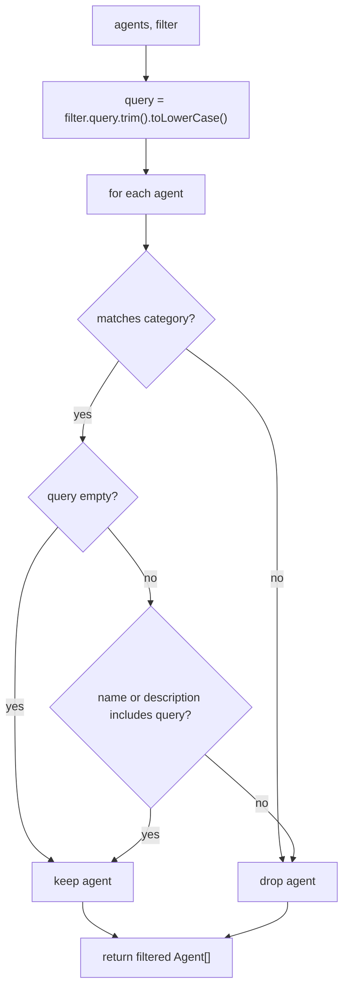

<!-- structure:84f9ad55e270 -->

**File:** `src/lib/filterAgents.ts` · **Lines:** 33

<!-- fill:file:summary -->
This module provides `filterAgents`, a pure helper that narrows an `Agent[]` (from `../data/agents`) down to those matching a category selection and a free-text query. It also exports the `AgentFilter` interface describing those two criteria. `AgentGrid.tsx` uses it to drive the agent list as the user types or switches tabs, and `filterAgents.test.ts` exercises it directly. Because it has no side effects it can be unit tested in isolation.
<!-- /fill:file:summary -->

## Imports

This file pulls in the following modules. Relative imports point to other documented files; external imports are libraries from `node_modules`.

| Module | Imports | Kind |
| --- | --- | --- |
| `../data/agents` | `Agent` | type-only · internal |


## Symbols

This file exports 2 symbols. Every export is documented below, in declaration order.

| Name | Kind | Default |
| --- | --- | --- |
| filterAgents | function | no |
| AgentFilter | interface | no |

## filterAgents

**Kind:** `function`

```ts
export function filterAgents(agents: Agent[], filter: AgentFilter): Agent[] { ... }
```

> Filter the agent list by category and free-text query.
> Pure and side-effect free so it can be unit tested directly.

### Parameters

| Name | Type | Default | Required | Purpose |
| --- | --- | --- | --- | --- |
| agents | `Agent[]` | — | yes | The catalogue to narrow; iterated with `Array.filter`, so it is read but never mutated. |
| filter | `AgentFilter` | — | yes | The criteria object holding the `category` tab selection and the free-text `query` to match. |

**Returns:** `Agent[]`

<!-- fill:sym:filterAgents:return -->
A new `Agent[]` containing only the agents that satisfy both the category and the query, preserving their original order. It is never `null`; when nothing matches it is an empty array. The input array is not mutated — `Array.filter` returns a fresh array.
<!-- /fill:sym:filterAgents:return -->

### Line-by-line walkthrough

Each top-level statement of `filterAgents`, in execution order. The line numbers reference the source file as it appears today.

**Line 15 — `FirstStatement`**

```ts
const query = filter.query.trim().toLowerCase()
```

<!-- fill:sym:filterAgents:walk:0 -->
Normalizes the search term once, up front: `trim()` strips surrounding whitespace and `toLowerCase()` folds case so the later `includes` checks are case-insensitive. Computing `query` outside the filter callback avoids redoing this work for every agent.
<!-- /fill:sym:filterAgents:walk:0 -->

**Line 17 — `ReturnStatement`**

```ts
return agents.filter((agent) => {
    const matchesCategory =
      filter.category === 'All' ||
      (filter.category === 'Popular'
        ? agent.popular
        : agent.category === filter.category)

    if (!matchesCategory) return false
    if (!query) return true

    return (
      agent.name.toLowerCase().includes(query) ||
      agent.description.toLowerCase().includes(query)
    )
  })
```

<!-- fill:sym:filterAgents:walk:1 -->
Returns the filtered array. Per agent it first computes `matchesCategory`: `'All'` matches everything, `'Popular'` matches when `agent.popular` is true, otherwise the agent's `category` must equal the filter category exactly. Agents failing the category test are dropped immediately. With no query the agent is kept; otherwise it is kept only if the lowercased `name` or `description` contains the normalized `query`. Both checks must pass, so category and query compose as an AND.
<!-- /fill:sym:filterAgents:walk:1 -->

### Examples

<!-- fill:sym:filterAgents:example -->
Given three agents `a` (PR Reviewer, Review, popular), `b` (Deploy Bot, Deploy, popular), and `c` (RCA Analyst, Reliability):

```ts
filterAgents(agents, { category: 'All', query: '' }).map(a => a.id)
// → ['a', 'b', 'c']

filterAgents(agents, { category: 'Popular', query: '' }).map(a => a.id)
// → ['a', 'b']

filterAgents(agents, { category: 'All', query: 'root cause' }).map(a => a.id)
// → ['c']  (matched against the description)

filterAgents(agents, { category: 'Popular', query: 'reviewer' }).map(a => a.id)
// → ['a']  (category AND query)

filterAgents(agents, { category: 'All', query: 'nonexistent' })
// → []
```
<!-- /fill:sym:filterAgents:example -->

### Used by

- `src/components/AgentGrid.tsx`
- `src/lib/filterAgents.test.ts`

## AgentFilter

**Kind:** `interface`

```ts
export interface AgentFilter { ... }
```

<!-- fill:sym:AgentFilter:summary -->
`AgentFilter` is the parameter object `filterAgents` accepts. It pairs a free-text `query` with a `category` selector, so callers express both filtering dimensions in one value. It exists to keep the filter signature stable as criteria are added and to mirror the controls rendered in `AgentGrid.tsx`.
<!-- /fill:sym:AgentFilter:summary -->

### Shape

| Name | Type | Description |
| --- | --- | --- |
| query | `string` | Free-text query matched against agent name and description. |
| category | `string` | 'All', 'Popular', or one of the AgentCategory values. |

## Tests

| Suite | Test | Asserts |
| --- | --- | --- |
| filterAgents | returns every agent for the All category and empty query | Asserts `{ category: 'All', query: '' }` keeps all three fixtures, confirming the no-op filter passes everything. |
| filterAgents | filters by an exact category | Asserts `category: 'Review'` returns only agent `a`, the lone Review agent. |
| filterAgents | filters by the Popular pseudo-category | Asserts `category: 'Popular'` returns `['a','b']`, the two agents flagged `popular`. |
| filterAgents | matches the query against the agent name | Asserts query `'deploy'` returns `['b']` by matching the name "Deploy Bot". |
| filterAgents | matches the query against the description | Asserts query `'root cause'` returns `['c']` by matching text only in its description. |
| filterAgents | is case-insensitive | Asserts uppercase query `'REVIEWER'` still matches agent `a`, proving the `toLowerCase` folding. |
| filterAgents | ignores surrounding whitespace in the query | Asserts `'  bot  '` returns `['b']`, proving `trim()` strips padding before matching. |
| filterAgents | applies category and query together | Asserts `category: 'Popular'` plus query `'reviewer'` returns only `['a']`, confirming the AND of both criteria. |
| filterAgents | returns an empty array when nothing matches | Asserts an unmatched query yields `[]` rather than null or the full list. |
| filterAgents | does not mutate the input array | Asserts the source `agents` array is unchanged after filtering, proving `Array.filter` leaves the input intact. |

## Diagrams

<!-- fill:file:diagrams -->

<!-- /fill:file:diagrams -->
