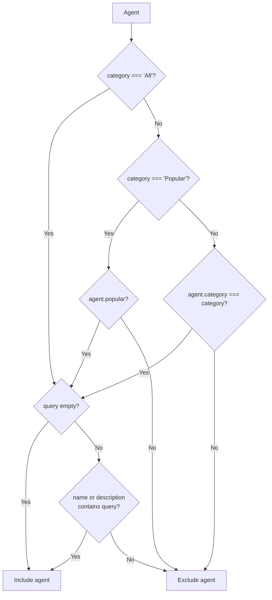

**File:** `src/lib/filterAgents.ts`

A pure, side-effect-free function that filters an array of `Agent` objects by
category and free-text query. Kept in `src/lib/` (not inside a component) so
it can be unit-tested directly.

## Types

### `AgentFilter`

```ts
export interface AgentFilter {
  query: string
  category: string
}
```

| Field | Type | Purpose |
|-------|------|---------|
| `query` | `string` | Free-text search string. Matched against agent name and description. Leading/trailing whitespace is ignored. Empty string matches everything. |
| `category` | `string` | One of: `'All'` (no filter), `'Popular'` (matches `agent.popular === true`), or an `AgentCategory` value (`'Review'`, `'Deploy'`, etc.) matched against `agent.category`. |

## `filterAgents`

```ts
export function filterAgents(agents: Agent[], filter: AgentFilter): Agent[]
```

**Parameters:**

| Param | Type | Purpose |
|-------|------|---------|
| `agents` | `Agent[]` | The source array to filter. Not mutated. |
| `filter` | `AgentFilter` | Category and query to apply. |

**Returns:** A new array containing only the agents that pass both the category
filter and the query filter.

**Side effects:** None — pure function.

**Mutations:** None — does not modify the input `agents` array.

## Implementation walkthrough

```ts
export function filterAgents(agents: Agent[], filter: AgentFilter): Agent[] {
  const query = filter.query.trim().toLowerCase()

  return agents.filter((agent) => {
    const matchesCategory =
      filter.category === 'All' ||
      (filter.category === 'Popular'
        ? agent.popular
        : agent.category === filter.category)

    if (!matchesCategory) return false
    if (!query) return true

    return (
      agent.name.toLowerCase().includes(query) ||
      agent.description.toLowerCase().includes(query)
    )
  })
}
```

### Step 1: Normalize the query

```ts
const query = filter.query.trim().toLowerCase()
```

Trimming removes leading/trailing whitespace (so `'  bot  '` matches `'deploy-bot'`).
Lowercasing enables case-insensitive matching without calling `toLowerCase()`
on each agent's name and description inside the loop.

### Step 2: Category filter

```ts
const matchesCategory =
  filter.category === 'All' ||
  (filter.category === 'Popular'
    ? agent.popular
    : agent.category === filter.category)
```

Three branches:
- `'All'` → always passes.
- `'Popular'` → passes when `agent.popular === true`.
- Any other value → exact match against `agent.category`.

### Step 3: Early return on category mismatch

```ts
if (!matchesCategory) return false
```

Category check comes first. If the agent fails the category filter, the query
check is skipped entirely (short-circuit).

### Step 4: Early return when query is empty

```ts
if (!query) return true
```

An empty (or whitespace-only) query string matches all agents that passed the
category filter.

### Step 5: Query match

```ts
return (
  agent.name.toLowerCase().includes(query) ||
  agent.description.toLowerCase().includes(query)
)
```

Substring match against name **or** description. Both are lowercased at match
time; the `query` was already lowercased in step 1.

## Filter decision flowchart



## Tests

`src/lib/filterAgents.test.ts` — 10 tests covering:

| Test | Asserts |
|------|---------|
| `'All'` + empty query | All 3 agents returned |
| Exact category | `'Review'` → only PR Reviewer |
| `'Popular'` | The 2 popular agents |
| Name match | `'deploy'` → Deploy Bot only |
| Description match | `'root cause'` → RCA Analyst only |
| Case-insensitive | `'REVIEWER'` → PR Reviewer |
| Whitespace trimming | `'  bot  '` → Deploy Bot |
| Category + query combined | `'Popular'` + `'reviewer'` → PR Reviewer only |
| No match | `'nonexistent'` → `[]` |
| Input not mutated | Source array unchanged |

## Used by

`AgentGrid` — composed with `sortAgents` inside a `useMemo`:

```ts
const visible = useMemo(
  () => sortAgents(filterAgents(agents, { query, category }), sort),
  [agents, query, category, sort],
)
```
