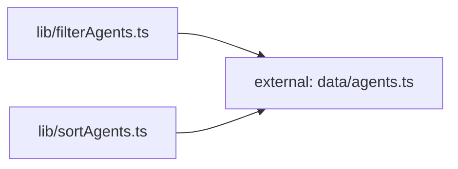

**Folder:** `src/lib/`

<!-- fill:folder:summary -->
`src/lib/` holds the frontend's framework-light building blocks: the typed API client (`api.ts`), two pure data transforms (`filterAgents.ts`, `sortAgents.ts`), and two reusable React hooks (`useFetch.ts`, `usePersistentState.ts`). As the dependency subgraph above shows, the pure helpers depend only on the `Agent` type from `data/agents.ts` and nothing else, which is what keeps them unit-testable in isolation. Presentational components belong in `src/components/`, not here — this folder is for logic and state primitives that components consume, not for anything that renders markup.
<!-- /fill:folder:summary -->

## Files

| File | Hint |
| --- | --- |
| [`api.ts`](../lib/api) | Typed client for the Snabbit Agent Console API. |
| [`filterAgents.ts`](../lib/filteragents) | Pure helper that filters agents by category and free-text query. |
| [`sortAgents.ts`](../lib/sortagents) | Pure helper that returns agents sorted by a chosen key. |
| [`useFetch.ts`](../lib/usefetch) | React hook that runs an async fetcher and exposes loading/error/data state. |
| [`usePersistentState.ts`](../lib/usepersistentstate) | React hook like `useState` that mirrors its value to `localStorage`. |

## Dependencies

### Module dependency subgraph

## Key flows

<!-- fill:folder:flows -->
- **Agent list rendering:** `AgentGrid.tsx` reads its UI preferences through `usePersistentState`, then pipes the agent array through `filterAgents` and `sortAgents` (in that order) to produce the visible, ordered subset on each keystroke or tab switch.
- **Pipeline loading:** `PipelinesPanel.tsx` calls `useFetch(fetchPipelines)`, where `fetchPipelines` from `api.ts` is the stable fetcher; the hook manages the request lifecycle (loading, error, abort-on-unmount) and exposes `reload` for the Refresh button.
<!-- /fill:folder:flows -->
