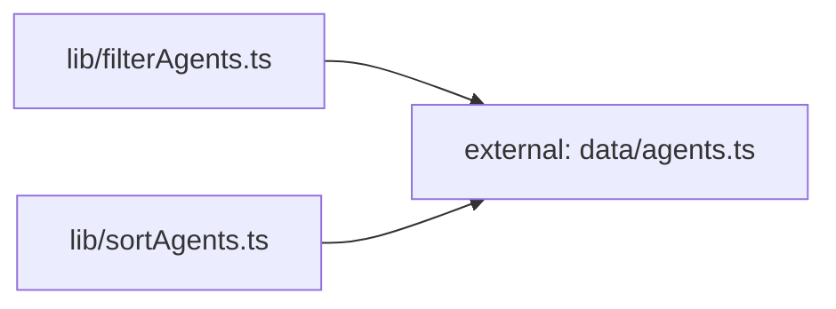

**Folder:** `src/lib/`

<!-- fill:folder:summary -->
<FILL: 2-4 sentences on what this folder is for, what kinds of modules belong here, and what does NOT belong here.>
<!-- /fill:folder:summary -->

## Files

| File | Hint |
| --- | --- |
| [`api.ts`](../lib/api) | Typed client for the Snabbit Agent Console API. |
| [`filterAgents.ts`](../lib/filteragents) | <FILL: one-line purpose for filterAgents.ts> |
| [`sortAgents.ts`](../lib/sortagents) | <FILL: one-line purpose for sortAgents.ts> |
| [`useFetch.ts`](../lib/usefetch) | <FILL: one-line purpose for useFetch.ts> |
| [`usePersistentState.ts`](../lib/usepersistentstate) | <FILL: one-line purpose for usePersistentState.ts> |

## Dependencies

### Module dependency subgraph

## Key flows

<!-- fill:folder:flows -->
<FILL: 1-3 short descriptions of how modules in this folder cooperate at runtime.>
<!-- /fill:folder:flows -->
