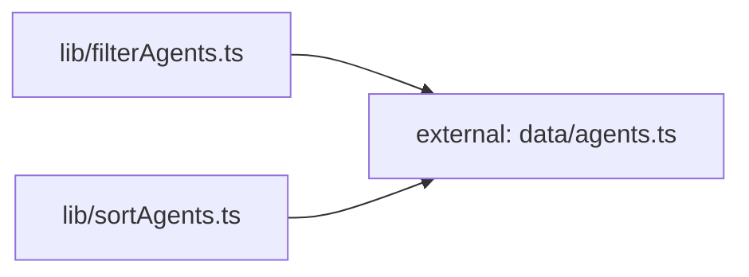

**Folder:** `src/lib/`

<!-- fill:folder:summary -->
`src/lib/` holds the framework-agnostic logic and reusable hooks that back the dashboard UI: the typed API client (`api.ts`), pure data transforms (`filterAgents.ts`, `sortAgents.ts`), and small React hooks (`useFetch.ts`, `usePersistentState.ts`). These modules are deliberately presentation-free — they take plain data and return plain data or state, which is why the pure transforms ship with their own Vitest suites. UI components such as `AgentGrid.tsx` and `PipelinesPanel.tsx` compose these helpers; what does NOT belong here is JSX/rendering, page layout, or static fixture data (the agent records live in `src/data/agents.ts`).
<!-- /fill:folder:summary -->

## Files

| File | Hint |
| --- | --- |
| [`api.ts`](../lib/api) | Typed client for the Snabbit Agent Console API. |
| [`filterAgents.ts`](../lib/filteragents) | Pure helper that filters an `Agent[]` by category and free-text query. |
| [`sortAgents.ts`](../lib/sortagents) | Pure helper that returns an `Agent[]` sorted by a chosen `SortKey`. |
| [`useFetch.ts`](../lib/usefetch) | React hook that runs an async fetcher on mount and tracks loading/error/data state. |
| [`usePersistentState.ts`](../lib/usepersistentstate) | `useState`-like hook that mirrors its value to `localStorage`. |

## Dependencies

### Module dependency subgraph

## Key flows

<!-- fill:folder:flows -->
- **Agent list rendering:** `AgentGrid.tsx` keeps the active query, category, and sort in state (the sort persisted via `usePersistentState`), then pipes the agent data through `filterAgents` and `sortAgents` to produce the displayed list. The dependency subgraph above shows both transforms depending only on `data/agents.ts`.
- **Pipeline loading:** `PipelinesPanel.tsx` calls `useFetch(fetchPipelines)`, so `useFetch` runs the `api.ts` client on mount, manages the `AbortController`, and hands back loading/error/data plus a `reload` trigger for the panel to render.
- **Preference persistence:** `usePersistentState` mirrors UI choices (such as the selected `SortKey`) to `localStorage` so they survive a page reload, falling back to the initial value when storage is unavailable.
<!-- /fill:folder:flows -->
