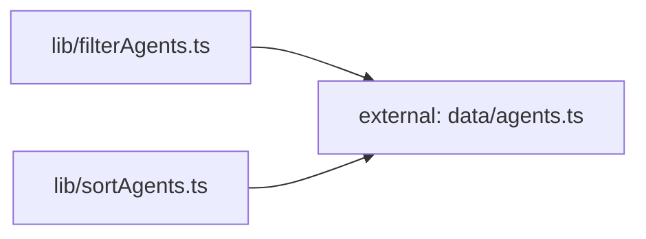

**Folder:** `src/lib/`

<!-- fill:folder:summary -->
Reusable logic shared across components — the typed HTTP client, two custom React hooks, and the pure filter/sort helpers used by `AgentGrid`. Code here must not render JSX or depend on a specific component; if it does, it belongs in `components/`. Static data and types live in `data/`, not here.
<!-- /fill:folder:summary -->

## Files

| File | Hint |
| --- | --- |
| [`api.ts`](../lib/api) | Typed client for the Snabbit Agent Console API. |
| [`filterAgents.ts`](../lib/filteragents) | Pure filter — keeps agents that match the category (with the `Popular` pseudo-category) and a case-insensitive query against name and description. |
| [`sortAgents.ts`](../lib/sortagents) | Pure sort — returns a new agent array ordered by `runs`, `success`, `name`, or `recent`; also exports `SORT_LABELS` for the menu. |
| [`useFetch.ts`](../lib/usefetch) | Generic `useState`-backed data hook that runs a fetcher on mount, manages `AbortController` cleanup, and exposes `loading`, `error`, `data`, and `reload`. |
| [`usePersistentState.ts`](../lib/usepersistentstate) | Tiny `useState` wrapper that reads the initial value from `localStorage[key]` and mirrors writes back, swallowing storage errors. |

## Dependencies

### Module dependency subgraph

## Key flows

<!-- fill:folder:flows -->
- **Agent grid pipeline.** `AgentGrid` composes the helpers as `sortAgents(filterAgents(agents, { query, category }), sort)` inside a `useMemo` so the visible list only recomputes when one of those inputs changes.
- **Persistent filters.** The same component reads/writes `category` and `sort` through `usePersistentState`, so refreshing the page or remounting the grid restores the previous selections.
- **Live pipelines.** `PipelinesPanel` passes the module-level `fetchPipelines` from `api.ts` into `useFetch` — referential stability of the fetcher is what keeps the effect from re-firing on every render.
<!-- /fill:folder:flows -->
