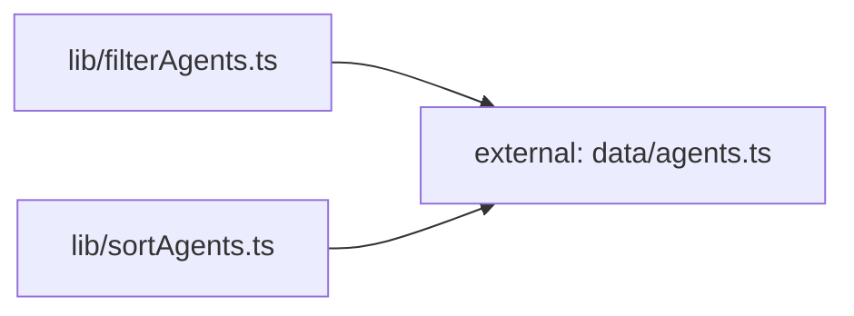

**Folder:** `src/lib/`

<!-- fill:folder:summary -->
`src/lib/` holds the framework-agnostic and reusable building blocks of the frontend: the typed API client (`api.ts`), pure data transforms (`filterAgents.ts`, `sortAgents.ts`), and generic React hooks (`useFetch.ts`, `usePersistentState.ts`). Modules here are intentionally free of JSX and presentation concerns so they can be unit tested in isolation and shared across components. Rendered UI, page layout, and component-specific styling do NOT belong here — those live under `src/components/`.
<!-- /fill:folder:summary -->

## Files

| File | Hint |
| --- | --- |
| [`api.ts`](../lib/api) | Typed client for the Snabbit Agent Console API. |
| [`filterAgents.ts`](../lib/filteragents) | Pure helper that filters an Agent list by category and free-text query. |
| [`sortAgents.ts`](../lib/sortagents) | Pure helper that returns a new Agent list sorted by runs, success, name, or recency. |
| [`useFetch.ts`](../lib/usefetch) | React hook that runs an async fetcher and exposes loading/error/data with abort handling. |
| [`usePersistentState.ts`](../lib/usepersistentstate) | useState variant that mirrors its value to localStorage and restores it on mount. |

## Dependencies

### Module dependency subgraph

## Key flows

<!-- fill:folder:flows -->
- Data loading: `PipelinesPanel` calls `useFetch(fetchPipelines)`, where `useFetch` drives the async lifecycle (loading/error/data, abort on unmount) and `api.ts`'s `fetchPipelines` performs the actual `/api/pipelines` request.
- Agent list rendering: `AgentGrid` pipes its agents through `filterAgents` and then `sortAgents` (both pure, both depending only on the `Agent` type from `data/agents.ts`) to produce the displayed, ordered list.
- Preference persistence: `AgentGrid` stores the active filter/sort selection via `usePersistentState`, so the chosen `SortKey` and category survive page reloads through `localStorage`.
<!-- /fill:folder:flows -->
