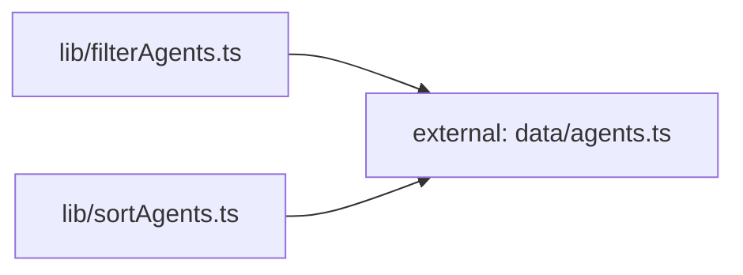

**Folder:** `src/lib/`

<!-- fill:folder:summary -->
This folder holds DOM-free helpers: pure functions (`filterAgents`, `sortAgents`), small React hooks (`useFetch`, `usePersistentState`), and the typed REST client (`api.ts`). Modules here are unit-testable without `@testing-library/react` — `filterAgents.test.ts` and `sortAgents.test.ts` are plain Vitest. Anything that renders JSX belongs in `../components/`; anything that is bundled static data belongs in `../data/`.
<!-- /fill:folder:summary -->

## Files

| File | Hint |
| --- | --- |
| [`api.ts`](../lib/api) | Typed client for the Snabbit Agent Console API. |
| [`filterAgents.ts`](../lib/filteragents) | Pure filter — narrows an agent list by category (`All`, `Popular`, or a real category) and a free-text query against name/description. |
| [`sortAgents.ts`](../lib/sortagents) | Pure sort — returns a new array ordered by `runs`, `success`, `name`, or `recent`; also exports the menu labels. |
| [`useFetch.ts`](../lib/usefetch) | Hook — runs an async fetcher on mount with an `AbortController`, exposing `{ data, loading, error, reload }`. |
| [`usePersistentState.ts`](../lib/usepersistentstate) | Hook — `useState` that mirrors its value to `localStorage` under a key and survives storage failures. |

## Dependencies

### Module dependency subgraph

## Key flows

<!-- fill:folder:flows -->
- **AgentGrid pipeline:** `AgentGrid` composes `sortAgents(filterAgents(agents, { query, category }), sort)` inside a `useMemo`, with `category` and `sort` stored via `usePersistentState`.
- **PipelinesPanel fetch:** `PipelinesPanel` calls `useFetch(fetchPipelines)`; `fetchPipelines` (in `api.ts`) hits `${VITE_API_URL}/api/pipelines` and the hook abandons in-flight requests via `AbortController` on unmount/reload.
<!-- /fill:folder:flows -->
