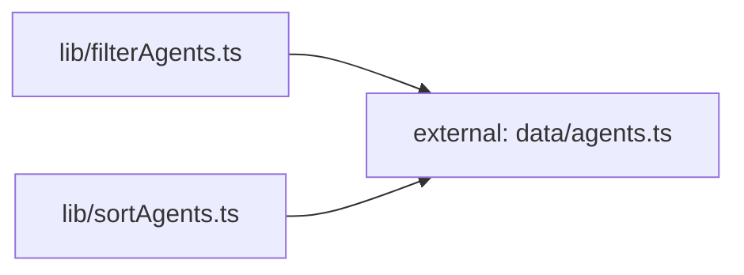

**Folder:** `src/lib/`

<!-- fill:folder:summary -->
`src/lib/` holds the frontend's reusable, presentation-free logic: the typed API client (`api.ts`), the pure list transforms (`filterAgents.ts`, `sortAgents.ts`), and the generic React hooks (`useFetch.ts`, `usePersistentState.ts`). The dependency subgraph below shows the two transforms depend only on the `Agent` type from `data/agents.ts` and nothing else. Modules here are deliberately UI-agnostic — they take data in and return data or state, leaving rendering to the components in `src/components/`. JSX, styling, and component markup do NOT belong here.
<!-- /fill:folder:summary -->

## Files

| File | Hint |
| --- | --- |
| [`api.ts`](../lib/api) | Typed client for the Snabbit Agent Console API. |
| [`filterAgents.ts`](../lib/filteragents) | Pure helper that narrows an `Agent[]` by category tab and free-text query. |
| [`sortAgents.ts`](../lib/sortagents) | Pure helper that returns a new `Agent[]` ordered by runs, success, name, or recency. |
| [`useFetch.ts`](../lib/usefetch) | Generic hook that runs an async fetcher on mount and exposes loading/error/data plus reload. |
| [`usePersistentState.ts`](../lib/usepersistentstate) | `useState`-like hook that mirrors its value to localStorage and restores it on the next mount. |

## Dependencies

### Module dependency subgraph

## Key flows

<!-- fill:folder:flows -->
- **Agent list pipeline:** `AgentGrid` feeds its agents through `filterAgents` then `sortAgents` (composed inside a `useMemo`) to produce the visible list, while `usePersistentState` keeps the chosen category and sort key across reloads.
- **Pipeline loading:** `PipelinesPanel` passes the module-level `fetchPipelines` from `api.ts` into `useFetch`, which runs it on mount, surfaces loading/error/data, and aborts the request on unmount or reload.
<!-- /fill:folder:flows -->
