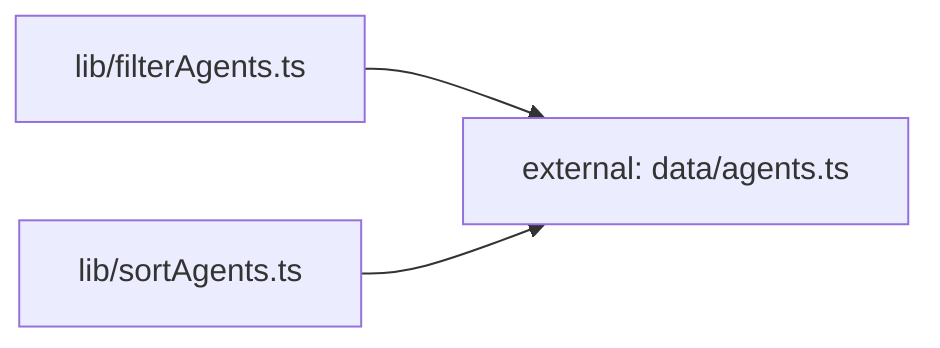

**Folder:** `src/lib/`

<!-- fill:folder:summary -->
`src/lib/` holds the frontend's framework-agnostic and reusable building blocks: the typed API client (`api.ts`), pure data transforms over the agent list (`filterAgents.ts`, `sortAgents.ts`), and generic React hooks (`useFetch.ts`, `usePersistentState.ts`). Modules here are deliberately decoupled from any specific screen — the pure functions take data in and return data out, and the hooks expose state without rendering anything. Presentational components, page layout, and the agent/KPI seed data itself live elsewhere (`src/components/` and `src/data/`) and should not be added here.
<!-- /fill:folder:summary -->

## Files

| File | Hint |
| --- | --- |
| [`api.ts`](../lib/api) | Typed client for the Snabbit Agent Console API. |
| [`filterAgents.ts`](../lib/filteragents) | Pure helper that narrows an agent list by category and free-text query. |
| [`sortAgents.ts`](../lib/sortagents) | Pure helper returning a new agent list ordered by runs, success, name, or recency. |
| [`useFetch.ts`](../lib/usefetch) | Generic React hook that runs an async fetcher and exposes loading/error/data plus reload. |
| [`usePersistentState.ts`](../lib/usepersistentstate) | `useState`-like hook that mirrors its value to localStorage and restores it on mount. |

## Dependencies

### Module dependency subgraph

## Key flows

<!-- fill:folder:flows -->
`PipelinesPanel.tsx` calls `useFetch(fetchPipelines)`: the hook drives `api.ts`'s `fetchPipelines` inside an `AbortController`, surfacing loading/error/data state and a `reload` trigger to the panel. `AgentGrid.tsx` pipes its agent list through `filterAgents` and then `sortAgents` — both pure transforms over the same `Agent[]` from `src/data/agents` (shown in the dependency subgraph above) — to produce the displayed order. `usePersistentState` runs alongside, persisting the grid's chosen sort/filter to localStorage so the selection survives reloads.
<!-- /fill:folder:flows -->
