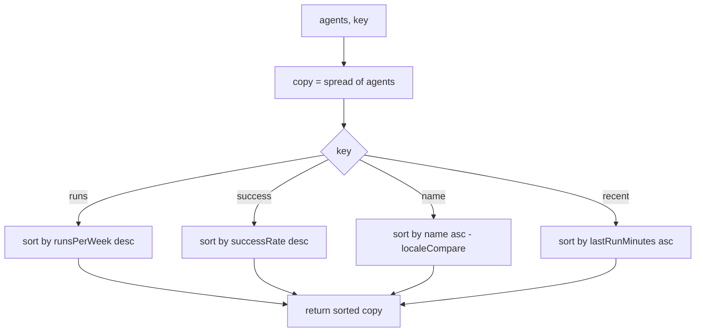

<!-- structure:6ec161de999b -->

**File:** `src/lib/sortAgents.ts` · **Lines:** 30

<!-- fill:file:summary -->
This module provides `sortAgents`, a pure helper that returns a new `Agent[]` (from `../data/agents`) ordered by one of four keys, plus the `SortKey` union and the `SORT_LABELS` map of human-readable menu labels. `AgentGrid.tsx` uses all three to render a sort dropdown and reorder the displayed agents, and `sortAgents.test.ts` exercises the sort logic directly. Like `filterAgents`, it is side-effect free and never mutates its input.
<!-- /fill:file:summary -->

## Imports

This file pulls in the following modules. Relative imports point to other documented files; external imports are libraries from `node_modules`.

| Module | Imports | Kind |
| --- | --- | --- |
| `../data/agents` | `Agent` | type-only · internal |


## Symbols

This file exports 3 symbols. Every export is documented below, in declaration order.

| Name | Kind | Default |
| --- | --- | --- |
| sortAgents | function | no |
| SortKey | type | no |
| SORT_LABELS | const | no |

## sortAgents

**Kind:** `function`

```ts
export function sortAgents(agents: Agent[], key: SortKey): Agent[] { ... }
```

> Return a new array of agents sorted by the given key.
> Pure — does not mutate the input array.

### Parameters

| Name | Type | Default | Required | Purpose |
| --- | --- | --- | --- | --- |
| agents | `Agent[]` | — | yes | The list to sort; the function shallow-copies it before sorting, so the caller's array is left untouched. |
| key | `SortKey` | — | yes | Which dimension to sort by — picks the comparator for `runsPerWeek` desc, `successRate` desc, `name` asc, or `lastRunMinutes` asc. |

**Returns:** `Agent[]`

<!-- fill:sym:sortAgents:return -->
A new `Agent[]` sorted according to `key`: by `runsPerWeek` descending, `successRate` descending, `name` ascending (locale-aware), or `lastRunMinutes` ascending (most recent first). It is never `null` — the original array is shallow-copied before sorting, so the input is left untouched and the returned array contains the same elements in a new order.
<!-- /fill:sym:sortAgents:return -->

### Line-by-line walkthrough

Each top-level statement of `sortAgents`, in execution order. The line numbers reference the source file as it appears today.

**Line 18 — `FirstStatement`**

```ts
const copy = [...agents]
```

<!-- fill:sym:sortAgents:walk:0 -->
Makes a shallow copy of `agents` with the spread operator. This is essential because `Array.sort` sorts in place; copying first means the subsequent `copy.sort(...)` reorders the clone and the caller's original array is never mutated, keeping the function pure.
<!-- /fill:sym:sortAgents:walk:0 -->

**Line 19 — `SwitchStatement`**

```ts
switch (key) {
    case 'runs':
      return copy.sort((a, b) => b.runsPerWeek - a.runsPerWeek)
    case 'success':
      return copy.sort((a, b) => b.successRate - a.successRate)
    case 'name':
      return copy.sort((a, b) => a.name.localeCompare(b.name))
    case 'recent':
      return copy.sort((a, b) => a.lastRunMinutes - b.lastRunMinutes)
  }
```

<!-- fill:sym:sortAgents:walk:1 -->
Branches on `key` and returns `copy.sort(...)` with the matching comparator. `'runs'` and `'success'` sort numerically descending (`b - a`), `'recent'` sorts `lastRunMinutes` ascending so the most recently run agent comes first, and `'name'` uses `localeCompare` for correct alphabetical ordering. Because `SortKey` is a closed union, the switch is exhaustive and every branch returns, so no fallthrough or default is needed.
<!-- /fill:sym:sortAgents:walk:1 -->

### Examples

<!-- fill:sym:sortAgents:example -->
Given agents `a` (Charlie, 50 runs/wk, 90% success, 30 min ago), `b` (Alpha, 300, 80%, 5 min ago), and `c` (Bravo, 100, 99%, 120 min ago):

```ts
sortAgents(agents, 'runs').map(a => a.id)    // → ['b', 'c', 'a']  (most runs first)
sortAgents(agents, 'success').map(a => a.id) // → ['c', 'a', 'b']  (highest success first)
sortAgents(agents, 'name').map(a => a.id)    // → ['b', 'c', 'a']  (Alpha, Bravo, Charlie)
sortAgents(agents, 'recent').map(a => a.id)  // → ['b', 'a', 'c']  (most recently run first)
```
<!-- /fill:sym:sortAgents:example -->

### Used by

- `src/components/AgentGrid.tsx`
- `src/lib/sortAgents.test.ts`

## SortKey

**Kind:** `type`

```ts
export type SortKey = 'runs' | 'success' | 'name' | 'recent'
```

<!-- fill:sym:SortKey:summary -->
`SortKey` is a string-literal union of the four supported sort orders: `'runs'`, `'success'`, `'name'`, and `'recent'`. It constrains the `key` argument to `sortAgents` and keys the `SORT_LABELS` record, so adding a new sort option in one place forces the comparator and label to be updated too. `AgentGrid.tsx` stores the active sort as a `SortKey`.
<!-- /fill:sym:SortKey:summary -->

### Used by

- `src/components/AgentGrid.tsx`

## SORT_LABELS

**Kind:** `const`

```ts
const SORT_LABELS: Record<SortKey, string>
```

> Display labels for each sort key, in menu order.

### Used by

- `src/components/AgentGrid.tsx`

## Tests

| Suite | Test | Asserts |
| --- | --- | --- |
| sortAgents | sorts by runs, descending | Asserts ids order to `['b', 'c', 'a']` — highest `runsPerWeek` (300) first, lowest (50) last. |
| sortAgents | sorts by success rate, descending | Asserts ids order to `['c', 'a', 'b']` — highest `successRate` (99) first. |
| sortAgents | sorts by name, ascending | Asserts ids order to `['b', 'c', 'a']` — Alpha, Bravo, Charlie alphabetically. |
| sortAgents | sorts by most recent run first | Asserts ids order to `['b', 'a', 'c']` — smallest `lastRunMinutes` (5) first. |
| sortAgents | does not mutate the input array | Snapshots the input ids before sorting and asserts the original array order is unchanged afterwards. |

## Diagrams

<!-- fill:file:diagrams -->

<!-- /fill:file:diagrams -->
