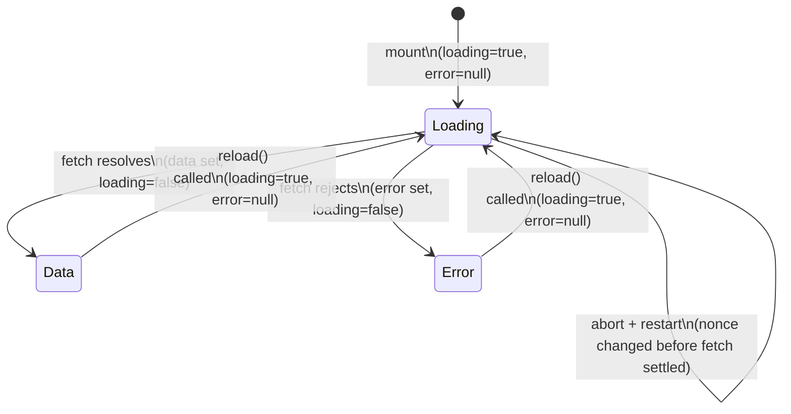

**File:** `src/lib/useFetch.ts`

A generic React hook that runs an async fetcher on mount, manages loading / error / data state, and provides a `reload()` function. Cancels in-flight requests on unmount or before a re-fetch via `AbortController`.

## `FetchState<T>` interface

```ts
export interface FetchState<T> {
  data: T | null
  loading: boolean
  error: string | null
  reload: () => void
}
```

| Field | Type | Description |
|---|---|---|
| `data` | `T \| null` | The successfully fetched value, or `null` before the first successful fetch completes. Remains set after a subsequent failed reload — `error` and `data` can be non-null simultaneously (stale-while-error). |
| `loading` | `boolean` | `true` while a fetch is in progress. Set to `true` synchronously at the start of each fetch attempt (including reloads). |
| `error` | `string \| null` | The error message string from the most recent failed fetch, or `null` when no error has occurred (or when a reload clears the previous error). |
| `reload` | `() => void` | Call this to trigger a fresh fetch. Increments an internal nonce counter that is in the `useEffect` dependency array, causing the effect to re-run. |

## `useFetch<T>` hook

```ts
export function useFetch<T>(
  fetcher: (signal: AbortSignal) => Promise<T>,
): FetchState<T>
```

### Parameters

| Parameter | Type | Required | Purpose |
|---|---|---|---|
| `fetcher` | `(signal: AbortSignal) => Promise<T>` | Yes | The async function to call. Receives an `AbortSignal` so it can cancel the underlying network request on cleanup. |

### Returns

`FetchState<T>` — an object with `data`, `loading`, `error`, and `reload`.

:::caution
The `fetcher` function must be **referentially stable** — it should be a module-level function, not an inline arrow created inside a component. Because `fetcher` is listed in the `useEffect` dependency array, an inline arrow that is recreated on every render would cause the effect to re-run on every render, producing an infinite request loop.

Correct:

```ts
// api.ts — module level
export async function fetchPipelines(signal?: AbortSignal) { ... }

// PipelinesPanel.tsx
const { data } = useFetch(fetchPipelines) // stable reference
```

Incorrect:

```ts
// PipelinesPanel.tsx
const { data } = useFetch((signal) => fetchPipelines(signal)) // new function every render
```
:::

## Internal state

```ts
const [data,    setData]    = useState<T | null>(null)
const [loading, setLoading] = useState(true)
const [error,   setError]   = useState<string | null>(null)
const [nonce,   setNonce]   = useState(0)
```

`nonce` is an integer counter starting at 0. `reload()` increments it:

```ts
const reload = useCallback(() => setNonce((n) => n + 1), [])
```

`reload` itself is memoized with `useCallback` so its reference is stable — callers that store `reload` in a callback or pass it to a child component do not trigger unnecessary re-renders.

## Effect walkthrough

```ts
useEffect(() => {
  const controller = new AbortController()
  setLoading(true)
  setError(null)

  fetcher(controller.signal)
    .then((result) => {
      if (controller.signal.aborted) return
      setData(result)
      setLoading(false)
    })
    .catch((err: unknown) => {
      if (controller.signal.aborted) return
      setError(err instanceof Error ? err.message : 'Request failed')
      setLoading(false)
    })

  return () => controller.abort()
}, [fetcher, nonce])
```

Step by step:

1. **New `AbortController` per run** — a fresh controller is created for each effect invocation. Each fetch has its own independent abort signal. The previous fetch's controller is already aborted by the cleanup returned from the previous effect run before this line executes.

2. **Synchronous state reset** — `setLoading(true)` and `setError(null)` run synchronously before the fetch begins. This clears any previous error banner and shows the loading state immediately, before the new request settles.

3. **Start the fetch** — `fetcher(controller.signal)` begins the async request. The signal is threaded through so `fetch()` inside the fetcher can be cancelled.

4. **Resolution guard** — on `.then()`, `controller.signal.aborted` is checked before setting state. If the component unmounted (cleanup ran) or `reload()` was called again before this fetch settled, the controller was already aborted. The guard prevents stale data from overwriting a newer in-flight fetch's state, and prevents React's "Can't perform a state update on an unmounted component" warning.

5. **Error extraction** — on `.catch()`, the same abort guard runs first. If the error is an `Error` instance, its `.message` property is stored. Otherwise the fallback string `'Request failed'` is used. Note that `AbortError` (thrown by cancelled `fetch()` calls) passes the abort guard and is discarded silently because `signal.aborted` is `true` at that point.

6. **Cleanup** — the effect returns `() => controller.abort()`. React calls this:
   - When the component unmounts.
   - Before re-running the effect when `fetcher` or `nonce` changes.

## State transition diagram



## Stale result protection

The `controller.signal.aborted` guards in both `.then()` and `.catch()` defend against a race condition:

1. Fetch A is in flight.
2. `reload()` is called (or component unmounts).
3. Cleanup runs: `controller.abort()` fires.
4. Fetch A resolves or rejects anyway (the network response arrives).

Without the guard, Fetch A's result would overwrite whatever state a newer Fetch B has already set. With the guard, the aborted result is silently dropped.

## The nonce pattern for reload

Calling `reload()` increments `nonce` from, say, 0 to 1. Because `nonce` is in the `useEffect` dependency array, React schedules a re-run of the effect. React first calls the previous cleanup (`controller.abort()`), then runs the effect again with a fresh `AbortController`. This pattern avoids exposing internal effect control to the caller — the caller only needs to know about `reload()`.

## Used by

`PipelinesPanel` is the only current consumer:

```ts
const { data, loading, error, reload } = useFetch(fetchPipelines)
```

`fetchPipelines` is a named module-level export from `src/lib/api.ts`, ensuring its reference is stable across renders.
