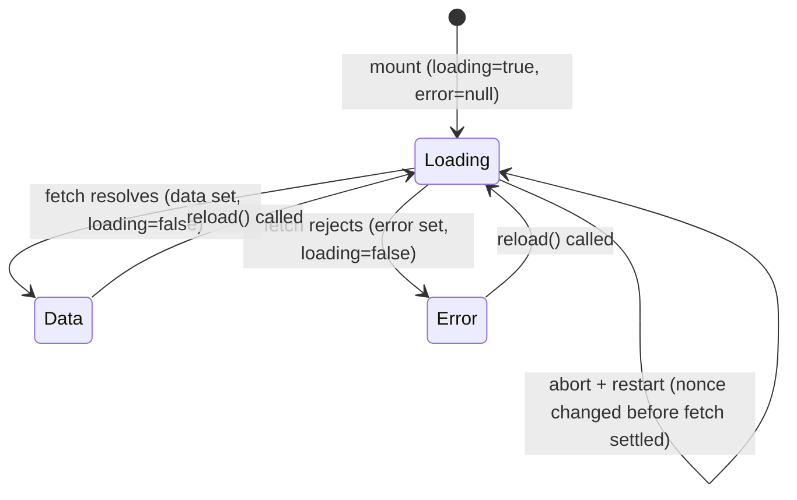

**File:** `src/lib/useFetch.ts`

A generic React hook that runs an async fetcher on mount, manages loading /
error / data state, and provides a `reload()` function. Cancels in-flight
requests on unmount via `AbortController`.

## Types

### `FetchState<T>`

```ts
export interface FetchState<T> {
  data: T | null
  loading: boolean
  error: string | null
  reload: () => void
}
```

| Field | Type | Description |
|-------|------|-------------|
| `data` | `T \| null` | The resolved response value, or `null` before the first successful fetch |
| `loading` | `boolean` | `true` while a fetch is in progress |
| `error` | `string \| null` | Error message string, or `null` when no error |
| `reload` | `() => void` | Triggers a fresh fetch (increments internal nonce) |

## Hook

```ts
export function useFetch<T>(
  fetcher: (signal: AbortSignal) => Promise<T>,
): FetchState<T>
```

**Parameters:**

| Param | Type | Purpose |
|-------|------|---------|
| `fetcher` | `(signal: AbortSignal) => Promise<T>` | The async function to call. Must accept an `AbortSignal` so the hook can cancel it on unmount. **Must be referentially stable** — a module-level function, not an inline arrow. |

**Returns:** `FetchState<T>`.

:::caution
The `fetcher` must be **referentially stable** (e.g. a module-level function).
An inline arrow function recreated on every render would re-trigger the effect
infinitely, since `fetcher` is in the effect's dependency array.
:::

## Internal state

```ts
const [data,    setData]    = useState<T | null>(null)
const [loading, setLoading] = useState(true)
const [error,   setError]   = useState<string | null>(null)
const [nonce,   setNonce]   = useState(0)
```

`nonce` is an integer counter that starts at 0. `reload()` increments it:

```ts
const reload = useCallback(() => setNonce((n) => n + 1), [])
```

Because `nonce` is in the `useEffect` dependency array, incrementing it
re-runs the effect. This is a simple way to trigger a refetch without
exposing internal state to the caller.

## Effect walkthrough

```ts
useEffect(() => {
  const controller = new AbortController()
  setLoading(true)
  setError(null)

  fetcher(controller.signal)
    .then((result) => {
      if (controller.signal.aborted) return
      setData(result)
      setLoading(false)
    })
    .catch((err: unknown) => {
      if (controller.signal.aborted) return
      setError(err instanceof Error ? err.message : 'Request failed')
      setLoading(false)
    })

  return () => controller.abort()
}, [fetcher, nonce])
```

**Step by step:**

1. A fresh `AbortController` is created for each effect run. This ensures
   each fetch has its own independent abort signal.

2. `setLoading(true)` and `setError(null)` are called synchronously before
   the fetch. This clears any previous error and shows the loading state
   immediately.

3. `fetcher(controller.signal)` starts the request. The signal is passed so
   the fetch can be cancelled.

4. On resolution: `controller.signal.aborted` is checked before setting state.
   If the component unmounted (or `reload()` was called again), the controller
   was already aborted — stale results are discarded to prevent setting state
   on an unmounted component.

5. On rejection: the error message is extracted from the `Error` instance if
   available, otherwise the fallback `'Request failed'` is used.

6. Cleanup: the effect returns `() => controller.abort()`. React calls this
   when the component unmounts **or** before the next effect run (when `nonce`
   or `fetcher` changes). Aborting signals the in-flight fetch to cancel.

## State transitions



## Stale result protection

The `controller.signal.aborted` guard in both `.then()` and `.catch()` handles
the race condition where:

1. A fetch is in flight.
2. `reload()` is called (or component unmounts).
3. The cleanup runs: `controller.abort()`.
4. The original fetch resolves or rejects.

Without the guard, the stale result would overwrite the newer state. With it,
the aborted result is silently dropped.

## Used by

`PipelinesPanel`:

```ts
const { data, loading, error, reload } = useFetch(fetchPipelines)
```

`fetchPipelines` is a module-level function in `api.ts`, ensuring referential
stability.
